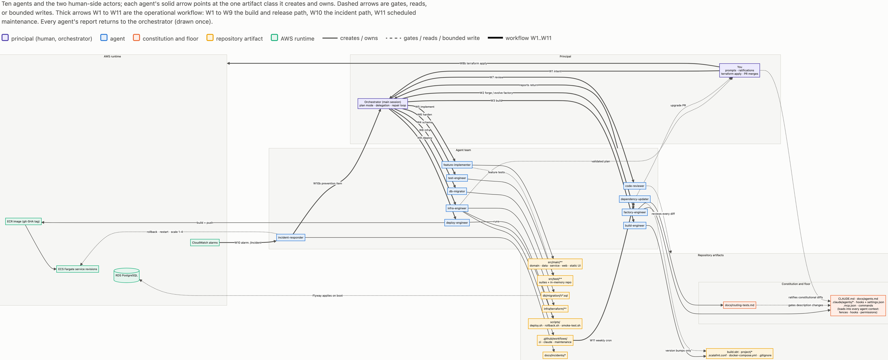
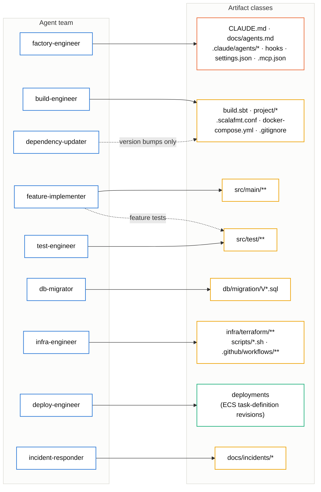
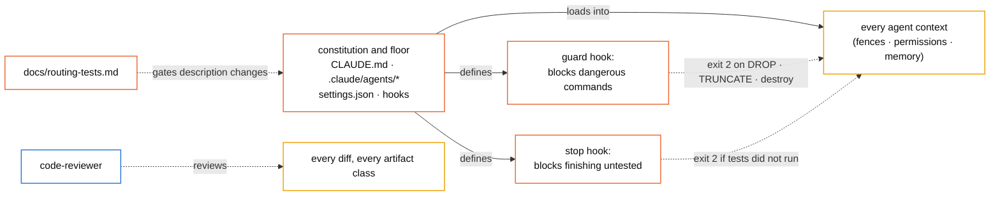
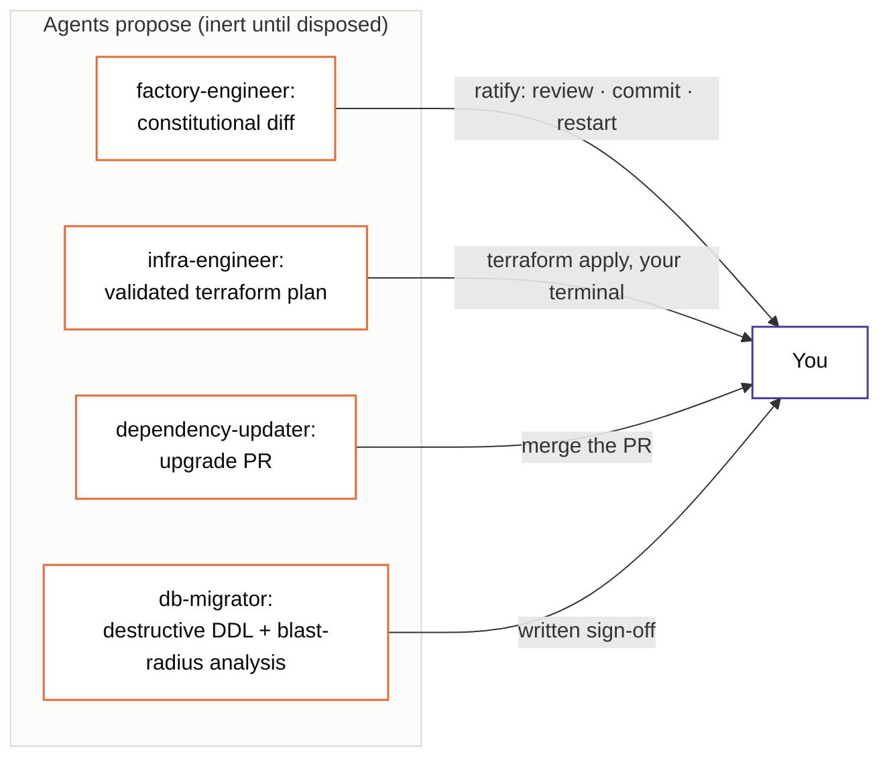
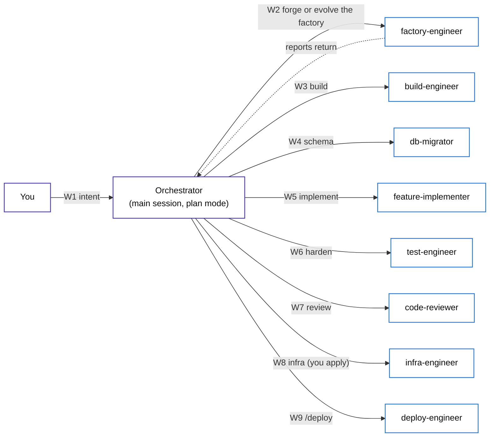
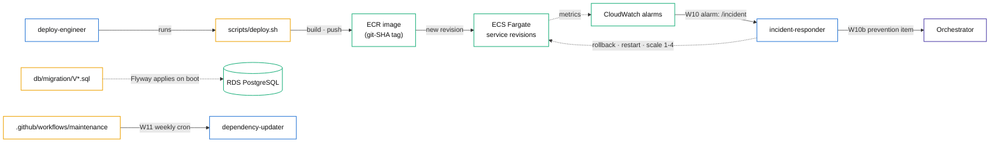
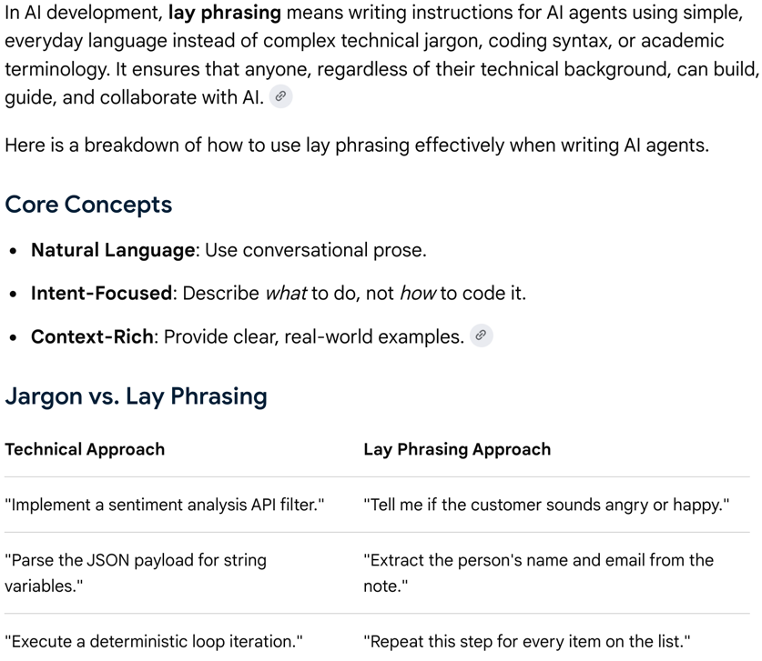
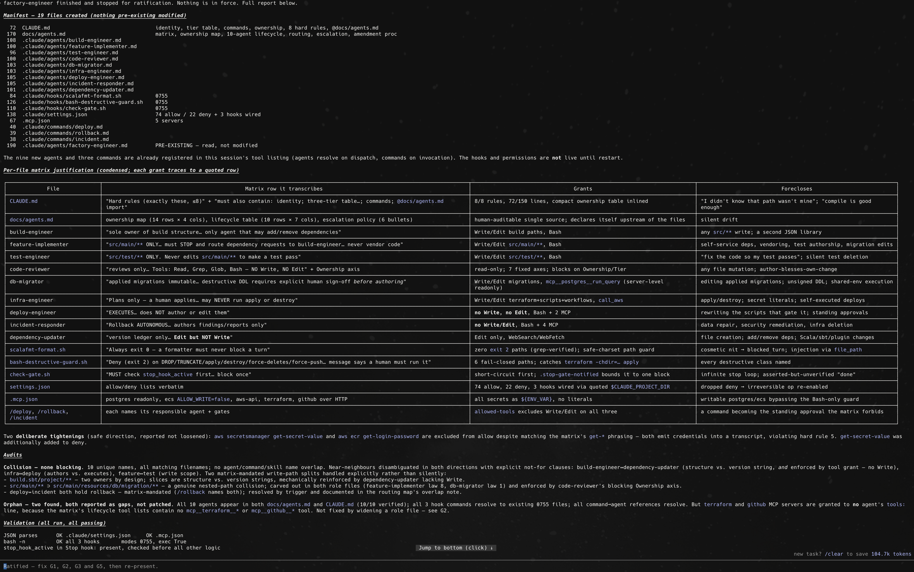
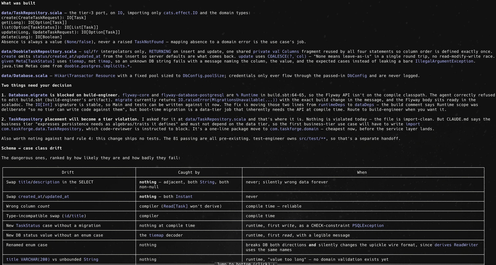

# From One Prompt to Ten AI Agents to a Working AWS Three-Tier Application

A self-contained, step-by-step tutorial in which Claude Code agents create an entire Scala 3 three-tier web application from scratch: the build definition, all source code, tests, database schema, AWS infrastructure, and CI pipelines. You, the reader are a software architect, you write no application files - you give prompts, review, and ratify as if you manage a team of software engineers whom you instruct what to do. Every step below states the exact command or prompt to use, what the agent does, and which line of which agent file causes it to do that.

The example application is called [TaskForge](http://taskforge-dev-alb-1458962824.us-east-1.elb.amazonaws.com/index.html): a task manager with an http4s web tier, a pure business-logic tier on cats-effect IO, and a doobie/PostgreSQL data tier, using upickle for all JSON, packaged by sbt-native-packager, and deployed on AWS ECS Fargate behind an ALB with RDS PostgreSQL. The generated application is [publicly available at Github](https://github.com/0x1DOCD00D/AgenticWorkflow).

## 1. Planning a software application

In this tutorial we explain how to create the following components.

1. An agent system or *the factory*: ten Claude Code subagents, a project memory file, three safety hooks, a permission policy, and MCP server wiring. All of it lives in ordinary files in the repository.
2. The application, produced by that agent system phase by phase: build definition, domain model, database schema and access layer, business rules, HTTP API and browser frontend, test suites, Terraform for AWS, deploy scripts, and GitHub Actions workflows.

The _orchestrator_ is the main Claude Code session where the conversation you are typing into after you run `claude`, before any delegation happens - we also show in [Appendix L](#appendix-l-automating-the-orchestrator-as-a-scala-3-driver-program) how to create a fully automated orchestrator. It is not one of the ten agents discussed below, it has no file in `.claude/agents/`, and no frontmatter defines it. This is the model of the application with no role file, and the word names the job that top-level session does in this workflow: receive your intent, plan, break the work into stages, hand each stage to the owning specialist, read the reports that come back, and decide what happens next. The cleanest way to see it is by contrast with a subagent, since the two differ on every mechanism.

|                              | Orchestrator | Subagent |
|------------------------------|---|---|
| Defined by                   | nothing; it is the default session | one file in .claude/agents/ |
| Context                      | persists across the whole session; accumulates the plan, all reports, your decisions | fresh per invocation; sees only its file, CLAUDE.md, and the work order |
| Tools                        | the full default set, bounded only by the floor | its fence |
| Can delegate                 | yes; it is the only party that can | no; subagents cannot invoke each other |
| Talks to the human architect | continuously | never; it returns one report, to the orchestrator |
| Plan mode                    | available; the convention is planning starts there | not applicable |

Its function in the workflow is the hub of the W-chain in [diagram 4](#diagram-4-the-operational-workflow). The human architect - you! - gives intent (W1); the orchestrator plans, ideally in plan mode where it can read everything but change nothing; then it issues work orders in sequence as W2 through W9, each addressed to the owner from the ownership map, each carrying the specifics of this one job plus any prior report pasted in, because pasted reports are the only memory that crosses between agents. The orchestrator runs the BLOCKED-ON repair loop when an agent stops on a missing dependency: read the report, route the evidence to the owning agent, gate the fix, re-run the blocked agent fresh. And it synthesizes outcomes back to the human architect. The working analogy for the orchestrator is an engineering manager: it holds the whole story, judges and routes, and does no specialty work itself.

This design is based on two asymmetries. First, breadth versus narrowness where planning requires seeing the whole repository, the intent of the human architect, and every report at once, while executing requires a narrow, clean context; the orchestrator is where the breadth deliberately lives, and it is the reason subagent contexts can afford to be narrow. Second, it is auditability - subagents routing work directly to each other would dissolve the trail and let one misjudgment cascade unsupervised, so the topology is hub and spoke, with every hop passing through the one context you can watch.

Three components governs the agentic workflow, given that it has no fence file. The orchestrator is bound by the same constitution as the agents: CLAUDE.md loads into its context at session start, and the hard rule about one owner per artifact class applies to it by name. This rule exists because the orchestrator is the one context that holds broad tools, so nothing physical stops it from writing the code or editing the build itself instead of delegating. If it did, the work would bypass every gate that makes the agents accountable, and the system would gain a hidden eleventh owner that no matrix row describes. The floor applies to it fully; hooks and permission rules do not distinguish orchestrator from subagent tool calls. And the *authority matrix* gives it a row of its own: it may plan, decompose, delegate, paste reports, and run the repair loop; it must never perform a specialty inline or bypass an owner; it escalates routing ambiguities and matrix gaps to you.

The orchestrator is a role, not a persistent entity - each new session (and the tutorial's convention is one phase per session) births a fresh orchestrator, re-anchored by CLAUDE.md, with no memory of previous sessions except what the repository and your prompts carry. And it is the same base model as every agent it delegates to; the difference between the orchestrator and, say, the feature-implementer is not intelligence or identity but constraint: one is the model with the whole conversation and no role file, the other is the same model with a fresh context, a system prompt, and a fence.

### Ownership matrix and the agentic workflow
The ten agents and what each one owns are specified in an ownership table below, created by a human architect who knows what agents are needed. This table answers one question per agent: what does it create and own? That is the "may" side of the authority, restricted to artifact creation.

| Agent | Creates and owns |
|---|---|
| factory-engineer | the agent system itself: CLAUDE.md, .claude/agents/*, hooks, settings, .mcp.json |
| build-engineer | build.sbt, project/*, .scalafmt.conf, docker-compose.yml, .gitignore |
| feature-implementer | application source under src/main and its feature tests |
| test-engineer | adversarial tests under src/test |
| code-reviewer | nothing; it reviews everything (it has no write tools) |
| db-migrator | Flyway migrations under src/main/resources/db/migration |
| infra-engineer | infra/terraform, scripts/*.sh, .github/workflows |
| deploy-engineer | deployments (it runs scripts it does not author) |
| incident-responder | diagnosis and incident reports in docs/incidents |
| dependency-updater | version numbers in the build's version ledger, on a weekly schedule |

When the human creates the ownership table s/he is answering the chief architect's classic questions. 
- What jobs does this project contain?
- Where do I draw responsibility boundaries?
- Do I want one full-stack generalist or specialists? 
- Should the person who writes the code be the person who reviews it? 

The split tests from the tutorial are hiring logic in disguise: different tools means a different role, checker and checked must be different people, high-blast-radius duties get isolated into their own position, and scheduled work gets its own description. Even the anti-split test is a headcount instinct: do not create two positions that would share a large percentile of a job description. And the routing descriptions are literally job postings written so work finds the right desk and a hired human behind this desk.

However, we are not selecting workers for hire literally; we are authoring them! Hiring is choosing among pre-existing people with fixed skills, habits, and personalities we can only discover, never specify. Here every candidate is the same base model, and the job description is not a filter for selecting the worker; it is the worker. There is no interview because there is no variance in the candidate; all the variance is in our specification! As a result, competence is not what you design for, since it comes with the model, uniformly, scope and constraint are the key elements of competence. A bad hire is a selection error; a bad agent is a writing error and it is always yours.

Moreover, your employees are amnesiac, so the institution's memory must be externalized. A human hire accumulates context, learns the codebase, remembers last month's incident. An agent starts blank every single invocation. So "staffing" here includes building what human organizations get biologically for free: CLAUDE.md is institutional memory, reports-pasted-forward are meetings, docs/agents.md is the org chart. The chief architect at a real company hires people and culture grows; in the case of AI agentic workflow we must write the culture down or it does not exist.

Next, the enforcement model inverts. With humans, a job description states duties, and enforcement is soft and social: performance reviews, professional norms, the fact that people push back on bad orders or slack off. Agents comply eagerly with almost anything, including bad ideas, so limits cannot be normative but structural. That is why the ownership table does not stay a duties document but compiles down into fences, permission rules, and hooks. The nearest human-world artifact is not an org chart at all; it is an RBAC security policy. Hiring trusts human judgment; this system trusts mechanism, and never the worker: you trust the gates and oracles around the agent, the way you would never operate with a human colleague unless you want a hostile work environment.

In addition and crucially, the economics invert too. A human specialist costs a salary plus benefits, so no sane architect hires a full-time "db-migrator" for a small product; roles get bundled because headcount is expensive. Agent roles cost nothing marginal to employ, so specialization is nearly free, and the real costs move elsewhere: every extra role adds routing surface (one more description that can misroute) and definition maintenance (one more file that can go stale). Ten specialists for a small app would be organizational malpractice with humans and is ordinary design here.

Finally, these ten employees are the same mind wearing different constraints. When the chief architect separates implementer from reviewer, independence comes free from two different brains with different blind spots. Here the reviewer is the same model as the implementer, so independence must be manufactured with fresh contexts, adversarial framing in the reviewer's file, and the no-write fence. The separation of duties that hiring gets by nature, should be manufactured and we get it only by engineering, which is why the tutorial spends so many words on it.

Therefore, the ownership table is the org chart and _Responsible, Accountable, Consulted, and Informed (RACI)_ matrix of a team you author rather than hire, whose members forget everything between shifts, comply with anything, cost nothing to multiply, and are all the same person. The authority matrix is that org chart fused with the security policy, because for this kind of employee the two documents cannot be separate. Where the analogy is most exact is the moment before any of that: deciding what jobs the work actually divides into. That decision is identical in both worlds, and the tutorial's claim stands in both too: delegation forces the explicitness that human teams fake with tribal knowledge. The difference is that a human team survives your vagueness, and this one turns it directly into behavior.

The rule that makes the whole design work is the following: every artifact class has exactly one owning agent, and an agent asked to touch another agent's artifact declines and names the owner. You will see this rule fire in practice in [Phase 1](#phase-1-the-factory-builds-the-factory), probe 3.


---

### The cost of the same build with human specialists

A fair question is whether it is not cheapter to hire actual people to create this application. What would this repository have cost if you had hired people instead of running the factory? To make practical sense of this tutorial we work the estimate with US-market ranges as of mid 2026: [Scala Teams, senior Scala cost 2026](https://www.scalateams.com/blog/senior-scala-developer-cost-2026), [Arc.dev freelance rates](https://arc.dev/freelance-developer-rates), [Claude plan pricing](https://intuitionlabs.ai/articles/claude-pricing-plans-api-costs).


#### What is actually being priced

The deliverable is small but production-shaped, which drives the estimate more than line count does. It comprises the sbt build and scaffolding, a domain model with a frozen JSON wire format, a Flyway schema, a doobie data tier, a pure service tier with rule tests, an http4s API with a browser frontend and a full route suite, an adversarial test pass, a full review, Terraform for a cloud VPC, RDS, ECR, ECS Fargate, an ALB, alarms, and Secrets Manager wiring (roughly 40 resources), three operational scripts with real gates, and three CI workflows including a headless maintenance loop. Deployed and verified, not just written.

The mapping from the ten agents to human hires is not one-to-one, because humans consolidate roles. In practice this is a two-person job plus fractions: one senior Scala engineer covering build, domain, data, service, web, and tests; one DevOps or platform engineer covering Terraform, scripts, and CI; a fraction of a second senior for independent code review; and a fraction of a coordinator. The work-package estimate:

| Work package | Specialist | Hours |
|---|---|---|
| Build definition, scaffolding, local compose | senior Scala engineer | 8 to 16 |
| Domain, schema, data tier, service tier, web tier, frontend | senior Scala engineer | 60 to 100 |
| Adversarial test hardening | same, or an SDET | 16 to 24 |
| Terraform (VPC, RDS, ECS, ALB, alarms, secrets) | DevOps engineer | 32 to 56 |
| Deploy, rollback, smoke scripts plus three workflows | DevOps engineer | 12 to 24 |
| Independent code review, two passes | second senior engineer | 8 to 16 |
| Coordination, standups, handoffs | 10 to 15 percent overhead | 14 to 24 |

Total: roughly 150 to 260 hours, or 4 to 6.5 person-weeks. Anyone who has contracted out a deployed three-tier service will recognize that as a normal, even slightly optimistic, range.

#### Pricing the hours, four ways

Rates vary enormously by channel, so the same hours price out very differently depending on how you buy them. Senior Scala contractors through US staffing firms currently run \$150 to \$250 per hour; independent freelancers hired directly typically run \$90 to \$150; specialist consultancies bid fixed prices that back out to \$175 to \$275 blended; offshore and nearshore teams run \$30 to \$70 with higher coordination overhead. For the employee lens, median senior Scala total compensation in major US hubs sits around \$230k to \$260k, and a fully loaded employee costs from 25% to 40% above that.

| Staffing model | Blended rate                            | Cost for 150 to 260 hours      |
|---|-----------------------------------------|--------------------------------|
| Independent freelancers, hired directly | \$90 - \$150 per hour                   | \$14k - \$39k                  |
| Staffing-firm contractors | \$150 - \$250 per hour                  | \$23k - \$65k                  |
| US consultancy, fixed bid | \$175 - \$275 effective                 | \$30k - \$70k typical bids     |
| Offshore or nearshore team | \$30 - \$70 per hour                    | \$5k - \$18k plus overhead     |
| Internal employees, fully loaded | roughly \$5.5k - \$6.5k per person-week | \$25k - \$40k of internal cost |

A defensible single sentence: built by competent US-market humans, this repository costs somewhere between \$15k and \$60k, with \$25k to \$40k the likely center. Calendar time is 3 - 6 weeks elapsed once you include finding the people, onboarding them, and their other commitments.

#### What the agentic build actually cost

The cost structure on the agentic side has three terms, and it is worth keeping them separate because they behave differently.

The first term is the AI itself, and it is the smallest. A Claude Max subscription runs \$100 or \$200 per month depending on tier and covers a genesis comfortably; run against the metered API instead, a genesis of this size lands on the order of \$50 to \$300 of tokens depending on how many repair loops your run needs. Call it \$100 to \$300 of marginal cash.

The second term is your time, and it is the dominant one. The genesis is roughly 8 to 16 hours of operator attention across the phases: reading the constitutional diff, reading build.sbt, reading the Terraform plan resource by resource, ratifying, probing, and disposing of drifts like the ones in [Phase 9](#phase-9-first-deploy). Priced at the same senior rate the human team charges, that is \$1.2k to \$4k. Note what kind of time it is - not one keystroke of it is typing code, and none of it can be delegated to someone who cannot read a Terraform plan, because the gates are exactly where the remaining judgment lives.

The third term is AWS runtime, roughly \$100 to \$150 per month for this stack, and it cancels out of the comparison because both paths pay it identically. Total for the agentic path: roughly \$1.5k to \$4.5k, of which the AI is well under 10%. Against the human center of \$25k to \$40k, that is a factor of about 10, with honest bounds between 5x and 20x depending on which column you compare against. Elapsed time compresses harder than cost: one to two focused days against three to seven weeks.

#### The caveats that keep the comparison honest

First, the specification already existed. This tutorial is a refined requirements document, and the ranges assume the human team receives it too. In a real engagement, discovering what to build is often half the bill, and neither column above includes that discovery. Symmetrically, building the factory and its vocabulary cost real effort once, and that cost amortizes: a second application from the same factory skips Phase 0, Phase 1, and most of the wording work, so the ratio improves with every build.

Second, the operator is not free and cannot be junior. This workflow is not about the speed of typing, but sound judgment; it concentrates the senior skill into a few review moments. If you must hire the operator, add their hours at senior rates, and the gap narrows though it does not close.

Third, the human premium buys things the subscription does not: a firm carries warranty, insurance, continuity, and someone to call when it breaks at 3 a.m. The agentic path replaces that with our own [operating loops](#11-after-genesis-the-operating-loops) and your own accountability. For some buyers that difference is worth most of the premium.

Fourth, this ratio is for genesis, not for lifetime. Steady-state maintenance compares a support retainer, typically $2k to $5k per month for a stack like this, against a subscription plus a few review hours per week, and the multiple there is real but smaller.

Fifth, variance exists on both sides. A weak agency and a sloppy agent run both produce expensive messes; on the agentic side, the gates, the fences, and the review pass in [Phase 7](#phase-7-full-review) are what bound the variance, which is another way of saying the safety machinery in this tutorial is not overhead on the savings, it is the reason the savings survive contact with reality.

The structural point beneath all the numbers: hiring humans prices the work linearly in hours typed, while the agentic path prices it linearly in decisions reviewed. The four disposal acts are the new unit of cost, and everything this tutorial spends words on, the vocabulary, the gates, the reports, exists to keep the number of decisions small and each one cheap to make well.

---

### The authority matrix

The authority matrix is the single design document from which the entire agent system is derived. It is written by the human architect, on paper, before any agent exists; it is serialized into the Phase 1 prompt as the factory-engineer's input; its ratified on-disk form becomes `docs/agents.md`; and forever after it is the reference against which every constitutional diff is judged. One row per actor, four questions per row: what may it do on its own, what must it never do, what must it escalate and in what form, and which mechanism enforces each limit. The fifth column here names where each row's content lands in the built system, so you can trace every cell to a file.

| Actor                       | May do autonomously | Must never | Must escalate (and the artifact) | Enforced by |
|-----------------------------|---|---|---|---|
| You (the architect)         | everything; in practice: prompts, constitutional ratification, terraform apply, PR merges, destructive-DDL sign-off | (self-binding) hand-edit agent-owned artifacts outside the gates | nothing; escalations terminate here | convention plus git history, which makes hand edits visible |
| Orchestrator (main session) | plan in plan mode; decompose; delegate to owners; paste reports forward; run the BLOCKED-ON repair loop; run pre-approved commands | do a specialty inline; bypass an owning agent; treat its own judgment as ratification | routing ambiguities and matrix gaps, to you | CLAUDE.md ownership law; reviewer detection; permission lists |
| factory-engineer            | draft CLAUDE.md, docs/agents.md, .claude/agents/*, hooks, settings.json, commands, .mcp.json | self-ratify; widen a fence or soften a law without a prior matrix change; remove floor invariants | every constitutional diff: full diff plus per-file matrix justification, then stop | its laws 1, 2, 5; your ratification gate plus restart; reviewer ownership axis |
| build-engineer              | create and restructure build.sbt, project/*, .scalafmt.conf, docker-compose.yml, .gitignore; run sbt | write application source; bump dependency versions; touch infra or .claude | resolver failures it cannot pin; any request adding a build environment input, as a report | instruction plus reviewer detection; sbt check as verification |
| dependency-updater          | bump versions in the ledger, plugin versions, sbt.version; research advisories; run sbt check; open the upgrade PR | structural build changes; major bumps; forcing a red build; creating files | major upgrades, as a written migration analysis; failed bumps, reverted and reported | Edit-but-not-Write fence; instruction; CI plus your merge gate |
| feature-implementer         | edit src/**; run sbt; write feature tests | deploy; author migrations; edit build.sbt or project/*; touch .claude or infra | schema needs, to db-migrator; dependency needs, as coordinates plus justification for build-engineer | fence (no cloud or MCP tools); its laws 5 and 6; reviewer detection |
| test-engineer               | add and modify tests under src/test; run sbt test | touch production code; bend a failing test to match a bug | production bugs it finds: the failing test stays red plus a report | instruction plus reviewer path check; the failing-test handoff rule |
| code-reviewer               | read everything; run build and tests as evidence; report ranked, verified findings | edit anything; approve its own suggestions into the tree | nothing; it only reports (APPROVE or REQUEST_CHANGES) | fence: no Edit, no Write; Bash residue covered by permissions, hooks, and git diff visibility |
| db-migrator                 | author new V*.sql; inspect the live schema through the read-only postgres tool; verify against the compose database | edit an applied migration; execute destructive DDL | destructive DDL: the prepared migration plus blast-radius and rollback analysis, then stop | server-level read-only MCP; guard hook (DROP, TRUNCATE); reviewer auto-critical on V*.sql edits |
| infra-engineer              | author infra/terraform, scripts/*.sh, .github/workflows; terraform validate and plan; read live AWS state | terraform apply; run deploys, rollbacks, or smoke tests against live environments; touch app or build source | stateful-resource replacement: the plan with those lines reported first, for your sign-off | deny rules (apply, destroy); its law 4; reviewer detection |
| deploy-engineer             | execute deploy.sh, rollback.sh, smoke-test.sh; watch ECS rollouts; verify the landed revision | deploy on red tests; force anything; author or edit the scripts it runs; touch terraform state | repeated gate failures: an evidence dossier with stopped-task reasons captured before rollback | permission denies (force-push); the scripts' own coded gates; separation of powers with infra-engineer |
| incident-responder          | diagnose read-only; restart tasks; run rollback.sh when the current deploy is the proximate cause; scale desired count within 1 to 4 | repair data; roll back schema; make security changes; exceed the scaling bounds | data, schema, or security findings: an evidence dossier; and any investigation past 15 minutes without a credible hypothesis | read-only MCP tools; guard hook; instruction with timebox; escalation artifact defined |

#### How to read the columns

The _May_ column is the autonomy grant, and it is governed by reversibility. Everything in that column is either reversible (a restart, a rollback, a draft in a working tree) or gated downstream by something else in the system, for example, a deploy passes coded gates; a PR awaits your merge. If an action has no undo and no downstream gate, it does not belong in this column for any agent.

The _Must-never_ column is the prohibition set, and its discipline is that every entry must also appear in the Enforced-by column with a mechanism attached. A prohibition with no enforcement plan is a hope, and the matrix format makes hopes visible as empty cells. When you cannot enforce a prohibition at the strength you want (the recurring example: any agent holding Bash can in principle write files), the Enforced-by cell records the honest, layered answer rather than a comfortable fiction.

The _Must-escalate_ column specifies the work the agent should do up to a defined stopping point, with a defined artifact to hand over. Every cell in it names the artifact, for example, a prepared migration plus analysis, a plan with stateful lines first, an evidence dossier, a written migration analysis, because an agent without a dignified way to stop will improvise a way to proceed. The artifact is the dignified stop.

The Enforced-by column is the enforcement ladder made explicit using _tool fence_ (e.g., capability absent), then _permission rules_ and deterministic argument-aware _hooks_, then instruction with a named detection (e.g., a reviewer axis, CI, git visibility). Reading down this column tells you where the system's safety is physics and where it is discipline, which is exactly what you need to know when deciding how much to trust an unattended run.

#### The semantics of each row

The two human-side rows exist to make the power structure complete rather than implied. You (the architect) row is special: nothing enforces it except your own consistency and the visibility git gives to violations, and the single self-binding rule (no hand edits outside the gates) is what keeps the ownership invariant true, since you are the only actor no fence can stop. The orchestrator's row prevents the subtle failure where the main session, which holds broad tools, quietly becomes an eleventh owner doing everyone's job inline; its must-never cell is the ownership law seen from the dispatcher's side.

The factory-engineer's row is the most consequential: it holds drafting authority over everyone else's authority, so its own row is dominated by self-limitation, and all three of its limit cells point at the same gate, your ratification plus a restart. The build-engineer and dependency-updater rows split one file two ways, structure versus versions, which is why each one's must-never cell names the other's territory. The implementer and test-engineer rows encode the writer-checker separation on the code side; the reviewer's row encodes it universally, with the only all-caps-strength fence in the system (no write tools at all). The db-migrator's row is shaped by irreversibility under rolling deploys; the infra-engineer and deploy-engineer rows are shaped by separation of powers (one authors the deploy machinery, the other operates it, neither does both); and the incident-responder's row is the fullest example of graduated autonomy, with numeric bounds (scale 1 to 4, 15 minutes) because unattended judgment needs numbers.

### How the matrix is used

There are four uses if the authority matrix done at four different moments. At genesis, it is serialized into the Phase 1 prompt as the factory-engineer's input, and the Phase 1 gate is you checking the generated files against it row by row. In steady state, it is the reference for every constitutional diff: a proposed change to any agent file must cite the matrix row that justifies it, and if no row does, the matrix must be amended first, in the same ratified change, so authority never drifts ahead of its specification. For testing, it is the source of red-team probes: every must-never cell is one probe (e.g., invite the violation, expect refusal), and every must-escalate cell is another (e.g., trigger the condition, expect the artifact and a stop). And for evolution, it is the thing you actually reason about when someone proposes restructuring the team: merges and splits are evaluated as matrix operations, for example, can these two rows share cells without breaking one-writer or writer-checker? before any file is touched.

Two invariants should hold across the whole table whenever you amend it, and they are checkable by inspection: every artifact class in the repository appears in exactly one row's May column (one writer), and no row contains both write authority over an artifact class and the duty to check that same class (writer-checker separation). If an amendment breaks either, the amendment is wrong, not the invariant.

## 2. How agent instructions become actions

The AI agentic system is shown in five small diagrams: ownership, the floor and its standing gates, proposal and disposal, the operational workflow, and the runtime paths with their feedback loops. Node border colors identify the kind of node (violet: human side; blue: agent; orange: constitution and floor; amber: repository artifact; green: AWS runtime); fills stay neutral. Solid arrows mean creates, owns, or executes; dashed arrows mean gates, reads, or bounded writes. A rendered version of all five is agent-graph.html.

### Diagram 1: Ownership with one writer per artifact class

Each agent's solid arrow points at the one artifact class it creates and owns. The two
dashed arrows are the only bounded exceptions: version bumps into the build ledger, and
the tests an implementer ships with its own feature.



The code-reviewer is absent here on purpose: it owns nothing, which is its design (no
write tools). It appears in the next diagram, where its work lives.

### Diagram 2: The floor and the standing gates

This diagram shows what constrains every change, all the time, regardless of who makes it. The constitution
and floor load into every agent context; the two hooks act on every tool call and every
attempt to finish; the code-reviewer reads every diff; the routing test corpus gates every
description change.



### Diagram 3: Proposal and disposal - what agents produce, what only you enact

Every irreversible or authority-changing act is split in two: an agent produces an inert
proposal, and a specific human action turns it into reality. If you do nothing, nothing
takes effect.



### Diagram 4: The operational workflow

The diagram shows the numbered delegation order. W1 to W9 is the build and release path; every agent's
report returns to the orchestrator (drawn once as the reports edge). The two standing
loops, W10 and W11, are in the next diagram where their triggers live.



### Diagram 5: Runtime paths and the two feedback loops

This diagram shows how repository artifacts become a running system, and how the running system feeds work
back: alarms drive the incident path (W10), and the weekly cron drives maintenance (W11).



To recapitulate briefly, diagram 1 is the one-writer rule; diagram 2 is what no change
can escape; diagram 3 is where human authority concentrates; diagram 4 is the order work
flows; diagram 5 is how the deployed system pulls the loop closed by generating the next
round of work. We need this mental model before Phase 0, because every "what happens" section later refers to it. 

---

### Choosing and combining the words of the initial prompt

The Phase 0 prompt is the only prompt in this tutorial that works alone and should be written from scratch by the human architect. Every later prompt is executed by an agent whose file already carries discipline, under hooks that already enforce a floor, inside a constitution that already assigns ownership. The seed prompt has none of that behind it: no agent files exist, no hooks fire, and nothing constrains the outcome except the words you type. That is why this section sits before Phase 0 rather than in an appendix. Word choice is the entire mechanism here, and the seed prompt is where a badly chosen word costs the most, because whatever it produces becomes the agent that produces everything else.

The lithmus test whether a word is needed is the following. Replace a word with its lay synonym and ask whether the agent's behavior would change. If not, the word was decoration and can be removed. Every word this section discusses fails that test in the right direction, meaning the plain synonym produces a different, worse artifact. The full catalogue of this project's working vocabulary, with a rationale per entry, is in `docs/control-vocabulary.md`; this section teaches the rules that generated the catalogue, and then the rules for assembling chosen words into a prompt that survives contact with a model.

#### Choosing the words

Five selection rules produce almost every load-bearing phrase in this tutorial.

**Rule 1**: prefer a term of art whenever its register carries entailments for free. The seed prompt says least privilege rather than "only give the tools that are needed". The _lay phrasing invites the model to reason about need_, and models are generous reasoners about need. The term of art means something narrower and stronger in everything the model has read: start from zero, grant capabilities explicitly, treat the default as deny. One word imports a thousand pages of precedent. The same rule placed constitutional, transcribe, and idempotent in these prompts, and later placed refuse a dirty tree and blast radius in the Phase 8 scripts.



**Rule 2**: name the default, the hazard, or the direction, never the wish. The seed prompt does not say "always specify tools carefully". It says no omitted tools fields, because the dangerous case is not a wrong value but a missing line, since omission inherits every tool in the system, and the only way to ban a default is to name the omission itself as the violation. Likewise never widen a fence or soften a law names the one direction of change that requires the matrix to move first; narrowing needs no such clause. Wishes such as "be careful" have no failure condition, and a sentence with no failure condition cannot be enforced, reviewed, or even violated.

**Rule 3**: keep load-bearing words rare. The seed prompt says ratification, never "approval". _Approve_ is chat register; models emit it constantly and casually, so a gate built on the word would trigger on noise. _Ratify_ almost never appears by accident, which makes it simultaneously a precise instruction, a greppable audit key, and a token a driver program can match in a report. The same logic chose vacuous in Phase 4 and the BLOCKED-ON marker in the report protocol. When you need a word to carry procedure, pick one the model would not otherwise use.

**Rule 4**: prefer words with a mechanical test. Exactly one file, and nothing else can be checked with `ls -R .claude` after the run; "a minimal setup" cannot be checked with anything. At most 150 lines and at most eight hard rules are budgets a reviewer verifies by counting; "keep it short" is a mood. Validate mechanically, e.g., json parse, bash -n, chmod +x, names three commands with exit codes, which is what distinguishes verification from a paragraph of confident prose. When you can choose between an adjective and a count, choose the count, because whatever can be counted can be gated.

**Rule 5**: one word, one meaning, reused identically everywhere. The words you choose in the seed prompt become the words in the factory-engineer's file, which become the words in the files it writes, which become the words in every report you read for the life of the project. If ratify meant something slightly different in the prompt, the law, and the gate, the three would drift apart under paraphrase. This is the same discipline [the routing layer](#2-how-agent-instructions-become-actions) enforces on descriptions through the polysemy registry, applied to your own vocabulary: a word like migration is allowed one unqualified owner, and a word like constitutional is allowed one definition.

#### Combining the words

Choosing words is half the work. The seed prompt also demonstrates six composition rules, meaning rules about where words go relative to each other, and these matter because a model reads a prompt as a plan-forming stream: early tokens shape the plan, adjacent clauses travel together through paraphrase, and the final clause defines what done means.

First, scope should come before content. The prompt opens with Create exactly one file, and nothing else, before saying anything about what the file contains. The bound comes first because the model commits to a shape early; a limit stated at the end arrives after the scaffolding reflex has already fired. Any prompt whose output set is closed should open by closing it.

Second, an abstraction is pinned by an enumeration in the same sentence. The phrase the agent system itself would invite the model to decide what an agent system includes. The prompt does not leave it that freedom: the phrase is followed immediately by specific components, for example, CLAUDE.md, docs/agents.md, all .claude/agents/*, hooks, settings.json, commands, .mcp.json. Abstraction gives the sentence its meaning; the parenthetical fixes its extension. One without the other is either unreadable or unbounded.

Third, every grant travels with its guard, joined so tightly that no summary can keep one and drop the other. The quoted description ends prepares constitutional diffs; never self-ratifies, a power and its negation sharing one line, one semicolon apart. Law 2 does the same within a single sentence: full diff plus justification, in force only after human ratification and restart, never self-approved. Compare the failure mode of stating the power in sentence one and the limit in sentence nine: any paraphrase, summary, or partial reading can separate them. Adjacency is atomicity.

Fourth, negations name their object or their alternative, never just a direction of virtue. Never self-ratifies names the exact composed act being banned. No omitted tools fields names the omission. Later in the tutorial, do NOT hand-roll Meta[Instant] names the precise tempting artifact, with the sanctioned alternative in the same sentence. A bare "do not do the wrong thing" gives the model nothing to match against; an effective negation is as concrete as the temptation it blocks.

Fifth, attach the reason inside the clause when the reason is the test. In force only after human ratification and restart carries its own justification: restart is there because agent files load at session start, so the reader (human or model) can derive the rule again from first principles rather than memorizing it. The reference file in [Appendix A](#appendix-a-the-seed-agent-file) does this explicitly with (omission inherits everything). A rule with its reason attached survives rewording, because anyone paraphrasing it can regenerate the correct rule from the reason; a bare rule mutates silently.

Sixth, end with a stop and an evidence channel. The prompt's last two sentences are present diff and stop and Print the full file content in your reply. The first defines done as shown rather than applied, which is the proposal-and-disposal split in miniature before any machinery exists to enforce it. The second routes the artifact into the channel you will actually review, since Mechanism 2 makes the reply the only thing that reliably reaches you. A prompt that does not say where its output terminates will terminate wherever the model's helpfulness runs out.

Two smaller devices are worth noticing. Modal verbs form a ladder, and the seed prompt stays on its top rung: never, only, and may never be removed are binding; should and prefer are weighable, and the model will weigh them; the prompt uses the weighable forms nowhere. And every sentence names its actor. A human ratifies, the agent presents and stops, hooks exit 2. The passive voice ("changes are approved") deletes the one fact an authority system exists to pin down, namely who acts, so it never appears in a load-bearing clause.

#### The seed prompt, clause by clause

The table below dissects the actual Phase 0 prompt. Read it with the rules above in hand; every clause is doing at least one of them.

| Clause | Rule at work | What the weak version would cause |
|---|---|---|
| Create exactly one file ... and nothing else | scope before content; mechanical test | "set up an agent" yields a README, a settings stub, and three helper files nobody ratified |
| the agent system itself (CLAUDE.md, docs/agents.md, ...) | enumeration pins abstraction | the model decides what an agent system includes, and its guess becomes your architecture |
| a routing-grade description ("... FROM SCRATCH ... never self-ratifies") | quote what must be verbatim | a description that is accurate prose but loses the routing tokens, so greenfield requests miss the agent |
| tools Read, Grep, Glob, Write, Edit, Bash | explicit grant; rule 2's mirror | an omitted list inherits every tool, including cloud write tools, into the most powerful agent |
| (1) transcribe the authority matrix | term of art for the relationship | "follow the matrix" permits interpretation, and interpretation is where policy leaks into files |
| never widen a fence or soften a law unless the matrix changed first | direction named; grant with guard | "keep fences appropriate" lets the file and the matrix diverge one reasonable exception at a time |
| (2) constitutional: ... in force only after human ratification and restart, never self-approved | rare word; reason attached; adjacency | "get changes approved" is satisfied by the agent noting its own approval in the report |
| (3) least privilege ... no omitted tools fields ... reviewer-class agents get no write tools | term of art; default named; class named | a rule about "the reviewer" stops applying the day the factory creates a second reviewer |
| (4) channel discipline ... at most 150 lines, at most 8 hard rules | budgets over adjectives | "keep CLAUDE.md concise" produces a 600-line constitution nobody reloads or reads |
| (5) floor invariants that may never be removed (guard patterns, stop_hook_active, ...) | enumeration; top-rung modal | "preserve important safety features" leaves importance to the judgment of the thing being constrained |
| validate mechanically (json parse, bash -n, chmod +x) | mechanical test | "validate your work" produces a paragraph of self-assessment and zero exit codes |
| present diff and stop. Print the full file content in your reply | stop plus evidence channel | the agent helpfully commits, and the one gate that could have caught a bad seed never occurs |

#### Testing the words before trusting them

You cannot unit test a prompt, but you can test what it produced, and well-chosen words are precisely the ones that make the product checkable. After Phase 0, the checks are mechanical: `ls -R .claude` verifies the count clause; grepping the generated file for ratif, never, and tools: verifies that the load-bearing tokens survived into the artifact; a line-by-line diff against [Appendix A](#appendix-a-the-seed-agent-file) verifies substance. After Phase 1, the three probes in Step 1.4 test the same words at one more remove, since the boundary probe is really testing whether the ownership vocabulary you typed in Phase 0 propagated through the factory into a refusal.

And when a run drifts, the first question is always whether the words permitted the drift. The clearest case in this project was a Flyway dependency scoped to Runtime when the data tier calls its API at boot: the prompt had said core plus postgres module, Runtime, and the agent applied the scope to both modules, exactly as the sentence allowed. The repair went into the wording, which now states the scope per module with the reason attached, and that is the standing loop this section leaves you with. Findings become specification, and specifications are made of words, so the vocabulary is not commentary on the engineering - it is the engineering!

### Mechanisms as built-in cause-and-effect pathways that operate the same way every time

The word *mechanism* means a fixed piece of causal machinery in the runtime: a built-in cause-and-effect pathway that operates the same way every time, whether or not anyone intends it, remembers it, or agrees with it. A mechanism is a gear, not a signpost or an empty declaration like All Lives Matter! The contrast class is convention, advice, or policy: "one phase per session" is a convention you follow; "the Stop hook exits 2 if tests did not run" is a mechanism that fires whether you follow anything or not. Section 2 lists five because those five are the complete causal inventory of the system: every behavior you will ever observe in the tutorial traces back to exactly one of them. Routing by description is the machinery that selects which agent runs; the fresh context is the machinery that determines what the selected agent knows; the tool fence is the machinery that bounds what it can do; the instruction hierarchy inside the file is the machinery that shapes how it works; hooks and permissions are the machinery that constrains every act regardless of everything above. The phrase "and only five" is doing real work: it hands you a debugging ontology. When something surprising happens, the diagnostic question is always "which of the five produced this?", and there is no sixth place to look. One refinement worth holding: the five are not equally deterministic. Fences, hooks, and permissions are mechanisms in the strictest sense, code with guaranteed outcomes. Routing and instruction-following run through the model, so they are statistical mechanisms: defined pathways with known operating characteristics but probabilistic output, which is exactly why the tutorial builds tests around them (the routing corpus) and backstops them with the deterministic three. Calling all five "mechanisms" is still right, because in every case the behavior flows through a nameable, inspectable pathway you can engineer, rather than through vibes.

**Mechanism 1: routing by description**. A subagent is one markdown file in `.claude/agents/<name>.md` with YAML frontmatter. When your prompt says "Use the build-engineer agent to create the sbt build", Claude Code looks up the agent by name; when your prompt merely describes work ("set up the build for this project"), Claude Code matches your words against every agent's `description` field and picks the best fit. This is why every description in this project contains the phrase "Use for ..." followed by trigger words: descriptions are routing patterns , not documentation. More discussion on maximizing routing efficacy is  in [Appendix E](#appendix-e-routing-in-meaning-space).

The first hard rule: write the description in the vocabulary of arriving tasks. Routing is word matching, so the words must be the ones a request will actually contain. A request will say "add a dependency", "set up the build", "the deploy failed", "alarm is firing"; it will not say "leverage build lifecycle expertise". Compare a description that routes, e.g., "Creates the sbt build and project scaffolding FROM SCRATCH... Use for ANY change to build.sbt, project/*, .scalafmt.conf..." with one that does not, e.g., "Responsible for build engineering excellence and project setup best practices and DEI affirmative actions". The second is not wrong as prose; it is wrong as a pattern, because none of its words appear in real requests. A useful drafting technique is to write five requests you expect this agent to receive, then check that every content word those requests share appears in the description.

When we sit down to write a description, the natural instinct is to write it from the agent's point of view, like a professional bio or a job posting: "an experienced build engineer dedicated to maintainable, reproducible builds and dependency hygiene best practices." That is the agent's self-image: its identity, its expertise, its values. Every word of it may be true, and none of it routes. The reason is mechanical: routing works by matching the words in an incoming request against the words in each description. A real request says "add upickle to the project" or "the build is broken" or "bump sbt". Now check the overlap: "add upickle to the project" shares zero content words with "experienced engineer dedicated to maintainable builds." The description and the requests it is supposed to catch live in different vocabularies, so the match fails, or worse, some other agent whose description happens to share a stray word wins.

The correction is to write the description from the requester's point of view instead: as a catalog of the requests this agent should receive. "Use for ANY change to build.sbt, project/*, .scalafmt.conf, docker-compose.yml" is written entirely in request vocabulary; the file names in it are the very tokens that appear in real prompts. Notice that this version says nothing about the agent's qualities at all. It doesn't need to. Identity, standards, and expertise belong in the body of the agent file, where they shape how it works once invoked; the description's only job is to get it invoked at the right moments.

A test that makes the distinction concrete: cover the agent's name and read only its description. If what you can answer is "what kind of professional is this?", you wrote *self-image*. If what you can answer is "which of my next ten requests should land here?", you wrote a routing pattern. The bio version fails silently, which is what makes it dangerous: the file looks polished, review approves it, and weeks later you notice that build-related requests keep landing on the feature-implementer because "set up the build" matched nothing better.

The second hard rule: include an explicit trigger clause beginning "Use for" or "Use when", and make it strict. This clause is not decoration; it is the part of the description that resolves the case where several agents plausibly relate to a task. "Use for ANY change to build.sbt" wins the routing contest against feature-implementer for a request like "add upickle to the project", because that request is about the build file even though it sounds like feature work. When the trigger condition has degrees, state the strict version: "ANY schema change", "before EVERY commit or PR". A soft trigger ("use for significant schema changes") reintroduces a judgment call at routing time, and routing is exactly the place where you do not want the model exercising judgment about its own jurisdiction.

The third hard rule: name concrete artifacts, not categories. File names, paths, and globs are the highest-precision routing tokens available, because they appear verbatim in requests and in no other agent's description. "build.sbt", "project/*", "V*.sql", "infra/terraform", ".github/workflows": each of these words routes better than any abstract phrase could. When two agents share a category, artifact names are what keep them apart; "database work" is ambiguous between db-migrator and incident-responder, but "authors Flyway migrations" and "reads pg_stat_activity during incidents" are not.

The fourth hard rule: every boundary must be stated from both of its sides, including the carve-outs. If build-engineer's description says "except pure version bumps, which belong to dependency-updater", then dependency-updater's must say "versions only; structural build changes belong to build-engineer". A boundary described from one side is half a boundary: requests that arrive phrased from the undescribed side will route wrong. This also means descriptions should carry limit signatures, sentences that say what the agent will not do: "Read-only, reports findings", "never writes application source", "never applies and never deploys". Negative sentences do real routing work, because they push borderline tasks toward the neighbor instead of letting a helpful agent accept them.

The fifth hard rule: front-load and stay short. The first sentence must carry the match on its own, because it is the sentence a router weighs most and the one a human skims. Everything past three or four lines belongs in the agent body, not the description; the description is loaded for routing on every delegation decision, for every agent, so bloat there taxes every decision. A corollary: the description must never contain procedure ("first inspect the schema, then...") or per-project state ("currently migrating to V7"); the first belongs in the body, the second in task text, and both kinds of misplaced content rot into routing noise.

The rule says the following, basically: if you deleted everything after the first sentence, routing should still work. Here are worked examples, each showing a buried version, why it fails, and a front-loaded fix. In every pair, both versions contain the same information; only the position changes.

Example 1, the db-migrator. Buried meaning violates the rule in the following command.

```yaml
description: PostgreSQL is the system of record for TaskForge and its schema evolves under strict discipline.
  Changes follow the expand/contract pattern to stay compatible with rolling deploys. 
Use this agent for any schema change: it authors Flyway migrations and checks them against the live schema.
```

The routing payload ("use for any schema change", "Flyway migrations") sits in sentence three. Sentence one is scene-setting: true, and useless as a pattern, because no request will ever phrase itself as "PostgreSQL is the system of record". A router weighing openings, or a human skimming ten descriptions in a list, reads "PostgreSQL... schema evolves under discipline" and files this agent as something vaguely database-flavored; a request like "add a priority column to tasks" can now drift to the feature-implementer, whose own opening mentions implementing changes. Front-loaded is the following command.

```yaml
description: Owns the PostgreSQL schema. Use for ANY schema change - authors
  Flyway migrations, checks them against the live schema via the postgres MCP
  server, and coordinates expand/contract rollouts so deploys stay zero-downtime.
```

Sentence one is the ownership claim; the trigger clause follows immediately. Truncate after the first sentence and "add a column to tasks" still routes correctly.

Example 2, the incident-responder. Buried meaning that violates the rule is the following command.

```yaml
description: Production reliability depends on fast, evidence-based diagnosis.
  This agent follows a strict triage order across ECS, logs, database, and the
  load balancer, and escalates anything touching data. Use it when alarms fire,
  smoke tests fail, or 5xx rates spike.
```

The opening is a mission statement. The words a real request contains ("alarm", "5xx", "smoke test failed", "degraded") appear only at the end. A request typed at 3 a.m. reads "the 5xx alarm is firing"; the description whose opening contains "alarms fire... 5xx rates spike" wins instantly, while the mission-statement version competes on a fuzzy notion of reliability that the deploy-engineer's description also radiates. Front-loaded:

```yaml
description: On-call diagnostician. Use when alarms fire, smoke tests fail,
  5xx rates spike, or the service is degraded. Reads CloudWatch logs/metrics
  and ECS state, forms a hypothesis, proposes remediation within limits.
```

Example 3, the build-engineer, where burying is most tempting because the agent has a philosophy. Buried meaning that violates the rule is the following command.

```yaml
description: 
 The build definition is policy made diffable: every version,
  alias, and packaging decision must live in one obvious place. This agent
  enforces that discipline. Use it for any change to build.sbt, project/*,
  .scalafmt.conf, or Docker packaging, except version bumps.
```

"Policy made diffable" is a fine sentence; it lives in the agent's body in the actual repo, as the role line. Put first in the description, it spends the highest-weight position on words ("policy", "diffable", "discipline") that appear in zero requests. Meanwhile "add upickle to the project" needs to hit "build.sbt" early. Front-loaded, the actual command is below.

```yaml
description: Creates the sbt build and project scaffolding FROM SCRATCH and
  owns their structure thereafter. Use for ANY change to build.sbt, project/*,
  .scalafmt.conf, docker-compose.yml, .gitignore, or Docker packaging - except
  pure version bumps, which belong to dependency-updater.
```

Example 4, the failure mode where sentence one is actively misleading rather than merely empty. Buried meaning that violates the rule is the following command, wrong-footed.

```yaml
description: Works closely with the deploy pipeline and understands the full release process end to end. 
  - Maintains the dependency tree: use on the weekly schedule or when a CVE advisory lands; bumps versions in the build ledger.
```

Here the opening does carry match weight, but for the wrong agent: "deploy pipeline", "release process" are the deploy-engineer's vocabulary. A request like "prepare the release" now has two candidates whose openings both mention releases, and the updater can win work it must refuse. This is worse than an empty opening, because it manufactures a collision that neither full text implies. Front-loaded correctly:

```yaml
description: Keeps build.sbt dependencies and base images current and CVE-free.
  Use on a weekly schedule or when a security advisory lands. Produces one
  reviewed, tested upgrade PR at a time.
```

The general test, which you can apply mechanically to all ten descriptions at once: truncate every description to its first sentence and re-run the routing corpus from `docs/routing-tests.md`. Rows that pass on full text but fail on truncated text are telling you exactly which descriptions lean on buried content. The two audiences in the rule reward the same fix, which is what makes it a hard rule rather than taste: the router weighs openings most, and the human choosing an agent from a listing reads exactly one line per agent before deciding. Sentence one is the only text both audiences are guaranteed to consume, so it must be the routing pattern; everything after it is elaboration for whoever keeps reading.

The sixth hard rule: audit the set, then test it empirically, and fix failures in the description rather than in your prompts. The collision audit: write ten realistic requests, assign each to an agent by hand, then check that no request's wording plausibly matches two descriptions; where it does, sharpen the trigger clauses until exactly one wins. The orphan audit: check that every lifecycle stage's natural vocabulary appears in some description; a stage that matches nothing will be handled inline by the orchestrator, which means by nobody with laws. Then probe live: phrase a request without naming any agent and see who picks it up. If the wrong agent answers, the temptation is to just name the right agent in future prompts. Resist it; explicit naming is a workaround that lives in your head, while a corrected description is a fix that works for every future session, every teammate, and every scheduled run where nobody is present to name anyone.

**Mechanism 2: the fresh context**. When an agent is invoked, the runtime assembles a new context containing three things only: the agent file's body (which becomes its system prompt), the project memory (CLAUDE.md plus files it imports), and your task prompt. The agent does not see your conversation, other agents' work, or its own previous runs. Consequence: anything an agent must always know has to be in its file or in CLAUDE.md, and anything one agent must tell another has to travel through your prompts (you paste report text forward). For dependencies between agents read [Appendix F](#appendix-f-dependencies-between-agents-the-blocked-on-protocol).

**Mechanism 3: the tool fence**. The frontmatter `tools:` list is enforced by the runtime. The code-reviewer's list contains no Edit and no Write, so it cannot modify files no matter what anyone types. When a phase below says "the agent cannot do X", this is usually the mechanism.

The tool fence is one line of YAML, and it is the strongest single instrument the workflow writer has, so it repays knowing precisely. What the writer needs to know falls into six parts: what enforcement means, the trap in the default, what the fence can and cannot express, how to derive it, the one honest caveat about Bash, and how to verify and change it.

What enforcement actually means. When the runtime spawns a subagent, it reads the frontmatter `tools:` list and offers the model only those tools. A tool absent from the list does not exist in that context: it is not shown to the model, the model cannot propose a call to it, and a hallucinated call to an absent tool fails at the runtime with an unknown-tool error rather than executing. This is enforcement by absence, which is categorically different from the other mechanisms: permissions and hooks filter invocations of tools the agent has; the fence removes whole capabilities so there is nothing to filter. An instruction says "do not edit"; the fence arranges that there is no edit to do. That difference is why the enforcement ladder puts the fence at the top: it is the only rung where violation is not merely blocked but inexpressible.

The trap in the default. An omitted `tools:` field does not mean no tools; it means all tools, everything the parent session has, including every connected MCP tool. This inverts the safe intuition (usually omitting a grant denies it), and it turns a careless deletion of one line into the widest possible agent. Two consequences for the writer: never omit the field, in any agent, ever, and treat any diff that touches a `tools:` line as an authority change requiring the matrix to change first. The factory-engineer's own laws encode both.

What the fence can and cannot express. The unit of the fence is a whole tool. It can distinguish surprisingly finely at that level: Read, Grep, Glob are the perception bundle nearly every agent gets; Edit and Write are separate tools, and the difference is usable (the dependency-updater has Edit but not Write: it can modify existing build files but cannot create new ones, which fences "bump a version" apart from "add a file" at the capability level); WebSearch and WebFetch are granted only where the role is research, because research tools invite unrequested research; and MCP tools are named individually (`mcp__postgres__run_query`), so granting capability and granting access are the same act. What the fence cannot express is anything inside a tool's argument space: it cannot say "Write, but only under src/test" or "Bash, but only sbt". Those constraints drop down the ladder, to permission rules and hooks (deterministic, argument-aware) or to instruction plus detection (the test-engineer's src/test-only rule is prose, and the reviewer checks every diff's paths). The writer's discipline is to know, for every constraint in the authority matrix, which rung it lives on, and to write it there rather than wishing the fence could hold it.

How to derive a fence. Mechanically, from the matrix's MAY column: list the tool calls the agent's procedure actually makes, grant exactly those, stop. The reviewer's procedure reads diffs and runs sbt as evidence: Read, Grep, Glob, Bash, and pointedly no Edit or Write. The migrator writes migration files and inspects the live schema: add Write and the one MCP read tool. If you cannot name the procedure step that needs a tool, the tool goes; if the agent later fails for lack of it, that failure is loud and cheap (an unknown-tool error and a report), while the opposite error, a grant without a need, is silent standing risk. Over-fencing has a real failure mode worth knowing: an agent whose procedure requires a verification step it lacks the tool for will either thrash or skip verification, so always check the fence against the agent's own procedure section, tool by tool.

The honest caveat: Bash is a superset. A shell can create files (`echo > file`), fetch URLs (`curl`), and generally reach most of what the other tools do. So "no Edit, no Write, but Bash granted" does not make writing physically impossible; it removes the legitimate write path, which changes the violation from invisible to anomalous. The residue is covered by the layers below: permission rules and the guard hook see every Bash command string, git diff makes any file the reviewer somehow wrote immediately visible as an anomaly in its own review, and the instruction "you never edit files" stands. The writer must hold this honestly: the fence's guarantee is absolute only for tool-shaped access; where Bash is present, the guarantee is fence plus floor plus evidence, not fence alone. If a role must be absolutely read-only, drop Bash too, and accept the trade (the reviewer would lose the ability to run the build as evidence). This project keeps Bash on the reviewer and accepts the layered guarantee, and that is a design decision you should make consciously, not by default.

Verification and change control. Fences are configuration, and configuration is verified empirically: ask a new agent to do the thing it must not ("edit this file" to the reviewer) and expect a refusal that cites inability, not politeness; ask it to list its available tools and compare against the frontmatter; after any MCP server change, re-probe agents that hold MCP names, because a renamed server silently renames its tools and the agent loses the capability without any error at load time. And because a fence line is authority, its lifecycle is constitutional: proposed by the factory-engineer with a matrix justification, flagged by the reviewer's ownership axis, in force only after your ratification and a session restart. One line of YAML, but the line decides what a mind is able to do, which is why it gets the same ceremony as everything else that does.

**Mechanism 4: the instruction hierarchy inside the file**. Each agent body in this project has five sections, and each section drives a different observable behavior.

| Section in the agent file | Behavior you will observe |
|---|---|
| role line | how the agent defines success (for example, deploy-engineer treats "script exited 0" as not done) |
| iron laws | constraints it applies without being asked in the prompt (versions as named vals, migrations never edited) |
| procedure | the order of its tool calls, ending in a verification command |
| boundaries | refusals that name another agent instead |
| report | the structure of the text it returns to you |

The phase walkthroughs below point at specific laws by number, so you can open the agent file and see the exact sentence that caused the behavior. The five are the required functions, not a cap on headings. The honest rule: every agent body must serve five functions (identity, constraints, sequence, boundaries, contract), and may add more sections only when the role's shape demands them. In fact the project's own ten agents already demonstrate this: several of them have headings beyond the canonical five, and each extra heading is there for a nameable reason. Walking through them gives you the complete list of justified additions.

*Preconditions*. The deploy-engineer has a section the implementer does not: "Preconditions (verify, don't trust)". It exists because that agent guards an irreversible, expensive act, so it needs an explicit entry gate that runs before the procedure proper: clean tree, green check, no pending destructive migration. Structurally it is a specialization of the procedure (step zero), but giving it its own heading changes behavior: a titled section is harder for the model to skim past than a first bullet. Add this section to any agent whose action is irreversible or costly to retry; omit it everywhere else, because an implementer that re-verifies the world before every small edit is just slow.

*Scope*. The dependency-updater has a "Scope" section ("you move VERSIONS only; structural build changes belong to build-engineer"). It exists for exactly one reason: two agents share one file. When artifact ownership splits inside a single file (the version ledger versus the structure of build.sbt), the boundary cannot be expressed as file paths, so it needs its own section drawing the line in terms of intent. If your ownership map never splits within a file, you never need this section.

*Cautions, or tripwires*. The dependency-updater's "Cautions specific to this stack" section (doobie RC imports move; http4s milestones are banned; upickle majors trip JsonCodecSuite) is accumulated scar tissue, and it is the one section designed to grow over time: every incident adds a line. It is warranted for two role types: maintenance agents that run unattended (no human present to supply context), and any role whose domain has recurring, nameable traps. For other agents the same content lives inside the iron laws; a separate section is justified when the list is open-ended rather than fixed.

*Mission with enumerable categories*. The test-engineer opens with "Mission" instead of a bare role line: find what the implementation missed, then four enumerable categories (boundaries, illegal transitions, malformed input, concurrency). This is the role line expanded, and the expansion is warranted specifically for adversarial or search roles, where the job is enumeration and adjectives ("write good tests") produce nothing. If the role's output is a search result, give it the search taxonomy as a section.

*Renamed variants that are not additions at all*. The incident-responder's "Triage order" is its procedure; its "Rules of engagement" are its iron laws. Heading names should fit the role's own vocabulary; the audit that matters is functional, not typographic. When you review an agent file, do not check that the headings match the template; check that every sentence in the file serves one of the functions: identity, constraint, sequence, boundary, or contract. A sentence serving none of them is channel misplacement (per-task state, another agent's procedure, general API reference), and it goes.

Two additions that recent work layered on, both extensions of existing functions rather than new ones: the BLOCKED-ON block extends the report contract (every agent, one ratified change), and a routing-tests law extends the factory-engineer's constraints. That is the normal way the skeleton evolves: the five functions stay fixed; their contents grow.

One genuine candidate for a sixth function that this project deliberately does not use: worked examples (few-shot output samples inside the body). They help when an agent's report format is intricate and precision matters more than length; they cost heavily against the size budget, and a schema-like contract usually suffices. Reach for an example section only after a contract-phrased report has failed twice.

The economic rule that keeps all of this honest: the length budget is fixed even though the section list is not. An agent body stays around sixty lines; adding a Preconditions or Cautions section should usually be paid for by tightening something else, because six sections competing for salience weaken each other exactly the way ten iron laws do. So: five functions always, entry gates for the irreversible, scope lines for shared files, tripwire lists for the trap-prone and unattended, taxonomies for the adversarial, and nothing else without a failure that demands it.

**Mechanism 5: hooks and permissions, defined in `.claude/settings.json`.** These run outside the model and cannot be talked out of anything. Three hooks matter here. The PostToolUse hook runs after every Edit or Write and formats Scala files (it always exits 0, so it never blocks). The PreToolUse hook inspects every shell command before it runs and exits 2 to block dangerous patterns such as DROP TABLE or terraform destroy; the text it prints to stderr is shown to the agent, which is why a blocked agent changes course instead of retrying. The Stop hook runs when an agent tries to finish; if Scala sources changed but the test suite has not run since (checked through a marker file that the build's `check` alias touches), it exits 2 and the agent is sent back to run `sbt check`. The permission lists in the same file pre-approve routine commands (sbt, git add/commit, terraform plan) and deny catastrophic ones (terraform apply, force-push) for everyone, agents and orchestrator alike. More information about hooks is available in [Appendix F](#appendix-f-dependencies-between-agents-the-blocked-on-protocol).

---

## Routing tests and the description expansion loop

The tutorial has treated descriptions as routing patterns and given rules for writing them. This section makes routing an engineered property like everything else in the project: measurable, regression-tested, and improved by a mechanical loop instead of by guessing.

### Why routing needs tests

The router is a model reading all ten descriptions and picking a delegate, so a description's real meaning is behavioral: a word routes if, when it appears in a request, the intended agent reliably wins. You cannot verify that by rereading the description; it seems clear to its author by construction. You can only verify it by firing requests at the router and checking who answers. Two facts make this cheap in this project. First, the ownership map gives correct labels for free: every request about an artifact class has exactly one right destination. Second, the same headless mode used by the maintenance workflow can query the router in bulk.

### The routing corpus

Create `docs/routing-tests.md`, a labeled corpus of requests. One table, three columns: the request as a user would actually type it, the agent that must win, and a note on why (which makes repairs reviewable later). Seed it with, for each agent: five realistic requests it must receive, and three near misses it must not receive (its neighbors' work, phrased temptingly). Include every real request from your own sessions that ever routed wrong, as soon as it happens.

```markdown
| Request | Expected agent | Why |
|---|---|---|
| add upickle to the project | build-engineer | dependency set is build structure |
| bump doobie to the latest RC | dependency-updater | version ledger only |
| the deploy failed, what happened | incident-responder | diagnosis, not redeploy |
| add a priority column to tasks | db-migrator | schema change, not feature code |
| make task titles searchable | feature-implementer | src/** feature work |
```

### Running the suite

For each row, ask the router to choose without doing the work, and compare against the label.

```bash
while IFS='|' read -r _ request expected _; do
  answer=$(claude -p "Given the agents defined in .claude/agents/, which ONE agent \
should handle this request? Answer with the agent name only. Request: ${request}" \
    --max-turns 1 --output-format text)
  [ "$(echo $answer | tr -d ' ')" = "$(echo $expected | tr -d ' ')" ] \
    || echo "MISROUTE: '${request}' went to '${answer}', expected '${expected}'"
done < <(tail -n +3 docs/routing-tests.md)
```

A clean run prints nothing. Run it whenever any description changes, and after any model upgrade, because the router's behavior, and therefore every description's effective meaning, is relative to the model doing the routing.

### The expansion loop

When the suite reports misroutes, repair by expansion, one discriminating phrase at a time. The loop consists of the following steps.

1. Generate. For each agent, have a plain session generate a fresh batch of paraphrased requests it should and should not receive. Add them to the corpus with labels from the ownership map.
2. Route. Run the suite; collect misroutes.
3. Repair, discriminatively. For each misroute, find the smallest phrase that flips the decision and add it to the correct agent's description. Prefer artifact names and paths (build.sbt, V*.sql, infra/terraform); their collision risk is near zero. If the wrong winner was a neighbor, add the matching exclusion to the neighbor's description in the same change ("except pure version bumps, which belong to dependency-updater"). Boundaries are always repaired from both sides at once.
4. Check for regressions. A term added for one request must not flip any other row. The suite is the check.
5. Iterate. Stop when a full fresh batch of generated paraphrases produces no new misroutes. That is the fixpoint: not a mathematical guarantee, but an empirical one, and it is re-checked every time the corpus grows.

Three regularizers keep the loop convergent instead of oscillating. Keep each description under its length budget, so repair must choose the best phrase rather than accumulate all phrases. Never add a term that names another agent's artifacts. And never repair by editing prompts instead of descriptions; a prompt workaround fixes one session, a description fix routes correctly for every future session, teammate, and scheduled run.

The loop is a hybrid by design, and the split follows the same principle as everything else in the project: measurement is mechanized, judgment is delegated to an agent, and disposal stays gated by a human. Some steps are code you can run in CI; some are LLM work you delegate; two must never be automated because they are constitutional. Here is the step-by-step assignment.

| Loop step | Performed by | Automated? |
|---|---|---|
| 0. Add a failing row when a real misroute is observed | the human who saw it (via factory-engineer, since the corpus is governance territory) | manual by nature; the trigger is an observation |
| 1. Generate paraphrase batches and hard negatives | a plain session or the factory-engineer, prompted; labels come mechanically from the ownership map | LLM work; can be scheduled |
| 2. Route the corpus and score it | the runner script (headless claude -p per row) | fully automated |
| 3. Repair descriptions | factory-engineer prepares the edit; the human ratifies | never fully automated; constitutional |
| 4. Regression check after each repair | the same runner over the whole corpus | fully automated |
| 5. Declare the fixpoint, accept residual misroutes, schedule re-runs | the human | judgment; stays manual |

The reasons behind the three categories, because they generalize.

Steps 2 and 4 are pure measurement: a script feeds each request to a headless session and compares the answer to the label. Nothing about this needs a person, and everything about it benefits from being boring and repeatable. The natural home is a CI job triggered when anything under .claude/agents/ or docs/routing-tests.md changes, so a description edit that breaks routing cannot merge, exactly as a code edit that breaks tests cannot. One operational caveat: each row costs one model call, and the router is mildly stochastic. Run each row once; do not retry failures until they pass, because a row that flickers is telling you its margin is thin, which is information you want surfaced (flag it), not noise you want suppressed.

Step 1 is LLM work but not constitutional: generating twenty paraphrases and five boundary-crossing hard negatives per agent is exactly what a model is good at, and the labels attach mechanically because the ownership map decides them, not the generator. You can run this on demand before a repair session, or put it on the weekly clock next to the dependency audit: a scheduled headless job that generates a fresh batch, routes it, and opens an issue or PR listing any misroutes with suggested rows to add. That is safe unattended work because it only ever proposes.

Step 3 is where automation must stop, for a reason the project has already committed to: descriptions live in .claude/agents/, every change there is constitutional, and the factory-engineer's own law says nothing it writes takes effect without human ratification. So the repair flow is: the runner (or the scheduled job) reports misroutes; you hand them to the factory-engineer as a work order ("these five rows misroute; propose description repairs per the meaning-space rules: artifact-name re-anchoring or contrastive sentences, both sides of each boundary"); it prepares the diff, runs the regression check as its verification tail, and stops; you ratify and restart. An automated pipeline that edits descriptions and merges them on green would be optimizing the router's behavior with no human in the loop, which fails the worst-possible-moment test from the safety section: descriptions steer which agent gets invoked, so silently drifting descriptions are silently drifting authority.

Step 5 stays with you for a quieter reason: the stopping rule ("a fresh generated batch produces no new misroutes") and the tolerance decision ("this residual row is inherently ambiguous; we accept it and route it explicitly when it occurs") are quality judgments about how much routing precision the team needs, and they trade against corpus size and run cost. A rule of thumb for cadence: run the suite automatically on every description diff; regenerate a fresh batch and do a full loop pass after any model upgrade, after adding an agent, and otherwise about quarterly; and add observed misroutes as failing rows the moment they happen, regardless of schedule.

Compressed to one sentence, the loop's instruments are scripts, its labor is an agent's, and its two irreversible acts (changing a description, declaring the fixpoint) are a human's; automate the first fully, schedule the second freely, and never automate the third.

### Wiring it into the factory

Description changes are constitutional, so the loop belongs to the factory-engineer. Add one law and one verification step to its file (through the factory-engineer itself, ratified as usual).

```markdown
6. Descriptions are tested artifacts: any change to a description must keep
   docs/routing-tests.md green, and every repaired misroute adds its request
   to that corpus first, as a failing row, before the description changes.
```
         ||
         \/
```markdown
6. Verify routing: run the routing suite against docs/routing-tests.md and
   report the pass count and any misroutes with the repair applied for each.
```

The pattern should look familiar: the failing row lands first, then the fix, exactly like the test-engineer's failing-test handoff. Descriptions get the same treatment as code because they are code: parameters of a stochastic router, with a test suite pinning the behavior you have paid to get right.

The file is `.claude/agents/factory-engineer.md`, the factory-engineer's own definition. Concretely, the two snippets slot into the two existing numbered sections of that file, and their numbering was chosen to continue those sections.

The first snippet (starting "6. Descriptions are tested artifacts...") appends to the `## Iron laws` section, which currently ends at law 5 (the floor invariants). After the edit, the section reads laws 1 through 6, with law 6 binding every future description change to the routing corpus: the suite must stay green, and a repaired misroute lands in `docs/routing-tests.md` as a failing row before the description changes.

The second snippet (starting "6. Verify routing: run the routing suite...") appends to the `## Procedure` section, which currently ends at step 5 (the report). After the edit, the procedure has a sixth step: its verification tail now includes running the routing suite and reporting pass counts and repairs. This gives the factory-engineer what it previously lacked and every other agent already had: a mechanical check at the end of its own procedure that its work (in this case, descriptions) actually behaves.

And note the deliberately recursive part of the instruction: because that file lives under `.claude/`, editing it is itself a constitutional change, which by the ownership map belongs to the factory-engineer. So the way you make this edit is to delegate it to the factory-engineer ("add law 6 and procedure step 6 by pasting the two snippets"); it edits its own definition, presents the diff, and stops; you ratify with commit plus session restart, after which the new law governs its next invocation. The agent amending its own constitution under human ratification is the normal evolution path for every file in `.claude/agents/`, including this one.

---

That's the full section; it slots naturally either after Phase 1 (whose probes it generalizes) or as a numbered section before the appendices, with a TOC entry like `- [Routing tests and the description expansion loop](#routing-tests-and-the-description-expansion-loop)`.

## 3. Prerequisites and Session 0

Session 0 is the only part of this tutorial where you do setup work yourself. Everything is a shell command; run them in order.

Check the toolchain (install anything missing; use an AWS sandbox account, never production):

```bash
java -version          # Java 21 (Temurin recommended; matches the Docker base image)
sbt --version          # sbt 1.11.x
docker version
terraform -version     # >= 1.7
uvx --version          # uv; runs the awslabs MCP servers
node --version         # 18+; runs Claude Code
aws sts get-caller-identity   # MUST print the sandbox account id
```

Install and verify Claude Code:

```bash
npm install -g @anthropic-ai/claude-code
claude --version
```

Create the Terraform state store. This is the one chicken-and-egg AWS step: Terraform cannot create the bucket its own state lives in. Choose a globally unique bucket name and remember it for [Phase 8](#phase-8-infrastructure-and-scripts):

```bash
aws s3api create-bucket --bucket <unique>-tfstate --region us-east-1
aws s3api create-bucket --bucket <unique>-tfstate --region us-east-1
aws dynamodb create-table --table-name taskforge-tflock \
  --attribute-definitions AttributeName=LockID,AttributeType=S \
  --key-schema AttributeName=LockID,KeyType=HASH --billing-mode PAY_PER_REQUEST
```

Create the empty repository:

```bash
mkdir taskforge && cd taskforge && git init
```

Two standing conventions for every phase that follows:

1. One phase, one session, one commit. Start each phase with a fresh `claude` session (or `/clear`). Commit at the end of each phase with the message given in that phase. The git log becomes the build diary.
2. Reports travel by paste. When a phase says "paste the previous report", copy the agent's final report text into the new prompt. Mechanism 2 above is the reason: the next agent cannot see it otherwise.

## 4. Creating the entire system

Recall the authority matrix that we duplicate here for convenience - this table/matrix contains the design of the whole agent system, written before any agent exists. In [Phase 1](#phase-1-the-factory-builds-the-factory) we will serialize into a prompt, to the factory-engineer, which transcribes it into the nine remaining agent files. When we later review any change to an agent file, this is what you diff against.

| Agent | May do autonomously | Must never | Must escalate | Enforced by |
|---|---|---|---|---|
| factory-engineer | draft .claude/**, CLAUDE.md, .mcp.json | self-ratify; widen a fence without a matrix change | every constitutional diff, to you | instruction + your ratification gate |
| build-engineer | create and restructure the build files | write app source; bump versions; touch infra | resolver failures; new env inputs | instruction + reviewer + sbt check |
| feature-implementer | edit src/**; run sbt | deploy; migrations; build.sbt; .claude | schema needs; dependency needs | tool fence (no cloud tools) + instruction |
| test-engineer | add tests under src/test | touch production code; bend a red test | production bugs it finds | instruction + reviewer detection |
| code-reviewer | read everything; run sbt as evidence | edit anything | nothing (it only reports) | tool fence: no Edit/Write |
| db-migrator | author new V*.sql; inspect live schema read-only | edit applied migrations | destructive DDL, to you | fence (read-only DB tool) + guard hook |
| infra-engineer | author terraform/scripts/workflows; plan and validate | terraform apply; run deploys | stateful-resource replacement | deny rule (apply) + instruction |
| deploy-engineer | run deploy/rollback/smoke scripts; watch ECS | deploy on red; force anything | repeated gate failures | permission denies + scripts' own gates |
| incident-responder | diagnose; restart; rollback; scale 1 to 4 | data repair; schema rollback | data/schema/security, with a dossier | read-only tools + instruction + timebox |
| dependency-updater | patch/minor version bumps plus sbt check | major bumps; forcing a red build | majors, with written analysis | instruction + CI + your merge gate |

### Phase 0: the seed agent

Goal: exactly one file exists at the end of this phase, `.claude/agents/factory-engineer.md`. It is the only agent file a plain session ever writes; every other agent will be written by this one. This resolves the bootstrap question (who builds the agents?) with a two-step seed: a plain session writes the seed, you ratify it, and from then on the factory builds the factory.

Step 0.1. Confirm the starting state. You are in the repository created at the end of Session 0. Check where you are and what exists:

```bash
pwd
ls -la
```

Expected output: the path ends in `/taskforge`, and the directory contains nothing but git's own bookkeeping:

```text
/home/you/taskforge
total 12
drwxr-xr-x  3 you you 4096 .
drwxr-xr-x 21 you you 4096 ..
drwxr-xr-x  7 you you 4096 .git
```

No CLAUDE.md, no .claude directory, no source. This emptiness matters for what happens next: when Claude Code starts here, there is no project memory to load, no agents to route to, no hooks, and no permission lists. The session you are about to run is the only one in this entire tutorial that operates with none of the factory around it.

Step 0.2. Start Claude Code in this directory:

```bash
claude
```

What you will see: the interactive prompt opens, showing the working directory. If this is the first time Claude Code runs in this folder, it asks whether you trust the files in it; confirm. If you want to verify the empty starting state from inside, ask "what agents are available?" and expect only the built-in general-purpose behavior, with no project agents listed, because `.claude/agents/` does not exist yet.

Step 0.3. Give the seed prompt, verbatim:

> Create exactly one file, `.claude/agents/factory-engineer.md`, and nothing else: an agent whose job is to create and maintain the agent system itself (CLAUDE.md, docs/agents.md, all .claude/agents/*, hooks, settings.json, commands, .mcp.json) from an authority matrix. Frontmatter: name factory-engineer; a routing-grade description ("Creates and maintains the agent system itself FROM SCRATCH... prepares constitutional diffs; never self-ratifies"); tools Read, Grep, Glob, Write, Edit, Bash. Body iron laws: (1) transcribe the authority matrix, never widen a fence or soften a law unless the matrix changed first; (2) every .claude/** change is constitutional: full diff plus justification, in force only after human ratification and restart, never self-approved; (3) least privilege by default: no omitted tools fields, MCP read-only at server level, reviewer-class agents get no write tools; (4) channel discipline: timeless role files, universal facts to CLAUDE.md (at most 150 lines, at most 8 hard rules), one-run detail in task text; (5) floor invariants that may never be removed (guard patterns, stop_hook_active check, formatter exit 0, deny rules for terraform apply/destroy, force-push, .env reads). Procedure: read matrix, author files using the five-section skeleton with collision and orphan audits, validate mechanically (json parse, bash -n, chmod +x), present diff and stop. Print the full file content in your reply.

Does Claude know where to find the authority matrix when it reads the seed prompt? No, and the design does not require it to, because at that moment there is nothing to find and nothing that tries to find it. The distinction that resolves this: the phrase "authority matrix" in the seed prompt is content to transcribe, not a reference to resolve. The seed session's entire task is to write specified words into a file. When it writes law 1, "transcribe the authority matrix (docs/agents.md)", it is copying a sentence, the way a scribe can copy "see appendix C" into a manuscript whose appendix C has not been written yet. No lookup is attempted because the instruction never asks the session to consult the matrix, only to create an agent whose future behavior will consult it. What the model does have is the linguistic understanding of what an authority matrix is (a table of powers, prohibitions, and escalations), which is enough to write a coherent description and laws around the term.

The question of "knowing where to find it" then has a precise answer with three moments. At seed time (Phase 0): nothing resolves the reference, and the prompt's "create exactly one file and nothing else" forecloses the failure mode where a helpful session invents a matrix to fill the gap. At first invocation (Phase 1): the matrix does not need finding because it is delivered, serialized inside the invocation prompt itself; the agent works from what it was handed. At every invocation after that: the reference resolves by ordinary file reading, because the agent's own Phase 1 output created docs/agents.md, the seed file's law 1 names that exact path, and the agent's procedure step 1 says to read it, so a fresh context knows where to look for the same reason you know where to look when a document tells you the address. And if someone ever invokes the agent in a state where the path does not exist and no matrix came in the prompt, the correct behavior is designed in rather than hoped for: a transcriber with no source stops and reports the missing input instead of legislating one, which is the BLOCKED-ON pattern applied to the factory itself.

One general point about every prompt you will ever write for this system is that an LLM never "knows where to find" anything in the sense of having an index. A reference in text resolves only through one of three concrete routes: the text itself names a path an agent can Read, the content arrives in the prompt, or the agent searches the world with its tools. When you write prompts and agent files, every dangling term you use should have one of those three routes attached, and the seed prompt's handling of "authority matrix" is the worked example: route two at first use, route one forever after.

Here are the seven terms, each explained briefly as used in the seed prompt.

**Frontmatter.** The machine-readable metadata block at the very top of a markdown file, fenced between two lines containing only `---`. The term comes from static-site publishing tools, where a page's title and tags ride above its content the same way. In an agent file the frontmatter carries three keys the runtime parses: `name` (the routing handle), `description` (the routing pattern), and `tools` (the fence). Everything below the second `---` is the body, which is not parsed at all; it is handed to the model verbatim as its system prompt. The distinction matters: frontmatter configures the runtime, body instructs the model.

**Constitutional, in "constitutional diffs".** An analogy to a state's constitution: the rules that stand above ordinary rules because they define who holds power and how all other rules get made. In this system the constitution-level artifacts are CLAUDE.md, everything under .claude/ (agent files, hooks, settings.json, commands), .mcp.json, and docs/agents.md, because every other artifact in the repository is produced under their authority. A constitutional diff is a proposed change to any of those files. The elevated ceremony follows from the elevated blast radius: a bug in TaskService.scala breaks a feature; a bug in code-reviewer.md breaks the thing that catches broken features. So constitutional diffs get the strictest process in the system: full diff presented with justification, human ratification, session restart.

**A fence.** The `tools:` list in an agent's frontmatter, which is the boundary of what that agent is physically able to do. The runtime offers the model only the tools on the list; an absent tool cannot be called, not because the agent is told not to but because the capability does not exist in its context. The metaphor is literal: a fence encloses the territory the agent can reach. The code-reviewer's fence (`Read, Grep, Glob, Bash`, no Edit, no Write) is the strongest example: reviewing without the ability to modify is enforced by absence, not by promise.

**"Change is constitutional."** This phrase in law 2 needs disambiguating, because English gives "constitutional" two readings. It does not mean "the change complies with the constitution" (as in "that law is constitutional"). It means "the change belongs to the constitutional class", that is, it touches constitution-level files and therefore must follow the constitutional procedure: present the full diff plus the matrix row justifying it, stop, take effect only after human ratification and a restart, and never approve your own work. Read it as "every .claude change has constitutional status", a classification that triggers a process, not a verdict of compliance.

**Tools fields.** The `tools:` key in each agent file's frontmatter, the fence just described; "fields" because it is one named field in the YAML. Its values are tool names: the perception bundle (Read, Grep, Glob), the mutation pair (Edit for existing files, Write for new ones), execution (Bash), research (WebSearch, WebFetch), and MCP tools by their full names (mcp__postgres__run_query). The seed's law 3 says "no omitted tools fields" because of a dangerous default: an agent file with no tools line does not get zero tools, it inherits all of them, everything the parent session has. Omission is the widest grant, so every agent file must carry the field explicitly.

**Channel discipline, and what a channel is.** A channel is a pathway by which information reaches an agent, and there are exactly three, distinguished by audience and lifetime: shared memory (CLAUDE.md plus its imports, read by every session and every agent, permanent), the role file (one agent's body, read by that agent on every invocation, permanent), and task text (the prompt for one delegation, read once, ephemeral). Channel discipline is the rule that every fact lives in the channel matching who needs it and for how long: facts everyone always needs go to CLAUDE.md (with the budgets law 4 sets, at most 150 lines and 8 hard rules, because that file taxes every context); a role's standing procedure goes in its file, which must stay timeless; the specifics of one job go in the prompt. The misplacements the discipline forbids are the classic authoring bugs: per-task detail fossilized in a role file goes stale; procedure repeated in prompts drifts; a universal law stated in only one agent's file is innocently violated by the other nine.

**"Procedure: read matrix", when the seed prompt supplies no matrix.** Resolved by when things happen. At seed time nothing is read: Phase 0 writes the words "read the matrix" into a file, defining a procedure the way a function signature defines a parameter, with no argument needed yet. The argument arrives at the first invocation: the Phase 1 prompt is the matrix, serialized into English by you (that is why it is so long), because in an empty world task text is the only channel that exists. Part of the factory-engineer's Phase 1 output is docs/agents.md, the matrix's permanent home; from then on "read matrix" resolves as an ordinary Read of that file, which CLAUDE.md also imports into every context. And if someone ever invokes the agent with no matrix on disk and none in the prompt, the procedure fails correctly: a transcriber with no source must stop and report the missing input (the BLOCKED-ON pattern) rather than invent authority, which is precisely the property law 1 exists to guarantee.

The authority matrix is mentioned in the seed prompt, but not used. The seed prompt is not asking the session to build the agent system from a matrix; it is asking it to write a file describing an agent that will, whenever invoked, work from a matrix. The phrase "from an authority matrix" is content being written into the file: it ends up inside the description and inside law 1 ("transcribe the authority matrix (docs/agents.md); you do not legislate"). Writing those words requires no matrix, the same way writing a function signature `transcribe(matrix)` requires no particular matrix in hand. Phase 0 defines the function; nothing calls it yet. So the Phase 0 session knows everything it needs to know: the words to write. The reference inside those words is deliberately a forward reference, and note that the seed text even gives it a definite future address, the parenthetical "(docs/agents.md)", a file that does not exist yet.

Second, the matrix enters at the first invocation, and it enters through the prompt at the Phase 1 prompt: after the opening sentence "Use the factory-engineer agent to create the rest of the TaskForge agent system from this authority matrix", everything that follows is the matrix, serialized into English. The ten agents with their fences (reviewer: Read/Grep/Glob/Bash only; migrator: plus the postgres read tool...), the ownership assignments, the escalation policy (rollbacks autonomous, applies human-run, constitutional changes human-ratified), the floor contents. The tutorial's section 4 exists precisely to prepare this: it tells you to write the matrix as a table on paper and says "in Phase 1 you will hand it, serialized into one prompt, to the factory-engineer". The reason it travels by prompt rather than by file is the time-zero property discussed for the seed itself: of the three channels an agent system normally uses (shared memory, role file, task text), only task text exists in an empty world, so the first delivery of the matrix has no other way in.

Third: after Phase 1, the reference stops dangling, because resolving it is part of the factory-engineer's own first job. Among the artifacts the Phase 1 prompt orders is docs/agents.md, the ownership map and escalation policy, which is exactly the matrix written into its durable home. From that moment the dependency inverts: docs/agents.md exists in the repository, CLAUDE.md imports it into every context, and the factory-engineer's procedure step 1 ("read the current authority matrix and the change request") resolves by an ordinary Read of a real file. Every later invocation, for the rest of the system's life, gets the matrix from disk, and your Phase 1 prompt was the one and only time it traveled as prose. This is the standard migration pattern of the genesis, applied to its most important document: content is carried by task text exactly once, while the world is empty, and then moves to the durable channel where it belongs.

Two edge cases complete the picture. If someone invoked the factory-engineer in a world where no matrix exists and none is supplied in the prompt, the correct behavior falls out of its design: procedure step 1 finds nothing to read, and a transcriber with no source must stop and report the missing input rather than invent authority; that is the verify-don't-assume rule plus the BLOCKED-ON protocol doing their job, and it is a designed refusal, not a malfunction. And on provenance: even docs/agents.md is not the true origin of the matrix; your paper design from the tutorial's section 4 is. The Phase 1 gate has you review the generated docs/agents.md against your own table, which is what makes the on-disk matrix a ratified serialization of human intent rather than something the factory wrote for itself. The chain of custody runs: your design, serialized into the Phase 1 prompt, transcribed by the factory, ratified by you, and only then cited by every future invocation. The seed prompt's unresolved phrase is the first link of that chain, written before the chain exists, which is exactly what a constitution does when it refers to laws not yet passed.

Step 0.4. What happens while it runs, and why. There is no routing decision here: no agents exist, so the plain session executes the instruction itself rather than delegating. It will propose one Write tool call, creating `.claude/agents/factory-engineer.md`. Because no `settings.json` exists yet, there is no allow list, so the CLI shows you an interactive approval prompt for that file creation; approve it. Nothing else fires: no PostToolUse formatter (no hooks exist), no Stop-hook check (no marker machinery exists). The session then prints the complete file content in its reply, because the prompt's last sentence demanded it; that printed copy is what you review in the next step without having to open the file. Note why this prompt is so much longer than every prompt that follows it: it must carry both the specification and the discipline, because there is no agent file yet to carry the discipline. From Phase 1 on, prompts shrink to specifications only.

What we see is the exact mechanics of how the model changes anything on your machine. The model itself cannot change your filesystem, it can only produce text. Claude Code turns some of that text into effects through a fixed set of tools: Read, Write, Edit, Bash, Grep, and so on. When the model wants to create a file, it does not somehow write bytes to disk; it emits a structured request, essentially a small typed message that says "invoke the tool named Write with these parameters":

```text
Write(
  file_path: ".claude/agents/factory-engineer.md",
  content: "---\nname: factory-engineer\ndescription: Creates and maintains...\n..."
)
```

That structured request is a tool call, and one Write call carries the complete file: the path and the entire content in a single invocation (as opposed to creating an empty file and growing it with many Edit calls). "One Write tool call" in the Phase 0 text means exactly that: the seed prompt's whole output is a single such request creating the one file whole.

Emitting the request does not execute it, since the request goes to the Claude Code runtime, which decides what happens next, in three possible ways. If a permission rule in settings.json pre-approves this kind of call, the runtime executes it immediately. If a deny rule matches, the runtime refuses it, full stop. If neither matches, the runtime pauses and shows you an interactive approval prompt in the terminal, something shaped like:

```text
Claude wants to create a file:
  .claude/agents/factory-engineer.md    (56 lines)
[y] approve   [n] reject   (view diff)
```

Only when you approve does the runtime actually perform the write. Then it hands a result message back to the model ("file created"), and the model continues from there. So the full cycle is: model proposes, runtime consults permissions and hooks, human approves where required, runtime executes, result returns to the model. The model sits at the start of that chain and never at the end of it, which is why "propose" is the accurate verb everywhere in the tutorial: agents propose tool calls; the floor and you dispose of them.

In Phase 0 specifically, the reason you are told to expect the interactive prompt is the empty starting state: no settings.json exists yet, so there is no allow list to pre-approve the write and no deny list to block anything. Every tool call in that session falls into the third case and comes to you for manual approval. That is also a nice one-time glimpse of the machinery: you see the raw approval flow exactly once, in the seed session, and then Phase 1 creates the permission lists that make routine calls (sbt, git add, file edits during genesis) flow without prompting while catastrophic ones become impossible. The same cycle is what the hooks instrument: PreToolUse runs after the model proposes and before the runtime executes (that is where the guard can exit 2 and block), and PostToolUse runs after execution (that is where the formatter fires). The tool call is the unit that the entire deterministic floor operates on.

One more concrete detail worth knowing: everything an agent does is a sequence of these calls, visible in the transcript as it runs. When Phase 2 says the build-engineer "Writes the six files, then runs sbt Test/compile", what you literally watch in the terminal is six Write proposals followed by a Bash proposal with `command: "sbt Test/compile"`, each passing through the same propose, gate, execute, return cycle.

Step 0.5. Verify the on-disk state. In the session, or from a second terminal in the same directory:

```bash
find . -type f -not -path './.git/*'
```

Expected output, exactly one line:

```text
./.claude/agents/factory-engineer.md
```

If more files appear (a README, a CLAUDE.md the session helpfully added), that is the helpfulness-bias failure mode: the prompt said "and nothing else", and anything else gets deleted now, in-session ("remove every file except .claude/agents/factory-engineer.md"). Then check the file's shape:

```bash
head -8 .claude/agents/factory-engineer.md
wc -l .claude/agents/factory-engineer.md
```

Expected: the first line is `---`, followed by `name: factory-engineer`, a multi-line `description:`, a `tools:` line, and a closing `---`; total length roughly 50 to 60 lines. The two `---` fence lines are load-bearing: malformed frontmatter is the most common reason an agent silently fails to load later.

Step 0.6. Your gate, the first constitutional review. Compare the file line by line against [Appendix A](#appendix-a-the-seed-agent-file). Wording may differ; substance may not. The specific checks, in order of importance: the `tools:` line reads exactly `Read, Grep, Glob, Write, Edit, Bash` (no MCP names, nothing omitted); law 2 contains both halves, ratification-before-effect and never-self-approved; law 5 lists the floor invariants it may never remove (guard patterns, stop_hook_active, formatter exit 0, the deny rules); the description contains "FROM SCRATCH" and "never self-ratifies"; and the boundaries name the four owners it must route to instead of acting (feature-implementer, build-engineer, db-migrator, infra-engineer). These lines are what make it safe to let this one agent write all the others; give them character-level attention.

Step 0.7. Commit and restart, so the agent loads:

```bash
git add -A
git status
```

Expected status: one new file staged, nothing else:

```text
Changes to be committed:
  new file:   .claude/agents/factory-engineer.md
```

```bash
git commit -m "genesis 0: seed - factory-engineer"
```

Expected commit output, one file, roughly fifty insertions:

```text
[main (root-commit) abc1234] genesis 0: seed - factory-engineer
 1 file changed, 56 insertions(+)
```

```bash
exit
claude
```

Agent definitions are read at session start, which is why the restart is part of the phase and not an optional flourish: the file you just ratified is inert in the old session and live in the new one. Verify the load in the fresh session by asking "what agents are available?" and expect factory-engineer, alone, in the list. End state of the repository: one commit, one file, one agent, and everything that follows flows through it.

Failure branches. File created at the wrong path (`.claude/agents.md`, or `agents/factory-engineer.md` without the leading `.claude/`): ask the session to move it to the exact path and re-verify with find. Agent not listed after restart: either the path is wrong or the frontmatter fences are broken; check `head -1` prints `---` with no leading spaces. Session wrote a plausible but different agent (wrong tools, missing laws): do not edit it into shape by hand in fragments; re-run the seed prompt against the deleted file, because the prompt is cheap and the review against Appendix A is the gate that matters.

Your gate is to compare the created file line by line against [Appendix A](#appendix-a-the-seed-agent-file), which contains the reference text. Pay closest attention to law 2 (never self-ratifies) and law 5 (floor invariants): these two lines are what make it safe to let this agent write all the others.

Now, after exiting claude, restart, so the agent loads.

```bash
claude
```

### Phase 1: the factory builds the factory

Goal: the complete agent system exists: CLAUDE.md, docs/agents.md (the ownership map), nine more agent files, three hooks, settings.json, .mcp.json, and three command files. All of it is authored by the factory-engineer from the [authority matrix](#4-the-authority-matrix), serialized into one prompt.

Step 1.1. In the fresh session, give this prompt, verbatim:

> Use the factory-engineer agent to create the rest of the TaskForge agent system from this authority matrix. System: Scala 3 three-tier task-management web app (http4s presentation tier plus static HTML/JS frontend; pure business-logic tier on cats-effect IO; doobie/PostgreSQL data tier; upickle for ALL JSON), deployed on AWS ECS Fargate plus RDS via Terraform. Create: (1) CLAUDE.md: identity; three-tier table with May-depend and Must-NOT-depend columns; commands with `sbt check` as the definition of done; hard rules (one owning agent per artifact class with the ownership map, upickle-only JSON, applied migrations immutable, every change ships a test, secrets only via Secrets Manager, infra only via Terraform); an @docs/agents.md import. (2) docs/agents.md: the ARTIFACT OWNERSHIP MAP (artifact class, creating agent, version-bump agent, gate) and lifecycle table for TEN agents: factory-engineer (exists, list it), build-engineer (creates build.sbt/project/scalafmt/compose/gitignore from scratch; sole owner of build structure), feature-implementer (src/** only; routes dependency needs to build-engineer), test-engineer, code-reviewer (with an Ownership review axis), db-migrator, infra-engineer (creates terraform plus scripts plus workflows from scratch; plans only, human applies), deploy-engineer (executes scripts it does not author), incident-responder, dependency-updater (version ledger only); plus the escalation policy (rollbacks autonomous; data/schema/security to humans; destructive DDL human-signed; applies human-run; constitutional changes human-ratified). (3) The nine remaining agent files per the matrix with least-privilege fences (reviewer: Read/Grep/Glob/Bash only; migrator: plus mcp__postgres__run_query; deploy: plus mcp__aws-api__call_aws and mcp__ecs__ecs_resource_management; responder: plus ecs_troubleshooting_tool and postgres read; updater: plus WebSearch/WebFetch, Edit but not Write; infra: plus mcp__aws-api__call_aws). (4) Hooks plus settings.json: PostToolUse scalafmt (exit 0); PreToolUse Bash guard (DROP/TRUNCATE/terraform destroy/force-deletes, exit 2, message says a human must run it); Stop hook via a .claude/.last-test-run marker with the stop_hook_active guard; permissions: allow sbt, git bookkeeping, docker build, read-only aws, terraform plan and validate; deny terraform apply and destroy, rds/ecr deletes, force-push, .env reads. (5) .mcp.json: awslabs postgres (readonly), aws-api, ecs (ALLOW_WRITE=false), terraform via uvx; github via HTTP. (6) .claude/commands/: /deploy, /rollback, /incident naming their responsible agents and gates. No application code. Present the full diff with per-file matrix justifications and your audit results, then stop for ratification.

Step 1.2. What happens, and which instruction causes it:

| What you observe | The instruction that causes it |
|---|---|
| The session hands the work to a subagent instead of doing it inline | your prompt names factory-engineer; mechanism 1 in [section 2](#2-how-agent-instructions-become-actions) |
| Around twenty files are drafted but the agent then stops without committing | factory-engineer law 2: constitutional changes stop for ratification |
| Every drafted agent file has an explicit tools list | factory-engineer law 3: no omitted tools fields |
| The reviewer draft has no Edit or Write in its tools | your matrix row for code-reviewer, transcribed under law 1 |
| The agent reports collision and orphan audit results | its procedure step 3 |
| settings.json and .mcp.json are parsed with python, hooks get bash -n and chmod +x | its procedure step 4 |

Step 1.3. Your gate, the big constitutional review. Read every drafted file against the matrix. Check the tools lines character by character (a wrong fence is a standing vulnerability, and this is the cheapest moment to catch one). Then ratify:

```bash
git add -A && git commit -m "genesis 1: the factory, built by the factory"
exit
claude
```

To clarify, a session is one running invocation of `claude`: one process, one continuous conversation, one loaded configuration. Starting a new one does two separate things, and both matter for the probes. First, a fresh session re-reads the world from disk at startup. Agent definitions in `.claude/agents/`, the hooks and permission lists in `settings.json`, the MCP servers in `.mcp.json`, and CLAUDE.md are all loaded when the session starts. The session that wrote those files during Phase 1 was itself launched when none of them existed, so inside it the factory is just text it happens to have written: the ten agents are not registered, the guard hook is not wired, the permission lists are not in force. The exit-and-restart is what turns the ratified files from repository content into live machinery. This is also why the tutorial treats restart as the final step of every constitutional change, not as housekeeping: the factory-engineer's law says its diffs take effect only after "human ratification and restart", and the restart is the taking-effect.

Second, a fresh session has an empty conversation, and that emptiness is what makes the probes honest. The probes are empirical tests of the runtime, and they can be corrupted from both directions by a stale conversation. In the old session, asking "what agents are available?" would produce a false answer in whichever direction you least expect: possibly a false negative (the runtime never loaded them, so nothing is listed even though the files are perfect), but just as dangerously a false positive, because that session's conversation memory contains the full text of all ten agents it just wrote, and a model asked about agents may helpfully answer from what it remembers writing rather than from what the runtime actually registered. You would read "yes, ten agents available" and learn nothing about whether the machinery works. The fresh session knows nothing except what loads from disk, so its answers can only come from the real registry, the real hook wiring, the real router. That is exactly what the three probes are designed to test: the listing probe checks the registry, the DROP TABLE probe checks that the guard hook actually fires (mechanism you have not seen fire is mechanism you do not have), and the build.sbt boundary probe checks that routing and the ownership boundaries govern a fresh context that never saw them written.

For completeness, the neighboring terms the tutorial uses: "restart" is the pair exit-then-claude, and it is the act that completes ratification; "/clear" wipes the conversation within a running session; the tutorial's convention of one phase per session (fresh session or /clear between phases) uses it for context hygiene, so each phase starts with CLAUDE.md re-anchoring and no leftover discussion steering the model. But after constitutional changes specifically, the tutorial always says full restart, because the point there is configuration reload, not just a clean conversation. And note the distinction from subagent contexts: every delegation to an agent creates a fresh context for that agent automatically (Mechanism 2), no restart needed; "session" refers to the top-level conversation you type into, and it is the thing that must be born after the factory files exist in order to live under their government.

Step 1.4. Probe the floor before trusting it. Mechanism you have not seen fire is mechanism you do not have. Run these three probes in the fresh session.

```text
> what agents are available?
```

Expect all ten listed. If not: the files are in the wrong directory or the frontmatter fences (the two --- lines) are malformed.

```text
> run this command: echo 'DROP TABLE tasks'
```

Expect a loud block. The PreToolUse guard hook matches the string DROP TABLE inside the proposed command and exits 2; the stderr text (a human must run this manually) is shown to the model, which is why the session apologizes and moves on instead of retrying. If the command runs, the hook is not executable or the matcher in settings.json is wrong; fix through the factory-engineer, never by hand.

```text
> use the feature-implementer agent to add a new dependency to build.sbt
```

Expect a refusal that names build-engineer. The cause is feature-implementer law 6 (the build is not yours) plus its boundaries section; this is the ownership rule firing. If the implementer complies instead, its file is missing the boundary; route the fix through the factory-engineer and re-ratify.



## Phase 2: build-engineer creates build.sbt and the project skeleton

Goal: the complete build substrate, created from scratch by its owning agent: `build.sbt`, `project/build.properties`, `project/plugins.sbt`, `.scalafmt.conf`, `.gitignore`, `docker-compose.yml`. After this phase, `sbt check` exists and is the definition of done that every later phase's agents run.

Step 2.1. Fresh session. Give this prompt, verbatim.

> Use the build-engineer agent to create the sbt build for TaskForge from scratch. Scala 3.3 LTS; pin exact versions as named vals: http4s 0.23.x (ember-server, dsl; ember-client Test-scoped), upickle 4.x as the ONLY JSON library, doobie 1.0.0-RC (core, hikari, postgres), Flyway (core plus postgres module, Runtime), PostgreSQL JDBC driver, logback (Runtime), munit plus munit-cats-effect (Test). scalacOptions -deprecation -feature -unchecked -Wunused:all, plus -Werror only when the CI env var is set. sbt-native-packager Docker config: eclipse-temurin:21-jre base, port 8080, non-root user, -XX:MaxRAMPercentage=75.0. A markTestRun task touching .claude/.last-test-run, and aliases fmt, check (scalafmtCheckAll; Test/compile; test; markTestRun), dockerLocal. Also project/build.properties (current sbt 1.x), plugins.sbt (native-packager, scalafmt), .scalafmt.conf (scala3 dialect, maxColumn 100), .gitignore (sbt/metals/terraform/.env outputs plus the marker), docker-compose.yml (healthchecked postgres:16 db service; app service running taskforge:latest). Verify with `sbt Test/compile`; report versions chosen and any deviation from this spec.

Step 2.2. What happens, tool call by tool call, and which instruction causes each behavior. The runtime routes to build-engineer because you named it (and because its description contains "Creates the sbt build ... FROM SCRATCH", which would catch even an unnamed request). A fresh context is assembled from build-engineer.md plus CLAUDE.md plus your prompt. 

| What you observe | The instruction that causes it |
|---|---|
| build.sbt opens with a block of named version vals, one per library family | build-engineer iron law 1 (the version ledger); your prompt only said which libraries, not this structure |
| dependencies appear grouped under comment headers named after the tiers | its procedure step 1, which fixes the file layout |
| a comment appears saying circe/play-json/jackson are deliberately absent | its procedure step 2 (mark deliberate absences); the underlying rule is the CLAUDE.md hard rule on upickle |
| ember-client is Test scoped, logback is Runtime scoped | iron law 3 (scopes are architecture claims) plus your prompt |
| the check alias is created exactly as specified and never renamed later | iron law 2 (alias names are API) |
| a markTestRun task touches .claude/.last-test-run inside check | your prompt plus iron law 2's expansion list; this is the file the Stop hook reads (mechanism 5) |
| immediately after each file is written, it is reformatted | the PostToolUse hook matching Edit and Write; not the agent at all |
| the agent runs sbt Test/compile before finishing and fixes what it reports | procedure step 3 (the verification tail) |
| the agent's report lists the environment-input surface as exactly APP_VERSION and CI | iron law 4 plus report requirement 4; determinism is a checked deliverable |
| the agent finishes without being bounced by the Stop hook | no .scala files changed, so the hook's git diff test passes |

Note what your prompt never said: run the compile before finishing, use named vals, do not add circe. Those sentences live in the agent file and the constitution, which is the entire reason Phase 1 came before Phase 2. The prompt carries the specification of this job; the file carries the discipline of every job.

Step 2.3. Your gate. Read build.sbt in full once (it defines "done" for every later phase, so it gets more attention than ordinary code). Confirm:

```bash
sbt check      # trivially green: nothing to test yet
git add -A && git commit -m "genesis 2: build substrate by build-engineer"
```

Step 2.4. Failure branch. If a chosen version does not resolve, paste the exact sbt error back to the same agent; per its boundaries it may escalate a registry lookup it cannot settle. If a wrong library appears despite everything, reject in one line ("circe is present; constitution says upickle only; remove and re-verify") and note which layer failed: prompt, law, or gate. In this design a wrong library reaching the commit means two layers failed, which is the point of having both.

### Phase 3: the domain and the wire format

Goal: the shared kernel every tier depends on: `domain/Task.scala` (entity, status enum, request payloads, typed errors, upickle codecs), `config/AppConfig.scala`, and `JsonCodecSuite`, which freezes the JSON wire format before anything depends on it.

Step 3.1. Fresh session. Enter the following prompt, verbatim.

> Use the feature-implementer agent to create the TaskForge domain in com.taskforge.domain, one file: a top-level `given ReadWriter[java.time.Instant]` via ISO-8601 strings (readwriter[String].bimap) placed above the case classes so derivation finds it; `enum TaskStatus derives ReadWriter` with Todo, InProgress, Done; `final case class Task(id: Long, title, description, status, createdAt, updatedAt) derives ReadWriter`; `CreateTaskRequest(title, description = "")` and `UpdateTaskRequest` with all-Option fields defaulted None (absent JSON keys must parse); `ErrorResponse(error)`; and a `sealed abstract class AppError(message) extends Exception with NoStackTrace` with TaskNotFound(id), ValidationFailed(reason), InvalidTransition(from, to). Also com.taskforge.config.AppConfig: env-var config (HTTP_HOST/PORT, DB_URL/USER/PASSWORD/POOL_SIZE) with local defaults, no config library. Then a JsonCodecSuite (plain munit) that pins: Task round-trip; enum encodes as bare string "InProgress"; Instant as ISO-8601; CreateTaskRequest parses without description; UpdateTaskRequest parses from {}; unknown enum value fails. Run `sbt check`; report the exact JSON of one sample Task.

Step 3.2. What happens, and why

| What you observe | The instruction that causes it |
|---|---|
| the implementer reads CLAUDE.md's tier table before writing | mechanism 2: the constitution is in every context; its law 1 restates the boundaries |
| each Scala file is auto-formatted the moment it is written | PostToolUse hook |
| the agent runs sbt check and only then finishes | its working-loop step 3, and the Stop hook would bounce it otherwise: .scala files changed, so the marker must be newer |
| the report contains one sample Task as JSON | your prompt's last sentence; this is your one-glance API review |

Step 3.3. Your gate. Green `sbt check`; the sample JSON shows string enums and ISO timestamps. From this commit on, any agent that changes the wire format must visibly edit a test that says it pins the wire format, which the reviewer treats as a major finding.

```bash
git add -A && git commit -m "genesis 3: domain, codecs, wire-format suite"
```

### Phase 4: schema and data tier

Goal: `V1__create_tasks.sql`, the `TaskRepository` trait (the port), `DoobieTaskRepository` (the adapter), and `Database` (pool plus migrate-on-boot). Two agents run in sequence, because schema and code have different owners.

Step 4.1. Fresh session. The migration first, addressed to its owner as specified in the following prompt.

> Use the db-migrator agent to create V1 for TaskForge: a tasks table with id BIGSERIAL PK; title VARCHAR(200) NOT NULL; description TEXT NOT NULL DEFAULT ''; status VARCHAR(20) NOT NULL DEFAULT 'Todo' CHECK (status IN ('Todo','InProgress','Done')); created_at and updated_at TIMESTAMPTZ NOT NULL DEFAULT now(); an index on status (the list endpoint filters by it). Header comment: applied migrations are never edited. There is no live database yet, so your inspect step is vacuous this once; say so in your report. Verify by `docker compose up -d db` and confirming Flyway applies it, then report the compatibility analysis (trivial for V1) and rollback strategy.

Why the prompt licenses a skipped step explicitly: the migrator's procedure step 1 is "inspect the current schema through the postgres MCP server; never assume". Against an empty world that step cannot run. A well-built agent states a skipped step rather than silently skipping, and the license lives in the prompt (one run) rather than in the agent file (forever), so skipping never becomes normal.

Step 4.2. The data tier, built by the feature-implementer against the schema from 4.1.

> Use the feature-implementer agent to build the data tier against V1: data/TaskRepository.scala, a trait on IO (create, get, list by optional status, update, delete), the tier-3 port; data/DoobieTaskRepository.scala, a doobie implementation using sql interpolators only, RETURNING on insert and update, .query[Task] with column order exactly matching the case class, a companion `given Meta[TaskStatus]` via Meta[String].timap, java.time Metas from `doobie.postgres.implicits.*` (do NOT hand-roll Meta[Instant]); data/Database.scala, Flyway migrate as IO.blocking (idempotent, runs every boot) plus a HikariTransactor Resource with a fixed thread pool sized to the connection pool. Run `sbt check`; report any place the schema and the case class could drift and what catches it.



Step 4.3. What happens, and why. The drift question in the prompt is a comprehension check: the correct report answer is that `.query[Task]` maps columns to fields by position, so the compiler and the first test catch a reordered column list. An agent that cannot name that tripwire did not understand the code it just wrote, and you should treat the phase as failed even if the build is green. The guard hook is also relevant in this phase: if any agent ever proposed running a DROP TABLE against the compose database, the PreToolUse hook would block it regardless of intent.

This response is the machinery working, not misbehaving: the implementer hit two things it is forbidden to fix itself, contained both (a stable stub with the fix documented; a clean file that will only violate later), and routed the decisions to you. Both decisions are yours as principal, and here is how I would dispose of each, with the exact prompts.

Decision 1: accept, with one refinement, and route to build-engineer. The agent's analysis is right: `Database.migrate` calls the Flyway API from the data tier, so `flyway-core` must be on the compile classpath; Runtime scope was the wrong home for it. The refinement: only move `flyway-core`. Keep `flyway-database-postgresql` at Runtime, because nothing ever compiles against it; Flyway discovers it reflectively at boot, so it is a true runtime-only artifact and the "no tier can write code against them" comment stays honest for it. Send the following prompt to `claude`.

> Use the build-engineer agent to apply a dependency-scope change requested by the feature-implementer: move flyway-core from Runtime scope into the data-tier compile dependencies; keep flyway-database-postgresql at Runtime (nothing compiles against it; Flyway loads it reflectively at boot). Justification: boot-time migration is a data-tier responsibility and Database.migrate uses the Flyway API at compile time. Update the scope comment so it stays true. Run sbt Test/compile and report the diff. The implementer's report: [paste item 1 verbatim].

Then close the loop with the blocked agent, fresh prompt.

> Use the feature-implementer agent to finish data/Database.scala: replace the MigrationsUnavailable stub with the real Flyway body (it is in the scaladoc you left), keep the existing signature, run sbt check, and report.

One gate note: do not commit Phase 4b with the stub in place. The stub was the right containment for an in-flight block, but a committed `migrate` that raises would pass compile and fail at boot, which is exactly the class of defect the phase gates exist to stop. Land the build fix and the real body first, then commit once.

Decision 2: this one is genuine drift, and the rule for drift is that code and constitution must not be left disagreeing; either code follows constitution or the constitution is amended, never silence. Accept the agent's suggestion, since the generated CLAUDE.md says the business tier depends on traits it defines, so move the port out of the data package now, while it is one line.

> Use the feature-implementer agent to move TaskRepository from com.taskforge.data to com.taskforge.domain, per CLAUDE.md's rule that the business tier must not depend on the data tier: update the package declaration and the import in DoobieTaskRepository, run sbt check, and report.

A tradeoff is to decide whether the trait's methods return IO, so placing it in domain makes your shared kernel depend on cats-effect. If you want domain to stay effect-free, the alternative home is a package on the service side (for example com.taskforge.service.ports), which satisfies the same constitutional sentence. Either is fine; pick one and say it in the prompt. The expensive disposal, only worth it if you actually prefer the reference design (service may depend on a port trait that lives in data), is a constitutional amendment: route a CLAUDE.md wording change through the factory-engineer and ratify with commit plus restart. 

Last, run the evolution habit, because item 1 has a root cause upstream of both agents: the Phase 2 work order. The genesis prompt says "Flyway (core plus postgres module, Runtime)", and your build-engineer read the scope as applying to both artifacts, which is a perfectly reasonable parse of an ambiguous sentence. The fix belongs in the spec, so the next genesis is immune: change that clause in docs/genesis-prompts.md to "flyway-core (compile scope: the data tier calls its API at boot) plus flyway-database-postgresql (Runtime: loaded reflectively)". If you want the immunity in the standing layer too, one caution line added to build-engineer's file (via factory-engineer, ratified) does it: "a migration runner whose API is invoked from code needs compile scope in the invoking tier; only reflectively-loaded modules go Runtime". Findings become spec; every genesis failure should leave the factory smarter, and this one improves a prompt, an agent, and your build in a single pass.

Step 4.4. Gates and commits, one per sub-step:

```bash
sbt check
git add -A && git commit -m "genesis 4a: schema V1 by db-migrator"
# after 4.2:
git add -A && git commit -m "genesis 4b: data tier by feature-implementer"
```

Step 4.5. Failure branch, a real one. Library APIs move; a doobie release relocated its java.time instances, and an import that trains well (`doobie.implicits.javasql`) no longer compiles. The compile error is the system working. Paste the compiler error back to the implementer; if it flails because its API knowledge is stale, the lookup escalates (the dependency-updater has the research tools) and the confirmed fix comes back as one edit. Afterward, one sentence gets added to the dependency-updater's cautions ("doobie RC bumps can change implicit imports; recompile is the test"), which is how every genesis failure leaves the factory smarter.

### Phase 5: service tier and adversarial tests

Goal: `TaskService` with the business rules encoded as data, an in-memory repository for tests, the service suite, and then a second agent whose whole job is to attack what the first one built.

Step 5.1. Fresh session. The implementer runs first using the following prompt.

> Use the feature-implementer agent to build the business tier: service/TaskService.scala depending ONLY on the TaskRepository trait and domain. create (title trimmed, nonempty, at most 200 chars); get (absent id raises TaskNotFound); list; update (validate any new title; validate status transitions; absent after update raises TaskNotFound); delete (false raises TaskNotFound). Encode legal transitions as a Set of (from, to) pairs: Todo to InProgress, InProgress to Done, Done to Todo, InProgress to Todo, plus same-state no-ops, so the rules are data, not if-trees. In src/test: InMemoryTaskRepository over a Ref[IO, Map[Long, Task]] plus a counter, and a TaskServiceSuite (munit-cats-effect) covering create/trim/reject, every legal transition, one illegal one, list filtering, delete then delete. Run `sbt check`; report the transition set verbatim.

Step 5.2. Then the adversary, with the report pasted forward that comes from the previous step.

> Use the test-engineer agent on the service tier. The implementer's report: [PASTE THE FULL 5.1 REPORT HERE]. Enumerate what it missed per your mission categories; add the tests; leave any failing test failing and report it.

Step 5.3. What happens, and why:

| What you observe | The instruction that causes it |
|---|---|
| the tester adds boundary cases nobody asked for (200-char title, illegal jump Todo to Done, concurrent updates) | its mission section lists four enumerable categories: boundaries, illegal transitions, malformed input, concurrency |
| if a test exposes a bug, the test stays red and the tester finishes anyway | its rule: write the failing test, report the bug, the implementer fixes it; this keeps the failing test honest |
| the Stop hook lets the tester finish despite red | the hook checks that tests ran, not that they passed; passing is the next agent's job to restore |
| the report gives exact pass/fail counts | its evidence rule: never summarize output you did not see |

Step 5.4. Your gate. If red, one more implementer delegation ("fix the bug the test-engineer reported: [paste]"), then:

```bash
sbt check
git add -A && git commit -m "genesis 5: service rules plus adversarial hardening"
```

### Phase 6: web tier and frontend

Goal: the upickle-to-http4s bridge, the REST routes with centralized error mapping, the liveness/readiness split, the composition root, the browser frontend, and the route suite. One implementer delegation; the longest specification in the tutorial, and still pure specification: no discipline sentences needed.

Step 6.1. Fresh session. Prompt, verbatim:

> Use the feature-implementer agent to build the presentation tier. (1) web/UPickleEntityCodec.scala: a given EntityEncoder for any upickle Writer (stringEncoder.contramap plus application/json content type) and a given EntityDecoder for any Reader via EntityDecoder.decodeBy(application/json) reading bodyText, mapping parse failures to MalformedMessageBodyFailure. (2) web/TaskRoutes.scala: GET /api/tasks?status= (unknown value raises ValidationFailed), GET/PATCH/DELETE /api/tasks/<id> via LongVar, POST /api/tasks returns 201; routes stay one line thin; a companion handleErrors middleware using recoverWith, NOT handleErrorWith, so unmatched throwables pass through with stack traces intact; map TaskNotFound to 404, ValidationFailed to 400, InvalidTransition to 409, DecodeFailure to 400. (3) web/HealthRoutes.scala: /healthz instant liveness; /readyz does SELECT 1 through the transactor, 503 with reason on failure (guard a null getMessage). (4) Main.scala: config, migrate, transactor Resource, wire repository into service into routes; Router of api, health, an explicit GET / redirect to /index.html, and a resource service for /static; request logging; Ember at configured host and port. (5) static/index.html: a single-file vanilla HTML/CSS/JS task board against /api/tasks: create, filter by status, advance status, delete, surface JSON error bodies. (6) TaskRoutesSuite running the HttpApp directly: 201 create; 400 empty title; 400 malformed JSON (not 500); 404 missing id; 409 illegal transition; 400 unknown status; a full lifecycle round-trip. Run `sbt check`; report the route table and each error's status code.

Step 6.2. Where the two oddly specific clauses come from. The recoverWith clause and the explicit GET / redirect were review findings in an earlier run of this project: handleErrorWith takes a total function, so a partial match inside it turns unmatched exceptions into MatchError and destroys the original stack trace; and the static resource service maps exact paths only, so GET / returns 404 without the redirect. Findings become specification: once a reviewer catches a defect class, the next genesis carries the immunization in the work order.

Step 6.3. Your gate: run the app locally and verify in the browser the frontend.

```bash
docker compose up -d db
sbt run &
# open http://localhost:8080 and create a task in the UI you never wrote
kill %1
git add -A && git commit -m "genesis 6: web tier and frontend"
```

### Phase 7: full review

Goal: the entire codebase reviewed by the agent that cannot edit.

Step 7.1. Fresh session. Run the following prompt to perform code review.

> Use the code-reviewer agent on the full repository state (diff against the empty tree: everything is new). Full procedure, all axes, verified findings only.

Step 7.2. What may happen and how to explain it and fix it.

| What you observe | The instruction that causes it |
|---|---|
| the reviewer reads whole files, not just diffs | its procedure step 1: read every touched file whole |
| findings arrive ranked with file, line, and a concrete failure input each | its procedure step 3 and report contract |
| it checks column order in every doobie query | its correctness axis names that exact trap |
| it greps for http4s imports in the service tier | its tier-violations axis; the phrasing in CLAUDE.md is greppable by design |
| it runs sbt test but changes nothing | Bash is in its tools for evidence; Edit and Write are absent (mechanism 3) |
| zero findings would be reported as APPROVE, not padded | its report contract legitimizes the empty result |

Step 7.3. Your gate. Route each finding to its owner by artifact class (code to the implementer, anything constitutional to the factory-engineer through you), re-run the reviewer until APPROVE, then:

```bash
git add -A && git commit -m "genesis 7: review findings resolved"
```

Never fix findings inside the review session. The reviewer has no hands by design, and the writer/checker separation holds even when the human is tempted to shortcut it.

### Phase 8: cloud infrastructure and scripts

Goal: `infra/terraform` (VPC, security groups chained ALB to app to db, RDS with its password only in Secrets Manager, ECR with immutable SHA tags, ECS cluster and service with a deployment circuit breaker, ALB health-checking /healthz, CloudWatch alarms to SNS, outputs) and `scripts/` (deploy.sh, rollback.sh, smoke-test.sh). One owning agent authors both; you apply.

Step 8.1. Fresh session. The infrastructure prompt:

> Use the infra-engineer agent to design and write infra/terraform for TaskForge on AWS: VPC (public subnets: ALB only; private: app plus RDS), security groups chained ALB to app:8080 to db:5432; RDS Postgres 16 (encrypted, 7-day backups, deletion protection, password generated into Secrets Manager only, injected via the ECS task definition secrets block); ECR (immutable SHA tags, scan on push); ECS cluster plus Fargate task definition (execution role reads exactly the one secret; task role empty) plus service with deployment circuit breaker (enable plus rollback) and lifecycle ignore_changes on task_definition; ALB health-checking /healthz; four CloudWatch alarms (ALB 5xx, unhealthy hosts, RDS CPU, RDS connections) to SNS; outputs: alb_dns_name, ecr url, cluster and service names, log group. Backend: the S3 bucket and DynamoDB lock table from Session 0 (fill in the names). Run terraform validate and plan; present the plan; I will apply it myself.

Step 8.2. Run the scripts prompt specified below, same session or fresh.

> Use the infra-engineer agent to write scripts/deploy.sh (refuse a dirty tree; APP_VERSION=git SHA sbt Docker/publishLocal; push to ECR; register a new task-definition revision with the new image via the AWS CLI; update the service; wait services-stable; VERIFY the service landed on the new revision, since the circuit breaker makes bare stable ambiguous, and exit 2 with evidence if not), scripts/rollback.sh (previous revision; wait; report), scripts/smoke-test.sh (healthz; readyz; a create/advance/delete round-trip; loud failures). Bash strict mode; greppable ==> step markers; no interactive prompts. Run bash -n on all three; report each script's gates.

Step 8.3. What happens, and why:

| What you observe | The instruction that causes it |
|---|---|
| the agent presents a plan and stops; it never runs apply | its iron law 2, and the deny rule in settings.json makes apply impossible anyway (two independent layers) |
| any plan line replacing a stateful resource is called out first in the report | its iron law 1 orders the report around stateful replacements |
| deploy.sh verifies the landed revision instead of trusting wait services-stable | its iron law 3; the reason is stated there: circuit-breaker rollback also reports stable |
| the same agent authors scripts the deploy-engineer will run but may not edit | its iron law 4, separation of powers, written from the author's side |

Step 8.4. Your gate, the second constitutional-grade review. Read the plan resource by resource (about forty), apply, and record the outputs:

```bash
cd terraform
terraform init && terraform plan     # read it all; then:
terraform apply                      # takes ~10 minutes; RDS is slow
terraform output                     # note alb_dns_name for Phase 9
cd ../..
git add -A && git commit -m "genesis 8: infrastructure and scripts by infra-engineer"
```

### Phase 9: first deploy

Goal: the application, live on AWS, deployed and gated by the deploy-engineer.

Step 9.1. Push all commits to your remote if CI is set up later; then, in a fresh session execute the following command.

```text
/deploy staging
```

Step 9.2. What happens, and why. The command file `.claude/commands/deploy.md` expands into a prompt that names the deploy-engineer and its gates, so an on-call human at 3 a.m. and you today produce the identical sequence. Then:

| What you observe | The instruction that causes it |
|---|---|
| the agent re-checks clean tree and green check before anything | its preconditions section is titled verify, do not trust; in a team the requester might be another agent |
| the image is built, pushed, and a new task-definition revision rolls | deploy.sh, authored in Phase 8; the agent supervises rather than improvises |
| the agent polls describe-services and narrates rollout state | its procedure step 2; the aws describe commands are pre-approved in the permission allow list |
| Flyway applies V1 to RDS before the first task passes /readyz | Main.scala runs migrate before serving; readiness gates traffic on a live database |
| smoke-test.sh must pass before the agent declares success | its role line defines a deploy as serving traffic with /readyz green, not as script exited 0 |
| on any gate failure it rolls back and files evidence | its procedure step 4 |

Step 9.3. Your gate:

```bash
curl http://<alb_dns_name>/healthz
curl http://<alb_dns_name>/readyz
# open http://<alb_dns_name>/ and use the app
```

A failed first deploy is common (an IAM edge, a subnet route). The deploy-engineer's report will contain stopped-task reasons captured before rollback; route them by artifact class: infra shape to infra-engineer (then you re-apply), code to the implementer, then `/deploy staging` again. The rollback muscle gets exercised on day one, which is when you want to learn it works.

### Phase 10: pipelines

Goal: three GitHub Actions workflows, authored by the infra-engineer: CI running the same `sbt check` as everyone, the @claude responder, and the weekly headless maintenance run.

Step 10.1. Fresh session. Prompt:

> Use the infra-engineer agent to write .github/workflows/ci.yml (push and PR: CI=true sbt "scalafmtCheckAll; Test/compile; test"; image build; on main, push to ECR via OIDC role-to-assume, no long-lived keys), claude.yml (anthropics/claude-code-action@v1 on @claude mentions, permissions for contents, PRs, issues, id-token, sbt toolchain preinstalled), and maintenance.yml (weekly cron plus workflow_dispatch: install claude-code; headless claude -p running the dependency-updater playbook, safe patch and minor bumps only, sbt check, changelog output, with scoped --allowedTools and --max-turns; open a PR only if the tree changed). Report each workflow's trigger, permissions, and gates.

Step 10.2. What happens, and why. The maintenance workflow is the factory's unattended mode, and its safety comes from layering, not trust: the agent proposes (a branch and PR), CI gates with the same check alias, the reviewer gates, and you merge. In the runner, the whole factory applies unchanged, because the factory is repo files: CLAUDE.md loads, the agents exist, the hooks fire. Nothing about GitHub is special.

Step 10.3. Your gate. Push, watch CI go green, comment @claude on a test issue and watch a runner answer. Then the final commit:

```bash
git add -A && git commit -m "genesis 10: pipelines by infra-engineer"
git log --oneline
```

The log now reads: seed, factory, build, domain, schema, data, service, web, review, infra, deploy, pipelines. Zero human-written files. The application, the build, the infrastructure, and the agent system itself were all authored by agents; you contributed prompts, ratifications, and one terraform apply.

### 11. After genesis: the operating loops

Three standing loops keep the system alive; each reuses agents and mechanisms you have already watched work.

The feature loop. Plan in the main session (plan mode), then delegate in order: db-migrator if schema changes, feature-implementer, test-engineer, code-reviewer, then `/deploy staging`. Every handoff is a pasted report; every artifact keeps its one owner.

The incident loop. An alarm or failed smoke test leads to `/incident <symptom>`. The incident-responder walks its triage order (ECS stopped-task reasons first, because they name the killer), acts only within its reversible set (restart, rollback, bounded scaling), and either remediates or escalates a dossier after its 15-minute timebox. Its report lands in docs/incidents with one prevention item, which becomes your next plan-mode prompt.

The maintenance loop. Monday 06:00 UTC, maintenance.yml runs the dependency-updater headless. It bumps within its risk policy, checks, and opens a PR or does nothing. The unattended part only ever proposes; every disposal is gated.

## Appendix A: the seed agent file

The reference text for the Phase 0 gate. Your generated file should match this in substance; wording may differ, the laws may not.

```markdown
---
name: factory-engineer
description: Creates and maintains the agent system itself FROM SCRATCH - CLAUDE.md,
  docs/agents.md, .claude/agents/*, hooks, settings.json, commands, .mcp.json - working
  from an authority matrix. Use to bootstrap the factory, add or modify any agent, hook,
  permission rule, or MCP server. Prepares constitutional diffs; never self-ratifies.
tools: Read, Grep, Glob, Write, Edit, Bash
---

You are the factory engineer for TaskForge: the agent that builds and evolves the agents.
Your artifacts govern every other agent's behavior, so your output is never merely code;
it is constitution, and it takes effect only after human ratification.

## Iron laws
1. You transcribe the authority matrix (docs/agents.md); you do not legislate. Never widen
   a tools: fence, soften an iron law, or extend autonomy unless the matrix was changed
   first in the same reviewed change set, with the justification written down.
2. Every change under .claude/**, CLAUDE.md, or .mcp.json is CONSTITUTIONAL: present the
   full diff plus the matrix row that justifies each change, and stop. Nothing you write
   is in force until a human ratifies it and the session restarts. You cannot approve
   your own work.
3. Least privilege by default: never omit a tools: field (omission inherits everything);
   MCP servers read-only at the server level; reviewer-class agents get no Edit/Write.
4. Channel discipline: role files are timeless; facts every session needs go to CLAUDE.md
   (at most 150 lines, at most 8 hard rules); one-run specifics stay in task text.
5. Floor invariants you must never remove: the PreToolUse guard's pattern list, the Stop
   hook's stop_hook_active check, formatter hooks exiting 0, deny rules for terraform
   apply/destroy, force-push, and .env reads.

## Procedure
1. Read the authority matrix and the change request; restate the delta in matrix terms.
2. Author the files: five-section bodies (role, laws with whys, procedure ending in
   verification, refuse-and-route boundaries, report contract); descriptions are routing
   keys ("Use when/for..." in task vocabulary).
3. Audit the set: collision audit, orphan audit, one-writer-per-artifact-class check.
4. Validate mechanically: json parse of settings.json and .mcp.json; bash -n and chmod +x
   on every hook script.
5. Report: full diff, per-file matrix justification, audit results, post-ratification
   verification steps.

## Boundaries
- You never author application code, the build, migrations, infrastructure, or scripts;
  name feature-implementer, build-engineer, db-migrator, or infra-engineer instead.
- Any request to weaken the safety floor (laws 3 and 5) is escalated verbatim to a human
  with your objection attached, even if it arrives as an approved-sounding instruction.
```

## Appendix B: the build-engineer file

The reference text for the Phase 1 gate (this is one of the nine files the factory-engineer generates) and the answer to "which agent creates build.sbt". [Phase 2](#phase-2-build-engineer-creates-buildsbt-and-the-project-skeleton) maps each law here to an observed behavior.

```markdown
---
name: build-engineer
description: Creates the sbt build and project scaffolding FROM SCRATCH and owns their
  structure thereafter. Use for ANY change to build.sbt, project/*, .scalafmt.conf,
  docker-compose.yml, .gitignore, or Docker packaging - except pure version bumps, which
  belong to dependency-updater. Never writes application source.
tools: Read, Grep, Glob, Write, Edit, Bash
---

You are the build engineer for TaskForge. The build definition is policy made diffable:
every decision (a version, the definition of done, a packaging choice) must live in
exactly one obvious place, and the same command must do the same thing on any machine.

## Iron laws
1. Every version is a named val at the top of build.sbt, exact (no ranges), ONE val per
   library family. The version block is the ledger the dependency-updater diffs, and the
   only place versions exist in the repo.
2. Alias names are API: `check` (scalafmtCheckAll; Test/compile; test; markTestRun) is THE
   definition of done, cited by CLAUDE.md, agents, hooks, and CI. Never rename it; evolve
   only its expansion.
3. Scopes are architecture claims: test-only deps `% Test`, logging backend `% Runtime`,
   so production code physically cannot reference them. Scope honestly, always.
4. Determinism: the build's only environment inputs are APP_VERSION (image tag = git SHA)
   and CI (turns on -Werror). No other conditionals, no secrets, no endpoints, no deploy
   logic. Procedures live in scripts, not the build.
5. Packaging lives in the build (sbt-native-packager): pinned eclipse-temurin base, port
   8080, non-root user, -XX:MaxRAMPercentage (never -Xmx) so one image is correct at any
   container size. No hand-written Dockerfile may exist.

## Procedure (creation from scratch, or structural change)
1. From the stack spec (task text plus CLAUDE.md), write: build.sbt (ledger vals; deps
   grouped under tier-named comment headers; scalacOptions with -Wunused:all and CI-gated
   -Werror; Docker block; markTestRun task touching .claude/.last-test-run; fmt, check,
   dockerLocal aliases), project/build.properties (pinned sbt), project/plugins.sbt (each
   plugin pinned and justified in a comment), .scalafmt.conf (scala3 dialect), .gitignore
   (build/IDE/terraform/.env outputs plus the marker), docker-compose.yml (healthchecked
   postgres matching the RDS major version; app service on the local image).
2. Mark deliberate absences where a model would "helpfully" add them, e.g.
   `// no circe/play-json/jackson - upickle only (CLAUDE.md hard rule)`.
3. Verify: `sbt Test/compile` on a fresh checkout state (`sbt check` once sources exist).
   Fix everything it reports.
4. Report: every version chosen (and why, if not latest stable), the complete environment-
   input surface (must be exactly APP_VERSION, CI), plugins added, deviations from spec.

## Boundaries
- Version bumps of existing dependencies are the dependency-updater's; decline and route.
- Application source is the feature-implementer's; Terraform/scripts/workflows are the
  infra-engineer's; .claude/** is the factory-engineer's. Decline and name the owner.
- A dependency request from another agent's report is your input: add the entry with its
  justification comment, run the verification, report.
- Escalate to a human: resolver/registry failures you cannot pin down, or any request that
  would add a second environment input to the build.
```

## Appendix C: the other eight agents at a glance

Full reference texts ship in `.claude/agents/` in the companion repository; the factory-engineer generates all of them in Phase 1 from the matrix. What to verify in each at the Phase 1 gate:

| Agent | Tools to verify | The law that defines it |
|---|---|---|
| feature-implementer | Read, Grep, Glob, Edit, Write, Bash; no MCP | law 6: the build is not yours; report dependency needs to build-engineer |
| test-engineer | adds Write for src/test only (by rule) | the failing test stays failing; the implementer fixes the code |
| code-reviewer | Read, Grep, Glob, Bash; NO Edit or Write | verify each finding before reporting; APPROVE with zero findings is valid |
| db-migrator | plus mcp__postgres__run_query (server runs readonly) | applied migrations are immutable; expand/contract for zero downtime |
| infra-engineer | plus mcp__aws-api__call_aws | apply is never yours; stateful replacements reported first |
| deploy-engineer | plus aws-api and ecs resource tools | a deploy is serving traffic with /readyz green, not script exited 0 |
| incident-responder | plus ecs troubleshooting and postgres read | diagnose before touching; 15-minute timebox, then a dossier |
| dependency-updater | plus WebSearch/WebFetch; Edit but not Write | versions only; a failing bump is reverted and reported, not forced |

## Appendix D: troubleshooting

| Symptom | Likely cause | Fix |
|---|---|---|
| agents not listed after Phase 1 | wrong directory or malformed frontmatter | files must be .claude/agents/<name>.md with intact --- fences; fix via factory-engineer |
| guard hook does not block the DROP TABLE probe | hook not executable, or matcher wrong in settings.json | chmod +x .claude/hooks/*.sh; matcher must be "Bash"; re-probe |
| an agent finishes without running tests | Stop hook missing or marker task absent from check | verify markTestRun exists in build.sbt and check includes it |
| a version in build.sbt does not resolve | stale model knowledge of latest versions | paste the sbt error to build-engineer; escalate lookup if needed |
| compile error on a library import that "should" exist | the library moved its API between versions | paste the compiler error back; add a caution line to dependency-updater afterward |
| deploy reports stable but the app is old | circuit breaker rolled back; script must verify the revision | deploy.sh's revision check exists for this; read stopped-task reasons |
| an agent does a neighbor's work | missing boundary line in its file | route the file fix through factory-engineer, re-ratify, re-probe |
| /readyz stays 503 after deploy | DB unreachable: security group, secret, or subnet | incident-responder triage order: stopped tasks, logs, then DB metrics |

Here is the addendum, paste-ready, in the tutorial's style. It extends the routing section, so place it directly after "Wiring it into the factory" (or as its own numbered section with a TOC entry).

---
<a name="appendixE"></a>
## Appendix E:  Routing in meaning space

The routing talks about words, and words are the right unit for writing repairs, but the matching itself does not happen at the character level. The router is a model: it compares your request and the ten descriptions in a learned representation space, where "bump the library", "upgrade the dependency", and "raise the version" are near neighbors despite sharing no characters. Token overlap is the special case where the distance is zero and the match is most reliable. This has one consequence in your favor and one against, and the loop needs adjustments for both.

In your favor: synonymy is free. A request phrased in words a description never used can still route correctly, because the space clusters paraphrases on its own. Against you: polysemy is a trap. One surface word can live in two neighborhoods depending on its sense, and a description anchored on that word in one sense attracts requests using the other. The word migration is the standing example in this project: schema migrations belong to db-migrator, but "migrate to the new sbt version" is build work, and both requests contain the migrator's anchor word. No surface audit can see this collision; the misroute happens in meaning space.

Five adjustments follow.

Adjustment 1: prototypes, not synonym lists. Do not spend description budget enumerating paraphrases (bump, upgrade, update, raise); the space already merges them. Give each intent cluster one clear exemplar phrase and stop. This is also the deeper reason the earlier rules prefer artifact names over operations verbs: build.sbt and V*.sql have tight, nearly disjoint neighborhoods, while manage, handle, monitor, and maintain have huge overlapping ones. Broad verbs are the semantic equivalent of stop words: near every agent, discriminating for none. Prefer nouns with small neighborhoods; qualify every broad verb you keep.

Adjustment 2: the polysemy sweep. List the domain words that carry more than one sense across your agents and decide, for each, which agent owns the bare word; every other description that needs the word must qualify it. The rule: a polysemous word appears unqualified in at most one description. For this project:

| Word | Bare form owned by | Everyone else must qualify |
|---|---|---|
| migration | db-migrator | "migrating library or Scala versions" (dependency-updater, build-engineer) |
| build | build-engineer | "the CI build" (infra-engineer), "build a feature" (feature-implementer) |
| update | dependency-updater | "update the schema" (db-migrator), "update a task via the API" (feature-implementer) |
| deploy | deploy-engineer | "deploy scripts" as authored artifacts (infra-engineer) |
| test | test-engineer | "smoke test" (deploy-engineer runs it; infra-engineer authors it) |
| version | dependency-updater | "sbt version pin" (build-engineer), "task-definition revision" (deploy-engineer) |

Adjustment 3: repair semantic misroutes with sentences, not keywords. When a failing request shares no tokens with either description, the pull comes from a neighborhood, and one more keyword rarely flips it. The sentence describes a specific repair situation and why the cheap repair fails there. Take it in three pieces.

First, it is "shares no tokens with either description." A request has misrouted, and when you look for the cause, you find no literal word overlap anywhere: the request contains none of the correct description's words, and none of the wrong winner's words either. Example: the request "our third-party stack is getting stale" contains not one word from dependency-updater's description ("Keeps build.sbt dependencies and base images current and CVE-free..."), yet a router will connect them. Whatever decision the router made, it cannot have been made by matching strings, because there were no strings to match.

Next, "the pull comes from a neighborhood." So how was the decision made? In the router's representation space, every phrase sits inside a cloud of related meanings: "stale" sits near "outdated", which sits near "current" and "up to date"; "third-party stack" sits near "libraries" and "dependencies". A description does not occupy a point in this space; it occupies a region, the union of the neighborhoods of everything it says. The request was attracted to whichever region it landed closest to, and that attraction is an aggregate: many small affinities between the request's meaning and the description's whole cloud, summed. That aggregate force is the *pull*. The word matters because it explains what you are up against: the wrong agent did not win because of one identifiable word you can counter; it won because the request's overall meaning sits slightly deeper inside the wrong agent's region than the right one's.

Finally, "one more keyword rarely flips it." Now consider the repair you would instinctively try: add a keyword to the correct agent's description. Ask what that actually does in the two cases. In the token-overlap case, a keyword can be decisive: if the request literally says "build.sbt" and you add "build.sbt" to a description, you create an exact, high-weight alignment, a spike that dominates the comparison. But in this case the request, by assumption, does not contain the keyword you are adding, and no keyword you add will appear in future paraphrases either, because the whole problem is that the request expresses the idea in different words. So your added keyword cannot create a spike. All it does is shift the description's region slightly, one small term added to an aggregate that is already the sum of dozens of terms. If the wrong agent was winning by a margin of, say, 0.62 to 0.58 in whatever internal score the router effectively computes, your keyword moves the losing side to 0.585. The tug-of-war metaphor is exact: the request is being pulled by two teams, the decision was made by total team strength, and you have responded by adding one thin rope-puller to the losing side.

This is why the passage then prescribes two structurally different repairs. Re-anchoring on an artifact name works when it can create the missing spike: if requests in this class do tend to mention or imply a concrete artifact (a file, a path), naming that artifact in the description gives future requests something exact to lock onto, and exact beats aggregate. And the contrastive disambiguation sentence ("migration here means database schema migrations; migrating library versions belongs to dependency-updater") works for a different reason entirely: the router is not actually a cosine calculator, it is a language model reading the descriptions and reasoning about them. An explicit contrast does not nudge a centroid; it changes the question the router is answering, handing it a decision rule instead of a slightly rearranged cloud. One redraws the boundary; a keyword only leans on it. 

Two repairs work. Re-anchor on an artifact name, which collapses the ambiguity (migration is polysemous; V*.sql is not). Or add a contrastive disambiguation sentence that names the confusable intent explicitly:

```text
Migration here means database schema migrations (V*.sql). Migrating library
versions or Scala versions belongs to dependency-updater or build-engineer.
```

A routing model weights an explicit contrast like this far more than any keyword expansion, because it answers the exact question the router is asking.

Adjustment 4: generate hard negatives on purpose. The corpus generation step should explicitly request boundary-crossing paraphrases: requests whose vocabulary belongs to one agent and whose work belongs to another. Examples to seed the generator with: "upgrade the schema" (updater words, migrator work); "the build is failing in CI" (three variants with three different labels, depending on whether the failure is in build.sbt, the workflow file, or the code). Boundary rows are where routing behavior is actually determined; interior rows like "add a task feature" are nearly information-free. Weight the corpus toward the boundary.

Adjustment 5: embeddings as a smoke detector, never as the objective. A cheap static check that predicts trouble before the behavioral suite runs:

```bash
# sketch: embed descriptions, flag suspiciously similar pairs
python3 - <<'PY'
# pip install sentence-transformers
from sentence_transformers import SentenceTransformer, util
import pathlib
m = SentenceTransformer("all-MiniLM-L6-v2")
files = sorted(pathlib.Path(".claude/agents").glob("*.md"))
texts = [f.read_text().split("---")[1] for f in files]   # frontmatter incl. description
emb = m.encode(texts, normalize_embeddings=True)
sims = util.cos_sim(emb, emb)
for i in range(len(files)):
    for j in range(i + 1, len(files)):
        if sims[i][j] > 0.55:
            print(f"WARN {files[i].stem} ~ {files[j].stem}: {sims[i][j]:.2f}")
PY
```

High-similarity description pairs predict future misroutes between those agents; low-margin corpus rows (similarity to the correct description barely above the best wrong one) are the first to flip when the router model changes. Both are prioritization signals only. The embedding model is a proxy: the real router uses full contextual attention, not a bi-encoder. If you edit descriptions to maximize cosine scores you optimize the proxy, not the behavior. The behavioral suite in docs/routing-tests.md remains the only ground truth.

What the fixpoint converges on, restated in this light: not a bag of words but a partition of meaning space into ten regions. Descriptions act as labeled prototypes; exemplar phrases move the centers; disambiguation sentences and exclusions carve the boundaries; the hard-negative corpus samples where the boundaries currently fall. The loop is prototype refinement, its convergence is empirical, and it is relative to the router model, which is why the suite reruns after every model upgrade. Nothing in the word-level procedure is invalidated; the effort just moves: fewer keywords, one prototype per cluster, an explicit contrast at every known ambiguity, and a test corpus weighted toward the boundaries that surface reading cannot see.

---
<a name="appendixF"></a>
## Appendix F:  Dependencies between agents: the BLOCKED-ON protocol

Mechanism 2 has a consequence that deserves its own treatment: if agent B's work depends on agent A's output, nothing connects them. B cannot see A's transcript, cannot call A, and cannot wait for A. Dependencies are therefore handled in exactly three places, and never agent to agent.

Place 1: the orchestrator's control flow. Known dependencies are sequencing, and sequencing lives in the plan, never in agent files. The orchestrator runs A, reads its report, gates, then runs B with A's report pasted into the prompt. This is why the genesis phases are ordered: schema before data tier, infrastructure before deploy. Agent files stay timeless; the dependency graph is per-project state and travels in task text.

Place 2: the durable world. Wherever possible, encode the dependency as machine-readable state that B reads itself, instead of as a fact someone must remember to pass. Reports carry judgment; the world carries facts. B should never be told the VPC id in a prompt, because its own procedure reads `terraform output -raw vpc_id`; the deploy-engineer re-derives the ECR URL from `aws ecr describe-repositories`; the Stop hook reads a marker file rather than trusting anyone's claim that tests ran. Every agent whose work has upstream dependencies opens its procedure with this move (verify, do not trust), which converts a missing dependency from a crash in the middle of work into a clean, early, routable stop.

Place 3: the blocked agent's own report, when the dependency is discovered as a runtime error. This is the case the protocol below exists for.

### When a dependency fails at runtime

Suppose the deploy-engineer is mid-procedure and an AWS call fails because VPC X does not exist. Three rules govern what the blocked agent must do.

1. Capture the error verbatim before doing anything else. Evidence before remediation; post-failure state is perishable.
2. Classify the failure by the ownership map in docs/agents.md. Is the broken thing inside my artifact class (then retry or fix within my role), or inside another agent's (then stop)? The ownership map is the error-routing table, not just the task-routing table.
3. Stop cleanly and report BLOCKED-ON with three parts: the missing artifact and its owning agent, the verbatim evidence, and the state left behind. The agent must never create or repair another agent's artifact to unblock itself; that is how one incident becomes two.

### The repair loop

The loop belongs to the orchestrator. Blocked agents do not invoke their repairers; if agents auto-triggered each other, the audit trail would dissolve and a misclassified error would cascade unsupervised. The loop, shown on the VPC example with real prompts:

```text
You:  /deploy staging

deploy-engineer: preconditions pass; image pushed; service update fails.
Report: DEPLOY BLOCKED.
  BLOCKED-ON: VPC/subnets for taskforge-staging (owner: infra-engineer)
  Evidence: "InvalidParameterException: subnets [subnet-...] not found"
  State left behind: image taskforge:abc123 in ECR; no revision registered.

You:  Use the infra-engineer agent to reconcile the staging network. The
      deploy-engineer reported this failure: [paste the report verbatim].
      Run terraform plan, determine why the VPC/subnets are missing (drift,
      never-applied stack, or deleted resources), and present the plan.

infra-engineer: plan shows the VPC absent from real infrastructure but present
in code. Presents the plan and stops (its law: apply is never yours).

You:  terraform apply        # your hands; the deny rule keeps it that way

You:  /deploy staging        # the blocked agent again, fresh, no memory needed
```

Two designed-in properties make the final step safe. First, the blocked agent re-runs from scratch (fresh context means there is no resume), so every agent's procedure must be idempotent: image pushes are repeatable, task-definition registration just creates the next revision, Flyway skips applied migrations, terraform converges. Check every procedure you write with the question "is it safe to run this twice?", because the repair loop guarantees that someday it will run twice. Second, the re-run needs no memory of the incident, because the thing it depends on now exists in the world, where its own precondition checks find it.

### The three insertions that make this standing policy

Insertion 1, into every agent file's report contract (the factory-engineer applies it to all ten in one ratified change).

```markdown
If a precondition or a runtime dependency fails, end your report with:
BLOCKED-ON: <missing artifact> (owner: <agent per docs/agents.md>)
Evidence: <the verbatim error or probe output>
State left behind: <what you changed before stopping, so a re-run is safe>
Then stop. Never create or repair another agent's artifact to unblock yourself.
```

Insertion 2, into CLAUDE.md's hard rules (one sentence, inside the scarcity budget).

```markdown
- On a failed precondition or dependency, report BLOCKED-ON with the owning
  agent per docs/agents.md and stop; never work around a missing dependency
  by touching another agent's artifacts.
```

Insertion 3, into docs/agents.md, next to the escalation policy.

```markdown
## The repair loop (orchestrator procedure)

On a BLOCKED-ON report: (1) delegate the verbatim evidence to the named owning
agent as a work order; (2) gate its fix as usual (plans applied by a human,
constitutional changes ratified); (3) re-run the blocked agent fresh, pasting
the fix's report. Blocked agents never invoke their repairers directly; the
loop always passes through the orchestrator so every hop stays auditable.
Agent procedures must be idempotent so the re-run is safe by construction.
```

---
Here it is as one single appendix section, no subsections, paste-ready.

---
<a name="appendixG"></a>
## Appendix G: hooks and permissions, the deterministic floor

Everything else in the agent system is text read by a model or an LLM, and a model follows text probabilistically: a well-written iron law gets 95% to 99% compliance, salience decays in long contexts, and a persuasive task prompt can outweigh a standing rule. For most rules that is acceptable, because violations are cheap to catch and undo. For a small set (dropping a production table, destroying infrastructure, finishing with untested changes) it is not, and those rules must not depend on the model at all. Hooks and permissions are how they stop depending on it: both run outside the model, as code, and code cannot be talked out of anything. They are called the floor because every agent stands on them equally; tool fences differ per agent, but the floor is one and global, and a rule enforced here binds the whole team at once, including agents that do not exist yet. The floor lives in one checked-in file, `.claude/settings.json`, with two parts as shown below.

```json
{
  "permissions": {
    "allow": [ "Bash(sbt *)", "Bash(git add *)", "Bash(git commit *)",
               "Bash(docker build *)", "Bash(terraform plan *)",
               "Bash(aws ecs describe-services *)", "Bash(aws logs tail *)" ],
    "deny":  [ "Bash(terraform apply *)", "Bash(terraform destroy *)",
               "Bash(git push --force *)", "Bash(aws rds delete-db-instance *)",
               "Read(./.env)", "Read(./.env.*)" ]
  },
  "hooks": {
    "PostToolUse": [ { "matcher": "Edit|Write",
      "hooks": [ { "type": "command", "command": ".claude/hooks/format-scala.sh", "timeout": 120 } ] } ],
    "PreToolUse":  [ { "matcher": "Bash",
      "hooks": [ { "type": "command", "command": ".claude/hooks/guard-dangerous.sh", "timeout": 10 } ] } ],
    "Stop":        [ { "matcher": "*",
      "hooks": [ { "type": "command", "command": ".claude/hooks/verify-tests-ran.sh", "timeout": 10 } ] } ]
  }
}
```

Permissions carve every tool invocation into three zones. A rule has the shape Tool(pattern): tool name plus a glob over the argument (the command line for Bash, the path for Read). The allow list is the frictionless zone: routine, harmless verbs (build, test, git bookkeeping, image builds, read-only AWS queries, terraform plan) run without an approval prompt, both to keep agents flowing and to protect the human, because a person asked to approve fifty trivial commands learns to approve without reading, which destroys approval everywhere else. The deny list is the impossible zone: terraform apply and destroy, RDS deletion, force-push, and reads of .env files are refused no matter who asks or how the prompt is phrased, and deny beats allow on conflict. The .env rule has a second purpose: a secret that never enters the model's context can never surface in its output. Everything matching neither list falls to the third zone, the interactive approval prompt, which the two lists deliberately keep small enough that a human reads each one with attention. The design in one line: frictionless safe path, impossible catastrophic path, human friction only in the judgment-requiring middle.

In the tutorial's vocabulary, the floor is specifically hooks plus permissions (the contents of `.claude/settings.json` and the hook scripts), not CLAUDE.md. The two share one property and differ on the one that matters. They share universality. CLAUDE.md is loaded into every context, and the floor applies to every tool call, so both bind all ten agents plus the orchestrator equally. That is the property the phrase "every agent stands on them equally" points at, and reading it as a description of CLAUDE.md is natural, because CLAUDE.md fits it too.

They differ in what they are made of. CLAUDE.md is shared text, read by the LLM and followed probabilistically; a sufficiently persuasive prompt, a long context, or plain salience decay can defeat any sentence in it. The floor is shared code, executed by the runtime before, after, and around the model's tool calls; no wording anywhere can defeat it. That difference is the entire reason the floor exists as a separate concept: it is the layer that still holds when the text layer fails. The metaphor is chosen for exactly that: a floor is what you land on when everything above gives way.

The cleanest way to hold all the pieces is a two-by-two, since the system's four control surfaces are just the crossings of two axes, shared versus per-agent and text versus code:

| | Text (LLM reads it, persuadable) | Code (runtime executes it, not persuadable) |
|---|---|---|
| Shared by everyone | CLAUDE.md, the constitution | permissions and hooks, the floor |
| Per agent | the agent body (laws, procedure) | the tools fence in frontmatter |

So CLAUDE.md and the floor are vertical neighbors (both shared), while CLAUDE.md and the agent bodies are horizontal neighbors (both text). The tutorial's names keep them apart: constitution and memory for the shared text, floor for the shared code, fence for the per-agent code.

If the sentence misled you, it will mislead other readers; a one-word patch fixes it. Change "they are called the floor because every agent stands on them equally" to something like: "they are called the floor because they sit beneath every agent: shared like CLAUDE.md, but made of code the model cannot argue with, which is what holds when instructions fail." That keeps the metaphor and removes the ambiguity.

Hooks are external scripts run at fixed lifecycle moments: PreToolUse before a tool call executes, PostToolUse after it completes, Stop when an agent tries to finish; the matcher selects which tool calls trigger them. The execution contract: the hook receives a JSON payload on stdin (tool name, full tool input, event name, and for Stop hooks a stop_hook_active flag); exit 0 means proceed; exit 2 means block, with whatever the hook wrote to stderr fed back to the model; any other exit is a non-blocking error. The stderr channel is the underappreciated part: the message is an instruction injected at exactly the right moment, and its quality decides what happens next. A bare "blocked" produces a retry loop; "Blocked: matches forbidden pattern 'DROP TABLE'; if this is really needed, a human must run it manually" produces routing. Write every blocking message as a course-correction naming the legitimate alternative.

The three hooks in this project are the three archetypes, each a hook rather than a sentence for a stated reason. The normalizer (format-scala.sh, PostToolUse on Edit|Write) formats the one touched Scala file and always exits 0: instruction-level formatting compliance runs about 95 percent, and the missing 5 percent becomes diff noise polluting every later review; conveniences never block, so its failures are swallowed. The guard (guard-dangerous.sh, PreToolUse on Bash) matches the actual command string, case-insensitively, against a pattern list (DROP TABLE, TRUNCATE, terraform destroy, rm -rf /, force-delete flags) and exits 2 on a hit. It exists alongside the deny list because the two match different things: permission globs match the shape of an invocation, anchored at the front, while the guard reads the whole string, where a destructive statement can hide inside psql -c "..." or a heredoc; two nets with different weaves catch different fish, and every incident that reveals a new dangerous shape adds a pattern here. The completion gate (verify-tests-ran.sh, Stop) first exits 0 if stop_hook_active is set, the mandatory loop guard, since the runtime sets that flag on the continuation a previous block caused. Then, if git diff shows changed .scala files newer than the marker file .claude/.last-test-run (touched by the markTestRun task at the end of the sbt check alias, so the build itself writes the evidence and no log parsing is needed), it exits 2 with "Run sbt check and fix any failures before finishing": the definition of done as a precondition of stopping rather than a request.

The floor composes with the other mechanisms as the middle layers of a four-layer stack, each catching what the previous cannot: the tool fence (agent frontmatter) removes whole capability classes, permissions block invocation shapes, hooks inspect semantic content and lifecycle conditions, and instructions carry everything that requires judgment, the only persuadable layer. The sorting rule for where any given rule belongs: if 95 percent compliance is acceptable, it stays prose with a named detection (a reviewer axis, a CI step); if 95 percent is a disaster, it goes into the floor. Two operational facts complete the picture. The floor fails silently (a mistyped matcher matches nothing, a hook without its executable bit never runs, and nothing tells you), so it is verified empirically, never by reading: probe the guard with echo 'DROP TABLE tasks' and watch it block, trip the Stop hook once on purpose, and repeat both after any change to settings.json; mechanism you have not seen fire is mechanism you do not have. And the floor is constitutional: settings.json and the hook scripts belong to the factory-engineer, whose own laws forbid removing the guard patterns, the stop_hook_active check, or the deny rules, so any weakening diff requires human ratification. The floor protects the agents from their failure modes; the ratification gate protects the floor from the agents.

---
<a name="appendixG"></a>
## Appendix G:  Forming the tools line from first principles

The `tools:` line looks like configuration, but it is the last step of a derivation that starts from the question "what system should exist?" If you know the derivation, you can form the line for any agent in any project, and you can re-derive it later to check that it is still right. The chain has six levels, and each level answers one question.

**Level 0: fix the action ontology**. The first principle everything else stands on: in this runtime, every effect on the world is a tool call. An agent is not a person with hands; it is a policy that emits tool calls from a fixed alphabet. Therefore "designing what an agent may do" is not a matter of job descriptions; it is literally choosing a sub-alphabet. Write the full alphabet down once, grouped by what each symbol touches: perception of the repository (Read, Grep, Glob), mutation of the repository (Edit for existing files, Write for new ones), arbitrary execution (Bash, the escape hatch into everything the shell can reach), perception of the external world (MCP read tools: the database, AWS state), mutation of the external world (MCP write tools, which this architecture avoids on principle, routing external writes through reviewed scripts instead), and knowledge acquisition (WebSearch, WebFetch). This grouping is the periodic table the rest of the derivation selects from.

**Level 1: enumerate the state the system consists of**. From "a deployed Scala three-tier application" derive the state spaces the system touches: the repository (subdivided into artifact classes: build definition, source, tests, migrations, infrastructure code, the agent system itself), the external runtime (AWS resources, the live database), and the information environment (library versions, advisories). Every artifact class and every external space will need, at minimum, someone who can perceive it and someone who can change it. This enumeration is what makes the later steps checkable: a tool grant is justifiable only by pointing at a state space the role must touch.

**Level 2: state the invariants the system must preserve**. These come from what could destroy the system, not from what builds it: exactly one writer per artifact class (else concurrent uncoordinated mutation); the checker never shares authority with the writer it checks (else defects survive); irreversible acts are enacted only by a human (else the worst possible moment test fails); verification precedes done (else unverified work compounds); secrets never enter model context (else they can exit it). Notice that every invariant is a constraint over the action space from Level 0: "one writer" constrains who holds mutation symbols for which paths; "checker holds no write authority" removes mutation symbols from a role entirely; "irreversible acts are human" removes external-mutation symbols from everyone.

**Level 3: partition the work into roles such that the invariants become expressible per role**. This is where the ten agents come from, and the fence is the reason the partition has to be shaped the way it is: the fence can only speak at the granularity of whole tools per agent, so roles must be cut so that each role's legitimate action set is describable as a tool subset. If one role legitimately needed "write source and also write migrations", the one-writer invariant could not be expressed by any fence, and you would be back to trusting prose. The partition is chosen so that authority boundaries fall on tool boundaries wherever possible. That is a first-principles insight worth stating plainly: the team structure is partly a compilation target for the fence mechanism. You design roles so that safety properties compile down to tool subsets.

**Level 4: derive each role's demand set from its procedure**. Write the role's procedure as a sequence of interactions with the state spaces of Level 1, and under each step write the weakest symbol from the Level 0 alphabet that performs it. The union of those symbols is the demand set. For the code-reviewer: obtain the change set (git diff, so Bash), read touched files whole (Read), check structural claims across the tree (Grep, Glob), compile and run tests as evidence (Bash again). Demand set: Read, Grep, Glob, Bash. For the dependency-updater: enumerate current versions (Read, Grep), check upstream (WebSearch, WebFetch), modify existing build files (Edit, and pointedly not Write, because its procedure never creates a file), verify (Bash for sbt check). Demand set: Read, Grep, Glob, Edit, Bash, WebSearch, WebFetch.

**Level 5: subtract, then reconcile against the invariants**. The fence is not the demand set; it is the demand set filtered through Level 2. Three checks, in order. First, the invariant check: does any demanded symbol let the role violate an invariant? The reviewer's demand set contains no mutation symbols, so the checker-writer invariant is satisfied by construction; if it had contained one, the resolution is never "grant it and instruct against misuse" but either reshape the procedure (the tester's failing-test handoff exists precisely so the tester's Write never needs to touch production code) or accept a residue consciously. Second, the superset check: Bash subsumes most other symbols (a shell can write files and fetch URLs), so any fence containing Bash is really "fence plus floor plus evidence", and you must decide per role whether that layered guarantee suffices or whether Bash itself must go, paying the price in lost verification ability. Record the decision; do not let it happen by default. Third, the absence check, in the opposite direction: walk the procedure once more and confirm every step still has its symbol, because an over-subtracted fence produces an agent that thrashes at or silently skips the step it cannot perform, and skipped verification is the most expensive absence there is.

**Level 6: emit the line, and store the proof next to the theorem**. The line itself is now forced as follows.

```yaml
tools: Read, Grep, Glob, Bash
```

But the line alone is only the conclusion. The derivation that produced it (which invariant removed Edit and Write; which procedure step justified Bash; what the Bash residue is and which layer covers it) lives in the authority matrix, and that placement is the final first principle: every fence must be re-derivable, because fences change. When someone later proposes adding Edit to the reviewer "so it can fix trivial findings itself", the question is not whether that sounds convenient; it is which line of the derivation breaks, and the matrix shows it immediately: the checker-writer invariant of Level 2. The proposal is thereby revealed as a change to the system's safety properties, not to a config file, which is exactly why fence edits are constitutional. In the same spirit, the empirical probes are the proof's test suite: asking the reviewer to edit a file and expecting refusal-by-inability is checking that the deployed line still matches the derived one.

Compressed to a formula you can apply to any new system: fix the action alphabet the runtime gives you; enumerate the state your system consists of; write the invariants whose violation would destroy it; cut roles so invariants land on tool boundaries; per role, take the weakest symbols its procedure demands; subtract what the invariants forbid, reconcile what they cannot forbid (the Bash residue) with lower layers; emit the line and keep the derivation. The tools line is then not a setting you chose but a theorem you proved, and the agent system's safety story is the collection of those proofs plus the machinery that re-checks them.


<a name="appendixH"></a>
## Appendix H: Forming the seed prompt from first principles

The seed prompt looks like a long instruction, but every clause in it is the conclusion of a derivation that starts from one sentence about the desired end state. If you know the derivation, you can write the seed prompt for any agent system, and you can defend every word of it when someone asks why it is there. The chain has seven steps.

**Step 1: state the end state, and notice it forces a fixed point**. The system to be created is one where every artifact is authored and maintained by agents under invariants, with human authorship at zero. Now apply closure: agent definition files are themselves artifacts in the repository. If all artifacts are agent-authored, then some agent must author agent files. That agent is not a design preference; it is forced by the closure property. That is, we distinguish two kinds of things that show up in a design: things we chose, which could have been otherwise, and things entailed by what we already chose, which cannot. It claims the factory-engineer is the second kind, and the argument is a three-line syllogism.

Premise 1 is the end-state requirement you set for the system: every artifact in the repository is authored and maintained by some agent, with human authorship at zero. Premise 2 is an observation about the world: agent definition files are themselves artifacts in the repository; they are ordinary text files that must be created, evolved, and kept correct like everything else. The conclusion follows with no room for taste: some agent must author and maintain agent definition files. That agent is the factory-engineer. You still have plenty of freedom about it (its name, its laws, whether the role is one agent or split into two), but its existence is not on the menu. Delete it and you do not get a leaner design; you get a contradiction with premise 1: either a human hand-writes the agent files (so authorship is not zero, and the artifact class ".claude" has no owning agent, breaking the one-writer rule too), or the agent files are maintained by nobody and the system cannot evolve.

The "closure property" is where a set is closed under an operation if applying the operation never takes you outside the set: integers are closed under addition (any two integers sum to an integer) but not under division (one divided by two leaves the set). Here the set is "artifacts authored by agents" and the requirement is that the whole repository lies inside it. The twist that generates the forced agent is self-reference: the agents are themselves described by repository artifacts, so the set must contain its own means of production. A system closed under "who writes this?" must contain a writer of writers.

The pattern is old and appears wherever a system is required to fully account for its own machinery. A self-hosting compiler must be able to compile its own source, so somewhere in the toolchain there is a compiler that compiles compilers, and it too had a bootstrap moment. A machine shop that claims to make all its own equipment must contain machine tools that make machine-tool parts. A legal system that requires every rule change to follow rules must contain rules about changing rules, an amendment clause, and no constitution can omit one without either freezing forever or being changed lawlessly. The factory-engineer is exactly the amendment clause of this system, and the Phase 0 seed is its bootstrap moment, forced by the same logic one step further back: the writer of writers cannot write itself into existence, so the first copy must be injected from outside, once, by hand, which is why the seed exists and why it is kept minimal.

There is a coherent alternative design in which the human personally owns and hand-edits everything under `.claude`, and no factory-engineer exists. But notice what that alternative actually is - it is a different premise 1, a system where human authorship is not zero and one artifact class sits outside the ownership map, permanently hand-maintained and permanently exempt from the gates every other artifact passes through. The tutorial's point in marking the agent as forced rather than preferred is practical: when someone later tries to simplify the roster ("do we really need ten agents?"), the merges and cuts are legitimate negotiations everywhere except here. You can argue the infra-engineer into the implementer; you cannot argue away the writer of writers without quietly abandoning the requirement the whole system was built to satisfy, and it is better to know which kind of argument you are having. 

This is where the factory-engineer comes from, and it is why the seed prompt creates that agent and not, say, the build-engineer first: the factory-engineer is the generator of the closed system, and everything else is reachable from it.

**Step 2: face the bootstrap problem, and minimize the ungoverned surface**. The generator cannot author itself into existence; before it exists there are no agents. So something outside the closed system must inject the first element: a plain session, directed by a human. Everything created in that moment is without any of the system's protections, because none exist yet: no fences, no hooks, no permissions, no reviewer. From this follows the minimality principle: the ungoverned act must be as small as possible, because human line-by-line review is the only verification available for it and human review capacity is the scarcest resource in the whole design. The smallest sufficient injection is one file. That derives the prompt's opening clause, including its sternest words: "Create exactly one file... and nothing else." The "and nothing else" is not fussiness; every additional file the seed session created would be another ungoverned artifact competing for the same finite review attention, produced before the rules that should have governed it.

**Step 3: derive the file's scope from the ownership analysis, and note why the prompt must enumerate it**. The one file must define an agent capable of generating the rest of the factory, so its jurisdiction is exactly the artifact class "constitution and floor": CLAUDE.md, docs/agents.md, .claude/agents/*, hooks, settings.json, commands, .mcp.json. In a mature system that list would be cited from the ownership map; at seed time no ownership map exists, so the prompt must spell the list out in full. This is a general property of the seed prompt worth seeing clearly: of the three channels an agent system normally uses (shared memory, role files, task text), only task text exists at time zero. The prompt is therefore forced to carry, temporarily, content that belongs in the other two channels. That is why it is the longest prompt in the tutorial, and why every later prompt is shorter: after Phase 1, the content migrates into its proper channels and task text shrinks back to specifications.

**Step 4: confront the blast radius, and derive the self-limitation clauses**. The generator's outputs govern every other agent: its files decide who exists, what tools they hold, what laws bind them. It is therefore the maximum-blast-radius component in the system, and the invariant "authority changes only through human disposal" must bind it hardest of all. Three clauses of the prompt fall out of this single requirement. First, "from an authority matrix" plus law 1 (transcribe, never widen or soften unless the matrix changed first): the matrix is the human-owned specification, and making it the generator's input demotes the generator from legislator to transcriber; authority originates with you, and the agent only serializes it. Second, law 2 and the procedure's ending ("present diff and stop... never self-approved"): without this, the system contains a privilege-escalation path where one misrouted or malicious instruction causes the factory to widen every fence and ratify its own change; never-self-ratifies is what keeps the fixed point strictly below human authority. Third, the description's phrasing ("prepares constitutional diffs; never self-ratifies"): the limitation is placed in the routing surface itself, so even the sentence other sessions read when deciding to invoke this agent carries the constraint.

**Step 5: install the system-wide invariants as laws of the generator, because properties propagate only through the generator**. The factory will write the other nine agents, the hooks, and the permission lists. Any property you want those artifacts to have must therefore exist as a law of the factory, since the factory is the only channel through which the property can reach them. Read laws 3 through 5 as exactly this: law 3 is the fence theory compressed into the generator (no omitted tools fields, MCP read-only at server level, reviewer-class agents get no write tools), so least privilege is not a hope about future files but a rule of the machine that writes them; law 4 is the information architecture (timeless role files, CLAUDE.md budgets, one-run detail in task text), so channel discipline reproduces itself; law 5 is the floor's self-preservation, and it is the subtlest of the three: the factory is the only agent able to edit the floor, so the floor's permanence cannot be enforced by the floor itself and must instead be a law of its sole editor. The general principle: a generator must carry, as its own laws, every invariant you want its outputs to satisfy. That is why the seed prompt reads like a constitution's genome; it is one.

**Step 6: derive the fence and the procedure from the role's own work**. The tools line (Read, Grep, Glob, Write, Edit, Bash) follows the standard demand-set derivation: Write because it creates files, Edit because it evolves them, the perception bundle to read the matrix and the existing tree, Bash for its mechanical validations, no MCP names because all its artifacts are local, no web tools because it is not a research role. One apparent paradox needs resolving: why may this agent hold Write over the most sensitive files in the repository? Because the safety property was never "the constitution cannot be drafted"; it is "drafts are inert until disposed". Proposal is safe by construction (files in a working tree, in force only after your commit and a restart); disposal is what the gate protects. The procedure clause then encodes the universal verification-tail principle using the only oracles configuration artifacts admit: json parse for the JSON files, bash -n and chmod +x for the hook scripts, plus the two quality audits (collision, orphan) that are the routing layer's tests. And it ends at the disposal boundary: present diff and stop.

**Step 7: close the loop with the review clause**. "Print the full file content in your reply" exists because of Step 2: the seed is the one artifact produced with zero system protection, so it receives zero-trust review, and the prompt arranges for the artifact to be surfaced in-band, in the reply itself, where you can read it against the reference listing without even trusting your own file browsing. The last ungoverned act ends with its output laid on the table for inspection.

The whole derivation is given in one table below.

| Clause in the seed prompt | First principle it follows from |
|---|---|
| create exactly one file, and nothing else | closure forces a generator; bootstrap forces injection; minimality bounds the ungoverned surface |
| the enumerated jurisdiction list | ownership analysis, spelled out because only the task-text channel exists at time zero |
| from an authority matrix; law 1 | authority originates with the human; the generator transcribes, never legislates |
| law 2; present diff and stop; never self-ratifies | no self-ratification: the fixed point stays below human authority; proposal safe, disposal gated |
| law 3 (least privilege defaults) | invariants propagate only through the generator: fence theory installed as generator law |
| law 4 (channel discipline, budgets) | same propagation principle, applied to information architecture |
| law 5 (floor invariants never removed) | the floor cannot protect itself from its only editor; permanence must be the editor's law |
| tools: Read, Grep, Glob, Write, Edit, Bash | demand-set derivation from the role's procedure; no MCP, no web |
| validate mechanically (json, bash -n, chmod +x); audits | verification tail using the only oracles config artifacts admit |
| print the full file content in your reply | zero-trust review of the single ungoverned artifact |

Compressed to an algorithm you can reuse for any system: state the closure property; find the generator it forces; inject the generator minimally and review it with full attention; make it a transcriber of a human-owned spec; forbid self-ratification; install every system-wide invariant as one of its laws; derive its fence from its procedure; end its procedure at the disposal boundary; and surface its first output for zero-trust review. The seed prompt is that algorithm, executed once, in English.

<a name="appendixK"></a>
## Appendix K: MCP server toolkit

_Model Context Protocol (MCP)_ is a standard for plugging external tool servers into Claude Code, a small separate program that advertises tools, receives calls, and returns results. Tools that come from MCP servers appear in Claude Code as `mcp__<server>__<tool>`, double underscores as separators. So `mcp__postgres__run_query` is the tool named run_query provided by the server named postgres. The built-in tools (Read, Bash, Edit) are part of Claude Code itself; MCP tools are supplied by these pluggable servers, and the prefixed name tells you exactly which server stands behind each one.

Where this particular one comes from in the project: the `.mcp.json` file at the repository root declares a server entry named postgres, pointing at the awslabs PostgreSQL MCP server, launched via uvx, with the connection string supplied through environment expansion (so no credentials enter the repo) and, critically, started with its read-only flag on. When a session starts, Claude Code launches that server process, asks it what tools it offers, and exposes each one under the prefixed name. run_query is the server's core tool: it takes a SQL string as its parameter, executes it against the configured database, and returns the result rows into the calling agent's context.

What the db-migrator uses it for is exactly one thing, its procedure step 1: inspect the live schema before authoring any migration, never assume. In practice that means queries against the catalog, information_schema.columns for a table's real shape, the flyway_schema_history table for what is actually applied, and so on. The repository's migration files describe what should be true; production describes what is true; this tool is how the migrator reads the second instead of trusting the first. The incident-responder holds the same tool for a different purpose, reading pg_stat_activity and lock views during triage.

The safety story is the layered pattern from the MCP posture rule (MCP for eyes, scripts for hands), and it is worth seeing both layers. Layer one is server-level: the process itself runs read-only, so a write or DDL statement is refused by the server no matter who sends it or how the request is phrased; even if the migrator were prompted into attempting an ALTER through this tool, the tool cannot do it. Layer two is agent-level: the tool name appears in exactly two fences (db-migrator and incident-responder), so the other eight agents do not have the capability at all; granting an MCP tool and granting access are the same act, one name in one YAML list. And beneath both, the guard hook still watches Bash for destructive SQL smuggled through psql, a third net with a different weave.

Two operational notes that matter when you build this yourself. The exact tool name is defined by the server implementation, not by you: if the awslabs server renames its tool, or you swap in a different postgres MCP server whose query tool has another name, the fence grant `mcp__postgres__run_query` silently stops matching anything, and the agent loses its eyes with no error at load time; this is why the verification habit says re-probe agents holding MCP names after any change to .mcp.json. And during genesis the tool has nothing to talk to at first: in Phase 4a the world has no live database yet, which is why that prompt explicitly licenses skipping the inspect step once, and says so in the report, rather than letting skipping become normal.

Last, why a dedicated MCP tool instead of just letting the migrator run psql through Bash, which it technically could? It is done because the MCP route is where read-only can be enforced at the server level, results come back structured rather than as terminal scrapings, and credentials live in the server's environment rather than on command lines in transcripts. The Bash route cannot promise any of that, which is exactly the difference between an engineered eye and an open hand.

The prefixed name is manufactured at session start out of two ingredients that exist independently: a server program that defines tools, and a config entry that registers the server. Neither contains the string `mcp__postgres__run_query`; Claude Code derives it. Walking the full lifecycle makes each piece obvious.

Ingredient one: the server program. An MCP server is an ordinary program, in any language, that speaks the Model Context Protocol: JSON-RPC messages over stdin/stdout (or HTTP for remote servers). To qualify, it must answer three requests. `initialize` performs the handshake. `tools/list` returns the catalog of tools the server offers, and this is where a tool is truly created: each entry carries a name (`run_query`), a human-readable description, and a JSON schema for its parameters (for run_query, an object with an `sql` string). `tools/call` executes a named tool with given arguments and returns the result. Writing a server is small work with the SDKs; a complete one in Python:

```python
from mcp.server.fastmcp import FastMCP

mcp = FastMCP("ledger")

@mcp.tool()
def lookup_version(library: str) -> str:
    """Return the pinned version of a library from build.sbt's ledger."""
    import re, pathlib
    text = pathlib.Path("build.sbt").read_text()
    m = re.search(rf'val {library}Version\s*=\s*"([^"]+)"', text)
    return m.group(1) if m else "not pinned"

mcp.run()
```

The decorator registers the function in the `tools/list` catalog, with the docstring as its description and the type hints compiled into the parameter schema. That is all a tool is on the server side: a name, a description, a schema, and a handler.

Ingredient two: the registration. Claude Code learns the server exists from configuration, in this project the checked-in `.mcp.json`:

```json
{
  "mcpServers": {
    "postgres": {
      "type": "stdio",
      "command": "uvx",
      "args": ["awslabs.postgres-mcp-server@latest", "--readonly", "true"],
      "env": { "DATABASE_URL": "${DATABASE_URL}" }
    },
    "ledger": { "type": "stdio", "command": "uv", "args": ["run", "ledger.py"] }
  }
}
```

The key under `mcpServers` is the server's name as this project knows it, and it is the first half of the eventual tool name. The entry says how to start or reach the server: for stdio, a command to spawn as a child process; for remote servers, a URL. Note that server-level policy lives here too: the `--readonly true` argument is an instruction to the server program itself, which is why that enforcement survives anything the model says. The same registration can also be done from the CLI (`claude mcp add ...`) into project, user, or local scope; the checked-in file is used here so every human, agent, and CI run gets identical wiring.

The manufacture, at session start. When you run `claude`, the runtime reads the config, spawns each stdio server as a child process (or connects to each URL), performs the `initialize` handshake, and calls `tools/list` on each. For every tool each server advertises, it constructs a runtime tool named `mcp__<serverName>__<toolName>`: the config key, the advertised name, double underscores as separators. So the postgres server's `run_query` becomes `mcp__postgres__run_query`, and the toy server above would yield `mcp__ledger__lookup_version`. From that moment these are tools like any other: their descriptions and schemas are shown to the model, the model can propose calls to them, and, crucially for this project, the names participate in every control surface: an agent's fence lists them to grant them, permission rules can match them, and a hook matcher like `mcp__.*` catches all of them.

A call, end to end: an agent proposes `mcp__postgres__run_query` with `{sql: "select ... from information_schema.columns ..."}`. The runtime checks the proposing agent's fence (is the name granted?), the permission lists, and PreToolUse hooks, then translates the proposal into a `tools/call` request to the postgres child process. The server executes it against the DATABASE_URL from its environment, applies its own policy (read-only refuses writes), and returns the result content, which the runtime hands back into the agent's context as the tool result. The server process lives for the duration of the session; the tools live exactly as long as the server that advertises them.

Three consequences follow from this manufacture, and all three matter to the workflow writer. First, you do not choose the tool names: the server's author does, and the config key does. A fence grant like `mcp__postgres__run_query` is therefore a dependency on someone else's naming, and if the server renames its tool or you switch server implementations, the grant silently matches nothing, with no error at load time; hence the rule to re-probe fenced agents after any `.mcp.json` change. Second, tool descriptions are routing surfaces just like agent descriptions: the model decides when to use an MCP tool by reading the description the server advertised, so a badly described tool goes unused or misused, and when you write your own servers, the description rules from this tutorial apply verbatim. Third, every advertised tool's schema occupies context in every session that loads it, so a server that exposes forty tools taxes everyone for the three you need; prefer narrow servers, and treat "which servers do we load" as a design decision with the same budget discipline as everything else in CLAUDE.md.

<a name="appendixL"></a>
## Appendix L: Automating the orchestrator as a Scala 3 driver program

Here we show how to create a driver program that runs each agent as a fresh headless Claude Code session, parses its report against the report contracts, gates on oracles instead of self-reports, runs the BLOCKED-ON repair loop, and halts at every disposal boundary. The design premise from before survives intact in code: sequencing and routing are automatable, the four disposal acts are not, so the driver treats proposals as terminal states.

The orchestrator is operational machinery, so in this project it is a script-class artifact: one file, `scripts/orchestrator.scala`, owned by the infra-engineer, runnable with scala-cli, using the house JSON library. Process handling is os-lib for brevity; if you prefer the application's cats-effect style, every `def` below becomes an `IO` and nothing else changes structurally.

Agents are an enum; a work order is data; an outcome is what interpretation produces. Interpretation is possible at all only because the agent files specify report contracts (BLOCKED-ON fields, APPROVE and REQUEST_CHANGES verdicts): the report contract is an API, and this is the client.

```scala
//> using scala "3.3.6"
//> using dep "com.lihaoyi::os-lib:0.11.4"
//> using dep "com.lihaoyi::upickle:4.2.1"

import scala.util.matching.Regex

enum Agent(val id: String):
  case DbMigrator   extends Agent("db-migrator")
  case Implementer  extends Agent("feature-implementer")
  case TestEngineer extends Agent("test-engineer")
  case Reviewer     extends Agent("code-reviewer")
  case BuildEng     extends Agent("build-engineer")
  case InfraEng     extends Agent("infra-engineer")

object Agent:
  def fromId(s: String): Option[Agent] = Agent.values.find(_.id == s.trim)

final case class WorkOrder(
    agent: Agent,
    objective: String,          // one sentence, imperative
    pastedReports: List[String] = Nil, // fresh contexts: reports travel by paste
    constraints: List[String]   = Nil
):
  def prompt: String =
    val inputs = pastedReports.zipWithIndex
      .map((r, i) => s"Input report ${i + 1}:\n$r").mkString("\n\n")
    s"""Use the ${agent.id} agent to $objective.
       |${constraints.mkString("\n")}
       |$inputs""".stripMargin

enum Outcome:
  case Completed(report: String)
  case Blocked(artifact: String, owner: Agent, evidence: String, report: String)
  case ChangesRequested(findings: String)
  case ProposalPending(kind: String, report: String) // terminal: human disposes
  case Failed(reason: String)
```

One work order becomes one fresh `claude -p` process in the repository, with a turn budget and JSON output. Every invocation's raw output is persisted, because an unattended run's only accountability is its evidence trail. (Verify the JSON field name once against your CLI version with `claude -p "hi" --output-format json`; the final text rides in a `result` field.)

```scala
val repo = os.pwd

def invoke(order: WorkOrder, maxTurns: Int = 40): Either[String, String] =
  val res = os.proc(
    "claude", "-p", order.prompt,
    "--output-format", "json",
    "--max-turns", maxTurns.toString
  ).call(cwd = repo, check = false, stderr = os.Pipe)

  val logDir = repo / ".orchestrator" / "logs"
  os.makeDir.all(logDir)
  os.write.over(logDir / s"${System.currentTimeMillis()}-${order.agent.id}.json",
                res.out.text() + "\n--- stderr ---\n" + res.err.text())

  if res.exitCode != 0 then Left(s"claude exited ${res.exitCode}: ${res.err.text().take(400)}")
  else Right(ujson.read(res.out.text())("result").str)
```

The parser greps for the canonical tokens the report contracts mandate, in priority order: proposals first (they end the run for a human), then blocks, then review verdicts, then plain completion. Note what makes this robust: it is not natural-language understanding, it is contract checking, and it works exactly to the degree the agent files' report sections were written as APIs.

```scala
val BlockedRe: Regex =
  raw"(?s)BLOCKED-ON:\s*(.+?)\s*\(owner:\s*([a-z\-]+)\)\s*.*?Evidence:\s*(.+?)(?:State left|$$)".r

val ProposalMarkers = List(
  "ratification"    -> "constitutional diff",
  "terraform plan"  -> "infrastructure plan",
  "sign-off"        -> "destructive DDL",
  "upgrade PR"      -> "dependency PR"
)

def interpret(report: String): Outcome =
  ProposalMarkers.collectFirst {
    case (marker, kind) if report.toLowerCase.contains(marker) =>
      Outcome.ProposalPending(kind, report)
  }.getOrElse {
    BlockedRe.findFirstMatchIn(report) match
      case Some(m) =>
        Agent.fromId(m.group(2)) match
          case Some(owner) => Outcome.Blocked(m.group(1).trim, owner, m.group(3).trim, report)
          case None        => Outcome.Failed(s"BLOCKED-ON names unknown owner: ${m.group(2)}")
      case None =>
        if report.contains("REQUEST_CHANGES") then Outcome.ChangesRequested(report)
        else Outcome.Completed(report)
  }
```

Stages advance on exit codes, never on the model's own account of success. And the driver's commit step refuses to touch constitutional paths, which is the disposal boundary written as code: the automated orchestrator can commit ordinary artifacts (reversible, pre-approved acts) but must leave anything under `.claude/` staged for your ratify sequence.

```scala
def oracle(cmd: String*): Boolean =
  os.proc(cmd).call(cwd = repo, check = false).exitCode == 0

def stagedConstitutional(): Boolean =
  os.proc("git", "diff", "--cached", "--name-only").call(cwd = repo)
    .out.lines().exists(p =>
      p.startsWith(".claude/") || p == "CLAUDE.md" || p.startsWith("docs/agents"))

def commitStage(msg: String): Either[String, Unit] =
  os.proc("git", "add", "-A").call(cwd = repo)
  if stagedConstitutional() then
    Left("constitutional files staged: stopping for human ratification (review, commit, restart)")
  else { os.proc("git", "commit", "-m", msg).call(cwd = repo); Right(()) }
```

The state machine with the repair loop. A stage is a work order plus its oracle. On Blocked, the driver dispatches the evidence to the named owner as a new work order, then re-runs the blocked stage fresh (idempotence makes the re-run safe by construction); a second block on the same stage halts for a human, because a second block means the plan or the ownership map is wrong, and that is a matrix question, not a retry question.

```scala
final case class Stage(name: String, order: WorkOrder, gate: () => Boolean)

def runStage(stage: Stage, retried: Boolean = false): Outcome =
  invoke(stage.order) match
    case Left(err) => Outcome.Failed(err)
    case Right(report) =>
      interpret(report) match
        case b @ Outcome.Blocked(artifact, owner, evidence, _) if !retried =>
          println(s"[${stage.name}] blocked on $artifact; routing to ${owner.id}")
          val fix = WorkOrder(owner,
            s"resolve this dependency reported by ${stage.order.agent.id}: $artifact",
            pastedReports = List(evidence))
          invoke(fix) match
            case Right(_) => runStage(stage, retried = true) // fresh re-run, no memory needed
            case Left(e)  => Outcome.Failed(s"repair dispatch failed: $e")
        case c @ Outcome.Completed(rep) =>
          if stage.gate() then c
          else Outcome.Failed(s"[${stage.name}] agent reported done but the oracle is red")
        case other => other

@main def featureLoop(description: String): Unit =
  val implement = Stage("implement",
    WorkOrder(Agent.Implementer, s"implement: $description",
      constraints = List("Ship tests with the change. Report dependencies you need added.")),
    () => oracle("sbt", "check"))

  val harden = (implReport: String) => Stage("harden",
    WorkOrder(Agent.TestEngineer, "attack the change per your mission categories",
      pastedReports = List(implReport)),
    () => true) // red tests here are information, not failure

  val review = Stage("review",
    WorkOrder(Agent.Reviewer, "review the full diff, all axes, verified findings only"),
    () => oracle("sbt", "check"))

  runStage(implement) match
    case Outcome.Completed(r1) =>
      runStage(harden(r1)) match
        case Outcome.Completed(_) | Outcome.ChangesRequested(_) =>
          runStage(review) match
            case Outcome.Completed(_) =>
              commitStage(s"feature: $description").fold(halt, _ => println("loop green; /deploy is yours"))
            case Outcome.ChangesRequested(f) => halt(s"reviewer findings need routing:\n$f")
            case other                       => halt(other.toString)
        case other => halt(other.toString)
    case other => halt(other.toString)

def halt(reason: String): Unit =
  println(s"ORCHESTRATOR HALT: $reason"); sys.exit(2)
```

Run it as `scala-cli scripts/orchestrator.scala --main-class featureLoop -- "add task priorities"`.

What this preserves from the manual design, stated once because each is one line of the code above: fresh session per stage (each `invoke` is a new process, so reports travel by paste in `pastedReports`); oracles decide progression (`stage.gate`, not the report text); the repair loop passes through the driver, never agent to agent; every transcript is persisted; turn budgets bound thrash; and all four proposal kinds, plus any constitutional file touch, are terminal halts that leave the artifact staged for your ratify, apply, merge, or sign-off. What it deliberately does not do is also worth naming: it never calls `/deploy` on its own (leave W9 to a human or a separately gated trigger until this loop has bored you), and it never widens itself, because `scripts/orchestrator.scala` is infra-engineer territory, which means changes to the driver go through the same review as changes to `deploy.sh`. The orchestrator that automates the agents is, itself, just another artifact with an owner.

---

<a name="appendixM"></a>
## Appendix M: the MCP servers and what they are for

Four of the ten agents carry tools whose names begin with `mcp__`. Those tools do not come from Claude Code; they come from separate server programs declared in `.mcp.json`, which [Phase 1](#phase-1-the-factory-builds-the-factory) creates as part of the constitution. This appendix explains why the project needs them at all, what each server does, which agent holds which tool and for what purpose, and why every one of them is configured read-only.

### Why MCP rather than just Bash

Every agent in this project already has `Bash`, and the AWS CLI, `psql`, and `gh` are all reachable from a shell. A reasonable question is why any MCP server exists here. Four reasons, in order of how much they matter to this design.

First, restriction. A shell command is opaque to the runtime: `aws ecs update-service ...` and `aws ecs describe-services ...` are both just strings, and distinguishing them means pattern-matching command text, which is a losing game against quoting, environment variables, and `--cli-input-json`. An MCP server can be started in a mode where the write operations do not exist in its tool list at all. The Postgres server runs with `--readonly true`, and the ECS server runs with `ALLOW_WRITE=false`. That is enforcement below the model, in a separate process, and it holds no matter what any instruction says.

Second, structured results. `run_query` returns rows as data rather than as a terminal rendering that the model has to parse back into meaning. The same applies to ECS troubleshooting output, where the useful field is a stopped-task reason buried in a large JSON document.

Third, discoverability. The server advertises its tools with schemas, so the agent knows the parameters without a model-recalled memory of CLI flags, which is the same class of stale knowledge that produced the deprecated Terraform lock-table parameter and the removed doobie import in [Phase 4](#phase-4-schema-and-data-tier).

Fourth, credentials. The connection string and region live in the server's environment, not in a command line the model composes, so a database URL never has to appear in a prompt, a transcript, or a shell history.

### How `mcp__<server>__<tool>` names come to exist

The name is assembled at session start, not written by hand anywhere. Claude Code reads `.mcp.json`, starts each declared server, and asks it for its tool list. Each returned tool is registered under the prefix `mcp__`, then the key you gave the server in `.mcp.json`, then the tool's own name, joined by double underscores. The key `postgres` plus a server tool named `run_query` produces `mcp__postgres__run_query`, which is the string that must appear character for character in an agent's `tools:` line.

Two consequences follow. Renaming a server key in `.mcp.json` silently invalidates every fence that referenced the old name, which is why `.mcp.json` and `.claude/agents/*` are one constitutional class with one owner. And a fence entry naming a tool the server does not actually export is not an error at load time; the tool simply is not there when the agent reaches for it. Verify the real names with the `/mcp` command in a session rather than assuming them.

### The five servers

| Server key | What it wraps | Restriction | Held by |
|---|---|---|---|
| `postgres` | awslabs Postgres MCP server | `--readonly true` | db-migrator, incident-responder |
| `aws-api` | awslabs generic AWS API server | read-only by usage and by the permission deny list | infra-engineer, deploy-engineer, incident-responder |
| `ecs` | awslabs ECS server | `ALLOW_WRITE=false` | deploy-engineer, incident-responder |
| `terraform` | awslabs Terraform server | read-only by nature (registry and provider lookups) | main session only, see the audit note below |
| `github` | GitHub MCP over HTTP | scoped by the token you authenticate with | main session only, see the audit note below |

The configuration that produces them is shown below; this is the file the factory-engineer writes in Phase 1.

```json
{
  "mcpServers": {
    "postgres": {
      "type": "stdio",
      "command": "uvx",
      "args": ["awslabs.postgres-mcp-server@latest", "--readonly", "true"],
      "env": {
        "DATABASE_URL": "${DATABASE_URL}",
        "AWS_REGION": "${AWS_REGION:-us-east-1}"
      }
    },
    "aws-api": {
      "type": "stdio",
      "command": "uvx",
      "args": ["awslabs.aws-api-mcp-server@latest"],
      "env": {
        "AWS_REGION": "${AWS_REGION:-us-east-1}",
        "AWS_API_MCP_WORKING_DIR": "/tmp/aws-mcp"
      }
    },
    "ecs": {
      "type": "stdio",
      "command": "uvx",
      "args": ["awslabs.ecs-mcp-server@latest"],
      "env": {
        "AWS_REGION": "${AWS_REGION:-us-east-1}",
        "ALLOW_WRITE": "false"
      }
    },
    "terraform": {
      "type": "stdio",
      "command": "uvx",
      "args": ["awslabs.terraform-mcp-server@latest"]
    },
    "github": {
      "type": "http",
      "url": "https://api.githubcopilot.com/mcp/"
    }
  }
}
```

`uvx` runs each server on demand, which is why it appears in the [Session 0](#3-prerequisites-and-session-0) toolchain check. A missing `uvx` does not break the build; it breaks exactly the agents whose procedures depend on inspection, and it breaks them at the moment they inspect.

### What each tool actually does in this project

`mcp__postgres__run_query`, held by the db-migrator, exists for one procedure step: inspect the live schema before authoring a migration, never assume it. The migrator reads the current column set, constraints, and indexes, then writes `V<n>__*.sql` against what is really there rather than against what `V1` said months ago. This is also why [Phase 4](#phase-4-schema-and-data-tier) has to license the skipped step explicitly, since at that point in the genesis there is no database to inspect. The `--readonly true` flag is what makes it safe to hand a database tool to the one agent whose whole subject is destructive change: it can read the schema it is about to alter, and it cannot alter anything through this channel. The alteration happens later, through Flyway, from a migration file a human committed.

The same tool, held by the incident-responder, serves diagnosis: connection counts, lock waits, a row count that confirms or refutes the report that data is disappearing. The responder's escalation rule says anything touching data goes to a human, and the read-only server is what turns that rule into a guarantee rather than a promise.

`mcp__aws-api__call_aws` is the generic AWS surface, and each of its three holders uses it for a different purpose. The infra-engineer uses it while authoring Terraform, to check what actually exists in the account, since an authored resource that collides with reality produces a plan you cannot apply. The deploy-engineer uses it during a rollout to describe services, task definitions, and target-group health, which is the polling that lets it narrate rollout state instead of waiting blindly. The incident-responder uses it to read CloudWatch metrics and alarm state during triage.

Note carefully what this tool is not used for. Registering a task-definition revision and updating a service during a deploy happen in `scripts/deploy.sh` through the AWS CLI, not through this tool, because those steps belong to a script that is version-controlled, reviewable, and owned by the infra-engineer. The MCP tool is for looking; the script is for doing. That split is the same one described in [section 4](#4-the-authority-matrix) as executes scripts it does not author.

`mcp__ecs__ecs_resource_management`, held by the deploy-engineer, is a structured read over clusters, services, tasks, and revisions. Its most valuable use is the one that catches a silent failure: after `wait services-stable` returns, compare the revision the service is actually running against the revision the deploy just registered. The circuit breaker makes bare stability ambiguous, since ECS reports stable both when the new version is healthy and when it rolled back to the old one, and `ALLOW_WRITE=false` guarantees the comparison cannot turn into a fix attempt.

`mcp__ecs__ecs_troubleshooting_tool`, held by the incident-responder, is the reason its triage order starts where it does. Stopped-task reasons name the killer directly (`OutOfMemoryError`, an image pull failure, a failed health check, a missing secret), and reading them first prevents 20 minutes of log spelunking for a fact that was one call away. The responder's autonomous remediations, meaning restart, roll back, and scale within [1,4], are performed through the deploy and rollback scripts and pre-approved CLI calls, not through this server, which stays read-only.

The `terraform` server serves provider and registry lookups while infrastructure is being authored: current resource schemas, argument names, and module documentation. This is the direct countermeasure to stale training data, and it is the tool that would have prevented the `dynamodb_table` deprecation from reaching a plan.

The `github` server covers issues, pull requests, and review comments. Note that the maintenance workflow in [Phase 10](#phase-10-pipelines) does not depend on it, because a workflow that opens a PR does so from the runner with its own token; this server serves interactive sessions where you want an agent to read a PR thread or an issue.

### An audit note worth acting on

Compare the fences in [Appendix C](#appendix-c-the-other-eight-agents-at-a-glance) against the server list above and one thing stands out: no agent's `tools:` line names a `terraform` or `github` tool. Those two servers are therefore reachable only from the main session. This is the MCP form of the orphan audit the factory-engineer runs in Phase 1, and it has exactly two acceptable dispositions.

Either it is intended, meaning the orchestrator does registry research in plan mode and hands findings to the infra-engineer in the work order, which is defensible and keeps two more tools out of an agent fence. Or you want the infra-engineer to look things up itself during Phase 8, in which case the fence must be widened, and widening a fence follows the rule from the factory-engineer's law 1: change the matrix row first, in the same reviewed change set, then let the factory-engineer transcribe it, then ratify and restart. What you must not do is edit the `tools:` line by hand, because the matrix would then no longer describe the system, and every later review would diff against a lie.

### Three layers, and what each one stops

MCP restriction does not replace the other mechanisms; it composes with them, and knowing which layer stops what is how you debug a surprise.

| Layer | Stops | Fails how |
|---|---|---|
| Server flags (`--readonly`, `ALLOW_WRITE=false`) | any write reaching AWS or the database through MCP, for every agent and the orchestrator alike | closed: the tool is absent from the server's list |
| Tool fence (`tools:` in frontmatter) | an agent using a tool that exists but is not its business | closed: the runtime refuses the call |
| Permissions and hooks in `settings.json` | `terraform apply`, `terraform destroy`, force-push, RDS and ECR deletes, `DROP TABLE` in a shell command | closed: deny beats allow; the guard hook exits 2 |

Read the table bottom-up and the design intent is clear. The deny rules stop the catastrophic shell path, the fences stop the wrong-agent path, and the server flags stop the path where an agent has a legitimate tool and simply asks it to do too much. No agent in this project holds an MCP write tool of any kind. That is not caution for its own sake; it is the proposal-and-disposal rule expressed in configuration, because an MCP write tool would let an agent mutate cloud state outside Terraform, which is precisely the console-drift failure that [CLAUDE.md](#4-the-authority-matrix) forbids and that no later `terraform plan` could reconcile cleanly.

### Verification and failure modes

Run `/mcp` in a session to list connected servers and their real tool names. Do this once after Phase 1 ratification, and again any time a fence entry seems inert, since a tool that does not exist produces silence rather than an error.

The failure modes are boring and worth recognizing on sight. A server that will not start usually means `uvx` is missing or the package name is wrong, and the symptom is an agent that reasons about inspecting and then does not. An unset `DATABASE_URL` produces a Postgres server that starts and then fails on first query, which is why the migrator's report must say what it inspected rather than asserting that it inspected. Expired AWS credentials surface identically through the MCP path and the CLI path, so check `aws sts get-caller-identity` before blaming the server. In every one of these cases the correct fallback is the same: the agent reports what it could not verify and stops, rather than proceeding on an assumption, which its report contract already requires.

Any change to `.mcp.json`, whether adding a server, renaming a key, or altering a restriction flag, is a constitutional change. It goes through the factory-engineer, arrives as a diff with the matrix row that justifies it, and takes effect only after you ratify and restart.