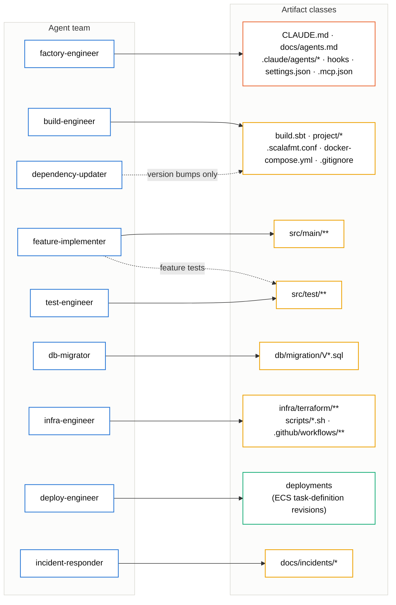
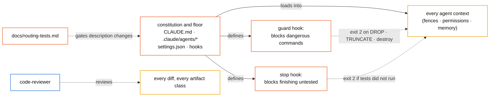
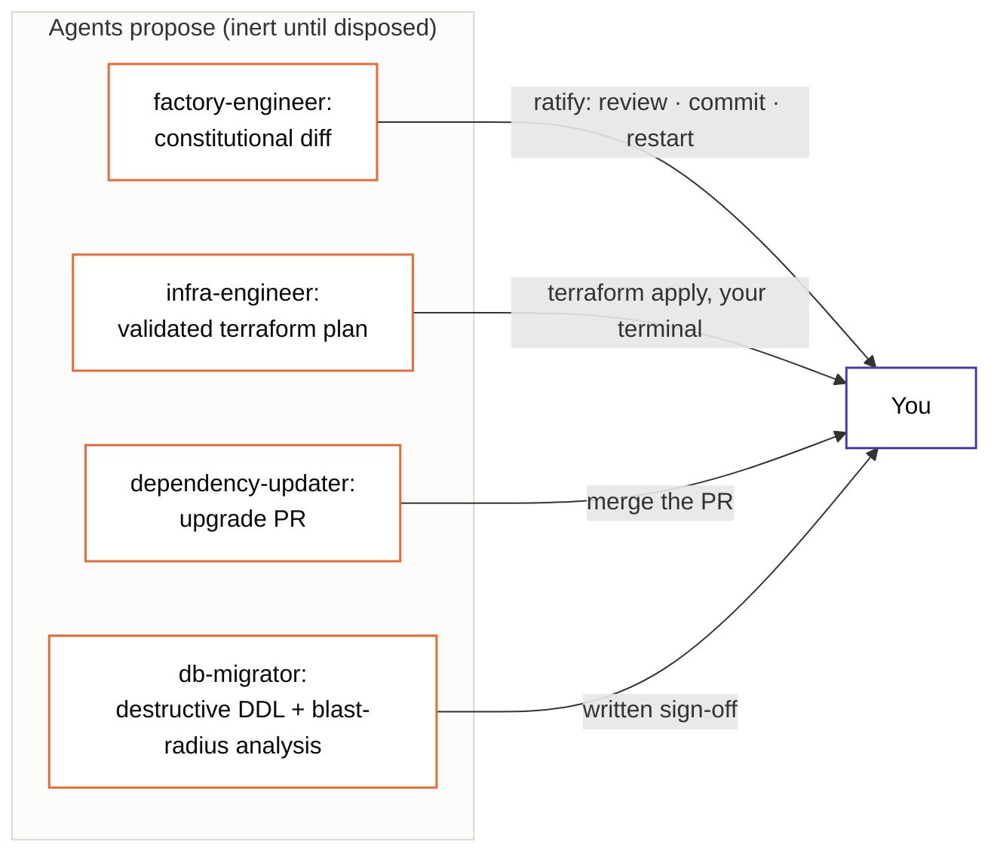
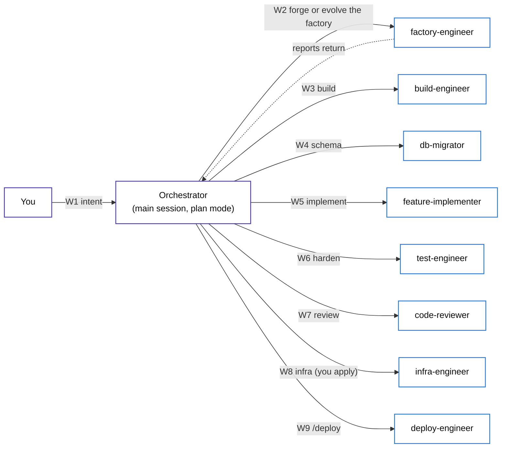
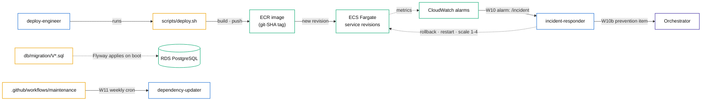

# AgenticScalaAppTutorial

A self-contained, step-by-step tutorial in which Claude Code agents create an entire Scala 3 three-tier web application from scratch: the build definition, all source code, tests, database schema, AWS infrastructure, and CI pipelines. You, the reader, write no application files. You run commands, give prompts, review, and ratify. Every step below states the exact command or prompt to use, what the agent does, and which line of which agent file causes it to do that.

The example application is called TaskForge: a task manager with an http4s web tier, a pure business-logic tier on cats-effect IO, and a doobie/PostgreSQL data tier, using upickle for all JSON, packaged by sbt-native-packager, and deployed on AWS ECS Fargate behind an ALB with RDS PostgreSQL.

## Table of contents

- [1. What you will build](#1-what-you-will-build)
- [2. How agent instructions become actions](#2-how-agent-instructions-become-actions)
- [3. Prerequisites and Session 0](#3-prerequisites-and-session-0)
- [4. The authority matrix](#4-the-authority-matrix)
- [Phase 0: the seed agent](#phase-0-the-seed-agent)
- [Phase 1: the factory builds the factory](#phase-1-the-factory-builds-the-factory)
- [Phase 2: build-engineer creates build.sbt and the project skeleton](#phase-2-build-engineer-creates-buildsbt-and-the-project-skeleton)
- [Phase 3: the domain and the wire format](#phase-3-the-domain-and-the-wire-format)
- [Phase 4: schema and data tier](#phase-4-schema-and-data-tier)
- [Phase 5: service tier and adversarial tests](#phase-5-service-tier-and-adversarial-tests)
- [Phase 6: web tier and frontend](#phase-6-web-tier-and-frontend)
- [Phase 7: full review](#phase-7-full-review)
- [Phase 8: infrastructure and scripts](#phase-8-infrastructure-and-scripts)
- [Phase 9: first deploy](#phase-9-first-deploy)
- [Phase 10: pipelines](#phase-10-pipelines)
- [11. After genesis: the operating loops](#11-after-genesis-the-operating-loops)
- [Appendix A: the seed agent file](#appendix-a-the-seed-agent-file)
- [Appendix B: the build-engineer file](#appendix-b-the-build-engineer-file)
- [Appendix C: the other eight agents at a glance](#appendix-c-the-other-eight-agents-at-a-glance)
- [Appendix D: troubleshooting](#appendix-d-troubleshooting)

## 1. What we will build

In this tutorial we explain how to create the following components.

1. An agent system (the "factory"): ten Claude Code subagents, a project memory file, three safety hooks, a permission policy, and MCP server wiring. All of it lives in ordinary files in the repository.
2. The application, produced by that agent system phase by phase: build definition, domain model, database schema and access layer, business rules, HTTP API and browser frontend, test suites, Terraform for AWS, deploy scripts, and GitHub Actions workflows.

The ten agents and what each one owns:

| Agent | Creates and owns |
|---|---|
| factory-engineer | the agent system itself: CLAUDE.md, .claude/agents/*, hooks, settings, .mcp.json |
| build-engineer | build.sbt, project/*, .scalafmt.conf, docker-compose.yml, .gitignore |
| feature-implementer | application source under src/main and its feature tests |
| test-engineer | adversarial tests under src/test |
| code-reviewer | nothing; it reviews everything (it has no write tools) |
| db-migrator | Flyway migrations under src/main/resources/db/migration |
| infra-engineer | infra/terraform, scripts/*.sh, .github/workflows |
| deploy-engineer | deployments (it runs scripts it does not author) |
| incident-responder | diagnosis and incident reports in docs/incidents |
| dependency-updater | version numbers in the build's version ledger, on a weekly schedule |

The rule that makes the whole design work: every artifact class has exactly one owning agent, and an agent asked to touch another agent's artifact declines and names the owner. You will see this rule fire in practice in [Phase 1](#phase-1-the-factory-builds-the-factory), probe 3.

## 2. How agent instructions become actions

The AI agentic system is shown in five small diagrams: ownership, the floor and its
standing gates, proposal and disposal, the operational workflow, and the runtime paths
with their feedback loops. Node border colors identify the kind of node (violet: human
side; blue: agent; orange: constitution and floor; amber: repository artifact; green: AWS
runtime); fills stay neutral. Solid arrows mean creates, owns, or executes; dashed arrows
mean gates, reads, or bounded writes. A rendered version of all five is agent-graph.html.

#### Ownership: one writer per artifact class

Each agent's solid arrow points at the one artifact class it creates and owns. The two
dashed arrows are the only bounded exceptions: version bumps into the build ledger, and
the tests an implementer ships with its own feature.



The code-reviewer is absent here on purpose: it owns nothing, which is its design (no
write tools). It appears in the next diagram, where its work lives.

#### The floor and the standing gates

What constrains every change, all the time, regardless of who makes it. The constitution
and floor load into every agent context; the two hooks act on every tool call and every
attempt to finish; the code-reviewer reads every diff; the routing test corpus gates every
description change.



#### Proposal and disposal: what agents produce, what only you enact

Every irreversible or authority-changing act is split in two: an agent produces an inert
proposal, and a specific human action turns it into reality. If you do nothing, nothing
takes effect.



#### The operational workflow

The numbered delegation order. W1 to W9 is the build and release path; every agent's
report returns to the orchestrator (drawn once as the reports edge). The two standing
loops, W10 and W11, are in the next diagram where their triggers live.



#### Runtime paths and the two feedback loops

How repository artifacts become a running system, and how the running system feeds work
back: alarms drive the incident path (W10), and the weekly cron drives maintenance (W11).



Reading the five together: diagram 1 is the one-writer rule; diagram 2 is what no change
can escape; diagram 3 is where human authority concentrates; diagram 4 is the order work
flows; diagram 5 is how the deployed system pulls the loop closed by generating the next
round of work. We need this mental model before Phase 0, because every "what happens" section later refers to it. 

### There are five mechanisms.

Mechanism 1: routing by description. A subagent is one markdown file in `.claude/agents/<name>.md` with YAML frontmatter. When your prompt says "Use the build-engineer agent to create the sbt build", Claude Code looks up the agent by name; when your prompt merely describes work ("set up the build for this project"), Claude Code matches your words against every agent's `description` field and picks the best fit. This is why every description in this project contains the phrase "Use for ..." followed by trigger words: descriptions are routing patterns , not documentation. More discussion on maximizing routing efficacy is  in [Appendix E](#appendix-e-routing-in-meaning-space).

The first hard rule: write the description in the vocabulary of arriving tasks. Routing is word matching, so the words must be the ones a request will actually contain. A request will say "add a dependency", "set up the build", "the deploy failed", "alarm is firing"; it will not say "leverage build lifecycle expertise". Compare a description that routes, e.g., "Creates the sbt build and project scaffolding FROM SCRATCH... Use for ANY change to build.sbt, project/*, .scalafmt.conf..." with one that does not, e.g., "Responsible for build engineering excellence and project setup best practices and DEI affirmative actions". The second is not wrong as prose; it is wrong as a pattern, because none of its words appear in real requests. A useful drafting technique is to write five requests you expect this agent to receive, then check that every content word those requests share appears in the description.

When we sit down to write a description, the natural instinct is to write it from the agent's point of view, like a professional bio or a job posting: "an experienced build engineer dedicated to maintainable, reproducible builds and dependency hygiene best practices." That is the agent's self-image: its identity, its expertise, its values. Every word of it may be true, and none of it routes. The reason is mechanical: routing works by matching the words in an incoming request against the words in each description. A real request says "add upickle to the project" or "the build is broken" or "bump sbt". Now check the overlap: "add upickle to the project" shares zero content words with "experienced engineer dedicated to maintainable builds." The description and the requests it is supposed to catch live in different vocabularies, so the match fails, or worse, some other agent whose description happens to share a stray word wins.

The correction is to write the description from the requester's point of view instead: as a catalog of the requests this agent should receive. "Use for ANY change to build.sbt, project/*, .scalafmt.conf, docker-compose.yml" is written entirely in request vocabulary; the file names in it are the very tokens that appear in real prompts. Notice that this version says nothing about the agent's qualities at all. It doesn't need to. Identity, standards, and expertise belong in the body of the agent file, where they shape how it works once invoked; the description's only job is to get it invoked at the right moments.

A test that makes the distinction concrete: cover the agent's name and read only its description. If what you can answer is "what kind of professional is this?", you wrote *self-image*. If what you can answer is "which of my next ten requests should land here?", you wrote a routing pattern. The bio version fails silently, which is what makes it dangerous: the file looks polished, review approves it, and weeks later you notice that build-related requests keep landing on the feature-implementer because "set up the build" matched nothing better.

The second hard rule: include an explicit trigger clause beginning "Use for" or "Use when", and make it strict. This clause is not decoration; it is the part of the description that resolves the case where several agents plausibly relate to a task. "Use for ANY change to build.sbt" wins the routing contest against feature-implementer for a request like "add upickle to the project", because that request is about the build file even though it sounds like feature work. When the trigger condition has degrees, state the strict version: "ANY schema change", "before EVERY commit or PR". A soft trigger ("use for significant schema changes") reintroduces a judgment call at routing time, and routing is exactly the place where you do not want the model exercising judgment about its own jurisdiction.

The third hard rule: name concrete artifacts, not categories. File names, paths, and globs are the highest-precision routing tokens available, because they appear verbatim in requests and in no other agent's description. "build.sbt", "project/*", "V*.sql", "infra/terraform", ".github/workflows": each of these words routes better than any abstract phrase could. When two agents share a category, artifact names are what keep them apart; "database work" is ambiguous between db-migrator and incident-responder, but "authors Flyway migrations" and "reads pg_stat_activity during incidents" are not.

The fourth hard rule: every boundary must be stated from both of its sides, including the carve-outs. If build-engineer's description says "except pure version bumps, which belong to dependency-updater", then dependency-updater's must say "versions only; structural build changes belong to build-engineer". A boundary described from one side is half a boundary: requests that arrive phrased from the undescribed side will route wrong. This also means descriptions should carry limit signatures, sentences that say what the agent will not do: "Read-only, reports findings", "never writes application source", "never applies and never deploys". Negative sentences do real routing work, because they push borderline tasks toward the neighbor instead of letting a helpful agent accept them.

The fifth hard rule: front-load and stay short. The first sentence must carry the match on its own, because it is the sentence a router weighs most and the one a human skims. Everything past three or four lines belongs in the agent body, not the description; the description is loaded for routing on every delegation decision, for every agent, so bloat there taxes every decision. A corollary: the description must never contain procedure ("first inspect the schema, then...") or per-project state ("currently migrating to V7"); the first belongs in the body, the second in task text, and both kinds of misplaced content rot into routing noise.

The rule says the following, basically: if you deleted everything after the first sentence, routing should still work. Here are worked examples, each showing a buried version, why it fails, and a front-loaded fix. In every pair, both versions contain the same information; only the position changes.

Example 1, the db-migrator. Buried meaning violates the rule in the following command.

```yaml
description: PostgreSQL is the system of record for TaskForge and its schema evolves under strict discipline.
  Changes follow the expand/contract pattern to stay compatible with rolling deploys. 
Use this agent for any schema change: it authors Flyway migrations and checks them against the live schema.
```

The routing payload ("use for any schema change", "Flyway migrations") sits in sentence three. Sentence one is scene-setting: true, and useless as a pattern, because no request will ever phrase itself as "PostgreSQL is the system of record". A router weighing openings, or a human skimming ten descriptions in a list, reads "PostgreSQL... schema evolves under discipline" and files this agent as something vaguely database-flavored; a request like "add a priority column to tasks" can now drift to the feature-implementer, whose own opening mentions implementing changes. Front-loaded is the following command.

```yaml
description: Owns the PostgreSQL schema. Use for ANY schema change - authors
  Flyway migrations, checks them against the live schema via the postgres MCP
  server, and coordinates expand/contract rollouts so deploys stay zero-downtime.
```

Sentence one is the ownership claim; the trigger clause follows immediately. Truncate after the first sentence and "add a column to tasks" still routes correctly.

Example 2, the incident-responder. Buried meaning that violates the rule is the following command.

```yaml
description: Production reliability depends on fast, evidence-based diagnosis.
  This agent follows a strict triage order across ECS, logs, database, and the
  load balancer, and escalates anything touching data. Use it when alarms fire,
  smoke tests fail, or 5xx rates spike.
```

The opening is a mission statement. The words a real request contains ("alarm", "5xx", "smoke test failed", "degraded") appear only at the end. A request typed at 3 a.m. reads "the 5xx alarm is firing"; the description whose opening contains "alarms fire... 5xx rates spike" wins instantly, while the mission-statement version competes on a fuzzy notion of reliability that the deploy-engineer's description also radiates. Front-loaded:

```yaml
description: On-call diagnostician. Use when alarms fire, smoke tests fail,
  5xx rates spike, or the service is degraded. Reads CloudWatch logs/metrics
  and ECS state, forms a hypothesis, proposes remediation within limits.
```

Example 3, the build-engineer, where burying is most tempting because the agent has a philosophy. Buried meaning that violates the rule is the following command.

```yaml
description: 
 The build definition is policy made diffable: every version,
  alias, and packaging decision must live in one obvious place. This agent
  enforces that discipline. Use it for any change to build.sbt, project/*,
  .scalafmt.conf, or Docker packaging, except version bumps.
```

"Policy made diffable" is a fine sentence; it lives in the agent's body in the actual repo, as the role line. Put first in the description, it spends the highest-weight position on words ("policy", "diffable", "discipline") that appear in zero requests. Meanwhile "add upickle to the project" needs to hit "build.sbt" early. Front-loaded, the actual command is below.

```yaml
description: Creates the sbt build and project scaffolding FROM SCRATCH and
  owns their structure thereafter. Use for ANY change to build.sbt, project/*,
  .scalafmt.conf, docker-compose.yml, .gitignore, or Docker packaging - except
  pure version bumps, which belong to dependency-updater.
```

Example 4, the failure mode where sentence one is actively misleading rather than merely empty. Buried meaning that violates the rule is the following command, wrong-footed.

```yaml
description: Works closely with the deploy pipeline and understands the full release process end to end. 
  - Maintains the dependency tree: use on the weekly schedule or when a CVE advisory lands; bumps versions in the build ledger.
```

Here the opening does carry match weight, but for the wrong agent: "deploy pipeline", "release process" are the deploy-engineer's vocabulary. A request like "prepare the release" now has two candidates whose openings both mention releases, and the updater can win work it must refuse. This is worse than an empty opening, because it manufactures a collision that neither full text implies. Front-loaded correctly:

```yaml
description: Keeps build.sbt dependencies and base images current and CVE-free.
  Use on a weekly schedule or when a security advisory lands. Produces one
  reviewed, tested upgrade PR at a time.
```

The general test, which you can apply mechanically to all ten descriptions at once: truncate every description to its first sentence and re-run the routing corpus from `docs/routing-tests.md`. Rows that pass on full text but fail on truncated text are telling you exactly which descriptions lean on buried content. The two audiences in the rule reward the same fix, which is what makes it a hard rule rather than taste: the router weighs openings most, and the human choosing an agent from a listing reads exactly one line per agent before deciding. Sentence one is the only text both audiences are guaranteed to consume, so it must be the routing pattern; everything after it is elaboration for whoever keeps reading.

The sixth hard rule: audit the set, then test it empirically, and fix failures in the description rather than in your prompts. The collision audit: write ten realistic requests, assign each to an agent by hand, then check that no request's wording plausibly matches two descriptions; where it does, sharpen the trigger clauses until exactly one wins. The orphan audit: check that every lifecycle stage's natural vocabulary appears in some description; a stage that matches nothing will be handled inline by the orchestrator, which means by nobody with laws. Then probe live: phrase a request without naming any agent and see who picks it up. If the wrong agent answers, the temptation is to just name the right agent in future prompts. Resist it; explicit naming is a workaround that lives in your head, while a corrected description is a fix that works for every future session, every teammate, and every scheduled run where nobody is present to name anyone.

Mechanism 2: the fresh context. When an agent is invoked, the runtime assembles a new context containing three things only: the agent file's body (which becomes its system prompt), the project memory (CLAUDE.md plus files it imports), and your task prompt. The agent does not see your conversation, other agents' work, or its own previous runs. Consequence: anything an agent must always know has to be in its file or in CLAUDE.md, and anything one agent must tell another has to travel through your prompts (you paste report text forward). For dependencies between agents read [Appendix F](#appendix-f-dependencies-between-agents-the-blocked-on-protocol).

Mechanism 3: the tool fence. The frontmatter `tools:` list is enforced by the runtime. The code-reviewer's list contains no Edit and no Write, so it cannot modify files no matter what anyone types. When a phase below says "the agent cannot do X", this is usually the mechanism.

Mechanism 4: the instruction hierarchy inside the file. Each agent body in this project has five sections, and each section drives a different observable behavior.

| Section in the agent file | Behavior you will observe |
|---|---|
| role line | how the agent defines success (for example, deploy-engineer treats "script exited 0" as not done) |
| iron laws | constraints it applies without being asked in the prompt (versions as named vals, migrations never edited) |
| procedure | the order of its tool calls, ending in a verification command |
| boundaries | refusals that name another agent instead |
| report | the structure of the text it returns to you |

The phase walkthroughs below point at specific laws by number, so you can open the agent file and see the exact sentence that caused the behavior. The five are the required functions, not a cap on headings. The honest rule: every agent body must serve five functions (identity, constraints, sequence, boundaries, contract), and may add more sections only when the role's shape demands them. In fact the project's own ten agents already demonstrate this: several of them have headings beyond the canonical five, and each extra heading is there for a nameable reason. Walking through them gives you the complete list of justified additions.

*Preconditions*. The deploy-engineer has a section the implementer does not: "Preconditions (verify, don't trust)". It exists because that agent guards an irreversible, expensive act, so it needs an explicit entry gate that runs before the procedure proper: clean tree, green check, no pending destructive migration. Structurally it is a specialization of the procedure (step zero), but giving it its own heading changes behavior: a titled section is harder for the model to skim past than a first bullet. Add this section to any agent whose action is irreversible or costly to retry; omit it everywhere else, because an implementer that re-verifies the world before every small edit is just slow.

*Scope*. The dependency-updater has a "Scope" section ("you move VERSIONS only; structural build changes belong to build-engineer"). It exists for exactly one reason: two agents share one file. When artifact ownership splits inside a single file (the version ledger versus the structure of build.sbt), the boundary cannot be expressed as file paths, so it needs its own section drawing the line in terms of intent. If your ownership map never splits within a file, you never need this section.

*Cautions, or tripwires*. The dependency-updater's "Cautions specific to this stack" section (doobie RC imports move; http4s milestones are banned; upickle majors trip JsonCodecSuite) is accumulated scar tissue, and it is the one section designed to grow over time: every incident adds a line. It is warranted for two role types: maintenance agents that run unattended (no human present to supply context), and any role whose domain has recurring, nameable traps. For other agents the same content lives inside the iron laws; a separate section is justified when the list is open-ended rather than fixed.

*Mission with enumerable categories*. The test-engineer opens with "Mission" instead of a bare role line: find what the implementation missed, then four enumerable categories (boundaries, illegal transitions, malformed input, concurrency). This is the role line expanded, and the expansion is warranted specifically for adversarial or search roles, where the job is enumeration and adjectives ("write good tests") produce nothing. If the role's output is a search result, give it the search taxonomy as a section.

*Renamed variants that are not additions at all*. The incident-responder's "Triage order" is its procedure; its "Rules of engagement" are its iron laws. Heading names should fit the role's own vocabulary; the audit that matters is functional, not typographic. When you review an agent file, do not check that the headings match the template; check that every sentence in the file serves one of the functions: identity, constraint, sequence, boundary, or contract. A sentence serving none of them is channel misplacement (per-task state, another agent's procedure, general API reference), and it goes.

Two additions that recent work layered on, both extensions of existing functions rather than new ones: the BLOCKED-ON block extends the report contract (every agent, one ratified change), and a routing-tests law extends the factory-engineer's constraints. That is the normal way the skeleton evolves: the five functions stay fixed; their contents grow.

One genuine candidate for a sixth function that this project deliberately does not use: worked examples (few-shot output samples inside the body). They help when an agent's report format is intricate and precision matters more than length; they cost heavily against the size budget, and a schema-like contract usually suffices. Reach for an example section only after a contract-phrased report has failed twice.

The economic rule that keeps all of this honest: the length budget is fixed even though the section list is not. An agent body stays around sixty lines; adding a Preconditions or Cautions section should usually be paid for by tightening something else, because six sections competing for salience weaken each other exactly the way ten iron laws do. So: five functions always, entry gates for the irreversible, scope lines for shared files, tripwire lists for the trap-prone and unattended, taxonomies for the adversarial, and nothing else without a failure that demands it.

Mechanism 5: hooks and permissions, defined in `.claude/settings.json`. These run outside the model and cannot be talked out of anything. Three hooks matter here. The PostToolUse hook runs after every Edit or Write and formats Scala files (it always exits 0, so it never blocks). The PreToolUse hook inspects every shell command before it runs and exits 2 to block dangerous patterns such as DROP TABLE or terraform destroy; the text it prints to stderr is shown to the agent, which is why a blocked agent changes course instead of retrying. The Stop hook runs when an agent tries to finish; if Scala sources changed but the test suite has not run since (checked through a marker file that the build's `check` alias touches), it exits 2 and the agent is sent back to run `sbt check`. The permission lists in the same file pre-approve routine commands (sbt, git add/commit, terraform plan) and deny catastrophic ones (terraform apply, force-push) for everyone, agents and orchestrator alike. More information about hooks is available in [Appendix F](#appendix-f-dependencies-between-agents-the-blocked-on-protocol).

---

## Routing tests and the description expansion loop

The tutorial has treated descriptions as routing patterns and given rules for writing them. This section makes routing an engineered property like everything else in the project: measurable, regression-tested, and improved by a mechanical loop instead of by guessing.

### Why routing needs tests

The router is a model reading all ten descriptions and picking a delegate, so a description's real meaning is behavioral: a word routes if, when it appears in a request, the intended agent reliably wins. You cannot verify that by rereading the description; it seems clear to its author by construction. You can only verify it by firing requests at the router and checking who answers. Two facts make this cheap in this project. First, the ownership map gives correct labels for free: every request about an artifact class has exactly one right destination. Second, the same headless mode used by the maintenance workflow can query the router in bulk.

### The routing corpus

Create `docs/routing-tests.md`, a labeled corpus of requests. One table, three columns: the request as a user would actually type it, the agent that must win, and a note on why (which makes repairs reviewable later). Seed it with, for each agent: five realistic requests it must receive, and three near misses it must not receive (its neighbors' work, phrased temptingly). Include every real request from your own sessions that ever routed wrong, as soon as it happens.

```markdown
| Request | Expected agent | Why |
|---|---|---|
| add upickle to the project | build-engineer | dependency set is build structure |
| bump doobie to the latest RC | dependency-updater | version ledger only |
| the deploy failed, what happened | incident-responder | diagnosis, not redeploy |
| add a priority column to tasks | db-migrator | schema change, not feature code |
| make task titles searchable | feature-implementer | src/** feature work |
```

### Running the suite

For each row, ask the router to choose without doing the work, and compare against the label.

```bash
while IFS='|' read -r _ request expected _; do
  answer=$(claude -p "Given the agents defined in .claude/agents/, which ONE agent \
should handle this request? Answer with the agent name only. Request: ${request}" \
    --max-turns 1 --output-format text)
  [ "$(echo $answer | tr -d ' ')" = "$(echo $expected | tr -d ' ')" ] \
    || echo "MISROUTE: '${request}' went to '${answer}', expected '${expected}'"
done < <(tail -n +3 docs/routing-tests.md)
```

A clean run prints nothing. Run it whenever any description changes, and after any model upgrade, because the router's behavior, and therefore every description's effective meaning, is relative to the model doing the routing.

### The expansion loop

When the suite reports misroutes, repair by expansion, one discriminating phrase at a time. The loop consists of the following steps.

1. Generate. For each agent, have a plain session generate a fresh batch of paraphrased requests it should and should not receive. Add them to the corpus with labels from the ownership map.
2. Route. Run the suite; collect misroutes.
3. Repair, discriminatively. For each misroute, find the smallest phrase that flips the decision and add it to the correct agent's description. Prefer artifact names and paths (build.sbt, V*.sql, infra/terraform); their collision risk is near zero. If the wrong winner was a neighbor, add the matching exclusion to the neighbor's description in the same change ("except pure version bumps, which belong to dependency-updater"). Boundaries are always repaired from both sides at once.
4. Check for regressions. A term added for one request must not flip any other row. The suite is the check.
5. Iterate. Stop when a full fresh batch of generated paraphrases produces no new misroutes. That is the fixpoint: not a mathematical guarantee, but an empirical one, and it is re-checked every time the corpus grows.

Three regularizers keep the loop convergent instead of oscillating. Keep each description under its length budget, so repair must choose the best phrase rather than accumulate all phrases. Never add a term that names another agent's artifacts. And never repair by editing prompts instead of descriptions; a prompt workaround fixes one session, a description fix routes correctly for every future session, teammate, and scheduled run.

The loop is a hybrid by design, and the split follows the same principle as everything else in the project: measurement is mechanized, judgment is delegated to an agent, and disposal stays gated by a human. Some steps are code you can run in CI; some are LLM work you delegate; two must never be automated because they are constitutional. Here is the step-by-step assignment.

| Loop step | Performed by | Automated? |
|---|---|---|
| 0. Add a failing row when a real misroute is observed | the human who saw it (via factory-engineer, since the corpus is governance territory) | manual by nature; the trigger is an observation |
| 1. Generate paraphrase batches and hard negatives | a plain session or the factory-engineer, prompted; labels come mechanically from the ownership map | LLM work; can be scheduled |
| 2. Route the corpus and score it | the runner script (headless claude -p per row) | fully automated |
| 3. Repair descriptions | factory-engineer prepares the edit; the human ratifies | never fully automated; constitutional |
| 4. Regression check after each repair | the same runner over the whole corpus | fully automated |
| 5. Declare the fixpoint, accept residual misroutes, schedule re-runs | the human | judgment; stays manual |

The reasons behind the three categories, because they generalize.

Steps 2 and 4 are pure measurement: a script feeds each request to a headless session and compares the answer to the label. Nothing about this needs a person, and everything about it benefits from being boring and repeatable. The natural home is a CI job triggered when anything under .claude/agents/ or docs/routing-tests.md changes, so a description edit that breaks routing cannot merge, exactly as a code edit that breaks tests cannot. One operational caveat: each row costs one model call, and the router is mildly stochastic. Run each row once; do not retry failures until they pass, because a row that flickers is telling you its margin is thin, which is information you want surfaced (flag it), not noise you want suppressed.

Step 1 is LLM work but not constitutional: generating twenty paraphrases and five boundary-crossing hard negatives per agent is exactly what a model is good at, and the labels attach mechanically because the ownership map decides them, not the generator. You can run this on demand before a repair session, or put it on the weekly clock next to the dependency audit: a scheduled headless job that generates a fresh batch, routes it, and opens an issue or PR listing any misroutes with suggested rows to add. That is safe unattended work because it only ever proposes.

Step 3 is where automation must stop, for a reason the project has already committed to: descriptions live in .claude/agents/, every change there is constitutional, and the factory-engineer's own law says nothing it writes takes effect without human ratification. So the repair flow is: the runner (or the scheduled job) reports misroutes; you hand them to the factory-engineer as a work order ("these five rows misroute; propose description repairs per the meaning-space rules: artifact-name re-anchoring or contrastive sentences, both sides of each boundary"); it prepares the diff, runs the regression check as its verification tail, and stops; you ratify and restart. An automated pipeline that edits descriptions and merges them on green would be optimizing the router's behavior with no human in the loop, which fails the worst-possible-moment test from the safety section: descriptions steer which agent gets invoked, so silently drifting descriptions are silently drifting authority.

Step 5 stays with you for a quieter reason: the stopping rule ("a fresh generated batch produces no new misroutes") and the tolerance decision ("this residual row is inherently ambiguous; we accept it and route it explicitly when it occurs") are quality judgments about how much routing precision the team needs, and they trade against corpus size and run cost. A rule of thumb for cadence: run the suite automatically on every description diff; regenerate a fresh batch and do a full loop pass after any model upgrade, after adding an agent, and otherwise about quarterly; and add observed misroutes as failing rows the moment they happen, regardless of schedule.

Compressed to one sentence, the loop's instruments are scripts, its labor is an agent's, and its two irreversible acts (changing a description, declaring the fixpoint) are a human's; automate the first fully, schedule the second freely, and never automate the third.

### Wiring it into the factory

Description changes are constitutional, so the loop belongs to the factory-engineer. Add one law and one verification step to its file (through the factory-engineer itself, ratified as usual).

```markdown
6. Descriptions are tested artifacts: any change to a description must keep
   docs/routing-tests.md green, and every repaired misroute adds its request
   to that corpus first, as a failing row, before the description changes.
```

```markdown
6. Verify routing: run the routing suite against docs/routing-tests.md and
   report the pass count and any misroutes with the repair applied for each.
```

The pattern should look familiar: the failing row lands first, then the fix, exactly like the test-engineer's failing-test handoff. Descriptions get the same treatment as code because they are code: parameters of a stochastic router, with a test suite pinning the behavior you have paid to get right.

The file is `.claude/agents/factory-engineer.md`, the factory-engineer's own definition. Concretely, the two snippets slot into the two existing numbered sections of that file, and their numbering was chosen to continue those sections.

The first snippet (starting "6. Descriptions are tested artifacts...") appends to the `## Iron laws` section, which currently ends at law 5 (the floor invariants). After the edit, the section reads laws 1 through 6, with law 6 binding every future description change to the routing corpus: the suite must stay green, and a repaired misroute lands in `docs/routing-tests.md` as a failing row before the description changes.

The second snippet (starting "6. Verify routing: run the routing suite...") appends to the `## Procedure` section, which currently ends at step 5 (the report). After the edit, the procedure has a sixth step: its verification tail now includes running the routing suite and reporting pass counts and repairs. This gives the factory-engineer what it previously lacked and every other agent already had: a mechanical check at the end of its own procedure that its work (in this case, descriptions) actually behaves.

And note the deliberately recursive part of the instruction: because that file lives under `.claude/`, editing it is itself a constitutional change, which by the ownership map belongs to the factory-engineer. So the way you make this edit is to delegate it to the factory-engineer ("add law 6 and procedure step 6 by pasting the two snippets"); it edits its own definition, presents the diff, and stops; you ratify with commit plus session restart, after which the new law governs its next invocation. The agent amending its own constitution under human ratification is the normal evolution path for every file in `.claude/agents/`, including this one.

---

That's the full section; it slots naturally either after Phase 1 (whose probes it generalizes) or as a numbered section before the appendices, with a TOC entry like `- [Routing tests and the description expansion loop](#routing-tests-and-the-description-expansion-loop)`.

## 3. Prerequisites and Session 0

Session 0 is the only part of this tutorial where you do setup work yourself. Everything is a shell command; run them in order.

Check the toolchain (install anything missing; use an AWS sandbox account, never production):

```bash
java -version          # Java 21 (Temurin recommended; matches the Docker base image)
sbt --version          # sbt 1.11.x
docker version
terraform -version     # >= 1.7
uvx --version          # uv; runs the awslabs MCP servers
node --version         # 18+; runs Claude Code
aws sts get-caller-identity   # MUST print the sandbox account id
```

Install and verify Claude Code:

```bash
npm install -g @anthropic-ai/claude-code
claude --version
```

Create the Terraform state store. This is the one chicken-and-egg AWS step: Terraform cannot create the bucket its own state lives in. Choose a globally unique bucket name and remember it for [Phase 8](#phase-8-infrastructure-and-scripts):

```bash
aws s3api create-bucket --bucket <unique>-tfstate --region us-east-1
aws s3api put-bucket-versioning --bucket <unique>-tfstate \
  --versioning-configuration Status=Enabled
aws dynamodb create-table --table-name taskforge-tflock \
  --attribute-definitions AttributeName=LockID,AttributeType=S \
  --key-schema AttributeName=LockID,KeyType=HASH --billing-mode PAY_PER_REQUEST
```

Create the empty repository:

```bash
mkdir taskforge && cd taskforge && git init
```

Two standing conventions for every phase that follows:

1. One phase, one session, one commit. Start each phase with a fresh `claude` session (or `/clear`). Commit at the end of each phase with the message given in that phase. The git log becomes the build diary.
2. Reports travel by paste. When a phase says "paste the previous report", copy the agent's final report text into the new prompt. Mechanism 2 above is the reason: the next agent cannot see it otherwise.

## 4. The authority matrix

This table is the design of the whole agent system, written before any agent exists. In [Phase 1](#phase-1-the-factory-builds-the-factory) you will hand it, serialized into a prompt, to the factory-engineer, which transcribes it into the nine remaining agent files. Keep it: when you later review any change to an agent file, this is what you diff against.

| Agent | May do autonomously | Must never | Must escalate | Enforced by |
|---|---|---|---|---|
| factory-engineer | draft .claude/**, CLAUDE.md, .mcp.json | self-ratify; widen a fence without a matrix change | every constitutional diff, to you | instruction + your ratification gate |
| build-engineer | create and restructure the build files | write app source; bump versions; touch infra | resolver failures; new env inputs | instruction + reviewer + sbt check |
| feature-implementer | edit src/**; run sbt | deploy; migrations; build.sbt; .claude | schema needs; dependency needs | tool fence (no cloud tools) + instruction |
| test-engineer | add tests under src/test | touch production code; bend a red test | production bugs it finds | instruction + reviewer detection |
| code-reviewer | read everything; run sbt as evidence | edit anything | nothing (it only reports) | tool fence: no Edit/Write |
| db-migrator | author new V*.sql; inspect live schema read-only | edit applied migrations | destructive DDL, to you | fence (read-only DB tool) + guard hook |
| infra-engineer | author terraform/scripts/workflows; plan and validate | terraform apply; run deploys | stateful-resource replacement | deny rule (apply) + instruction |
| deploy-engineer | run deploy/rollback/smoke scripts; watch ECS | deploy on red; force anything | repeated gate failures | permission denies + scripts' own gates |
| incident-responder | diagnose; restart; rollback; scale 1 to 4 | data repair; schema rollback | data/schema/security, with a dossier | read-only tools + instruction + timebox |
| dependency-updater | patch/minor version bumps plus sbt check | major bumps; forcing a red build | majors, with written analysis | instruction + CI + your merge gate |

## Phase 0: the seed agent

Goal: exactly one file exists at the end of this phase, `.claude/agents/factory-engineer.md`. It is the only agent file a plain session ever writes; every other agent will be written by this one. This resolves the bootstrap question (who builds the agents?) with a two-step seed: a plain session writes the seed, you ratify it, and from then on the factory builds the factory.

Here is the expanded Phase 0, paste-ready. It replaces everything from `## Phase 0: the seed agent` down to (but not including) `## Phase 1: the factory builds the factory`. The heading is unchanged, so the table-of-contents link keeps working.

---

## Phase 0: the seed agent

Goal: exactly one file exists at the end of this phase, `.claude/agents/factory-engineer.md`. It is the only agent file a plain session ever writes; every other agent will be written by this one. This resolves the bootstrap question (who builds the agents?) with a two-step seed: a plain session writes the seed, you ratify it, and from then on the factory builds the factory.

Step 0.1. Confirm the starting state. You are in the repository created at the end of Session 0. Check where you are and what exists:

```bash
pwd
ls -la
```

Expected output: the path ends in `/taskforge`, and the directory contains nothing but git's own bookkeeping:

```text
/home/you/taskforge
total 12
drwxr-xr-x  3 you you 4096 .
drwxr-xr-x 21 you you 4096 ..
drwxr-xr-x  7 you you 4096 .git
```

No CLAUDE.md, no .claude directory, no source. This emptiness matters for what happens next: when Claude Code starts here, there is no project memory to load, no agents to route to, no hooks, and no permission lists. The session you are about to run is the only one in this entire tutorial that operates with none of the factory around it.

Step 0.2. Start Claude Code in this directory:

```bash
claude
```

What you will see: the interactive prompt opens, showing the working directory. If this is the first time Claude Code runs in this folder, it asks whether you trust the files in it; confirm. If you want to verify the empty starting state from inside, ask "what agents are available?" and expect only the built-in general-purpose behavior, with no project agents listed, because `.claude/agents/` does not exist yet.

Step 0.3. Give the seed prompt, verbatim:

> Create exactly one file, `.claude/agents/factory-engineer.md`, and nothing else: an agent whose job is to create and maintain the agent system itself (CLAUDE.md, docs/agents.md, all .claude/agents/*, hooks, settings.json, commands, .mcp.json) from an authority matrix. Frontmatter: name factory-engineer; a routing-grade description ("Creates and maintains the agent system itself FROM SCRATCH... prepares constitutional diffs; never self-ratifies"); tools Read, Grep, Glob, Write, Edit, Bash. Body iron laws: (1) transcribe the authority matrix, never widen a fence or soften a law unless the matrix changed first; (2) every .claude/** change is constitutional: full diff plus justification, in force only after human ratification and restart, never self-approved; (3) least privilege by default: no omitted tools fields, MCP read-only at server level, reviewer-class agents get no write tools; (4) channel discipline: timeless role files, universal facts to CLAUDE.md (at most 150 lines, at most 8 hard rules), one-run detail in task text; (5) floor invariants that may never be removed (guard patterns, stop_hook_active check, formatter exit 0, deny rules for terraform apply/destroy, force-push, .env reads). Procedure: read matrix, author files using the five-section skeleton with collision and orphan audits, validate mechanically (json parse, bash -n, chmod +x), present diff and stop. Print the full file content in your reply.

Step 0.4. What happens while it runs, and why. There is no routing decision here: no agents exist, so the plain session executes the instruction itself rather than delegating. It will propose one Write tool call, creating `.claude/agents/factory-engineer.md`. Because no `settings.json` exists yet, there is no allow list, so the CLI shows you an interactive approval prompt for that file creation; approve it. Nothing else fires: no PostToolUse formatter (no hooks exist), no Stop-hook check (no marker machinery exists). The session then prints the complete file content in its reply, because the prompt's last sentence demanded it; that printed copy is what you review in the next step without having to open the file. Note why this prompt is so much longer than every prompt that follows it: it must carry both the specification and the discipline, because there is no agent file yet to carry the discipline. From Phase 1 on, prompts shrink to specifications only.

What we see is the exact mechanics of how the model changes anything on your machine. The model itself cannot change your filesystem, it can only produce text. Claude Code turns some of that text into effects through a fixed set of tools: Read, Write, Edit, Bash, Grep, and so on. When the model wants to create a file, it does not somehow write bytes to disk; it emits a structured request, essentially a small typed message that says "invoke the tool named Write with these parameters":

```text
Write(
  file_path: ".claude/agents/factory-engineer.md",
  content: "---\nname: factory-engineer\ndescription: Creates and maintains...\n..."
)
```

That structured request is a tool call, and one Write call carries the complete file: the path and the entire content in a single invocation (as opposed to creating an empty file and growing it with many Edit calls). "One Write tool call" in the Phase 0 text means exactly that: the seed prompt's whole output is a single such request creating the one file whole.

Emitting the request does not execute it, since the request goes to the Claude Code runtime, which decides what happens next, in three possible ways. If a permission rule in settings.json pre-approves this kind of call, the runtime executes it immediately. If a deny rule matches, the runtime refuses it, full stop. If neither matches, the runtime pauses and shows you an interactive approval prompt in the terminal, something shaped like:

```text
Claude wants to create a file:
  .claude/agents/factory-engineer.md    (56 lines)
[y] approve   [n] reject   (view diff)
```

Only when you approve does the runtime actually perform the write. Then it hands a result message back to the model ("file created"), and the model continues from there. So the full cycle is: model proposes, runtime consults permissions and hooks, human approves where required, runtime executes, result returns to the model. The model sits at the start of that chain and never at the end of it, which is why "propose" is the accurate verb everywhere in the tutorial: agents propose tool calls; the floor and you dispose of them.

In Phase 0 specifically, the reason you are told to expect the interactive prompt is the empty starting state: no settings.json exists yet, so there is no allow list to pre-approve the write and no deny list to block anything. Every tool call in that session falls into the third case and comes to you for manual approval. That is also a nice one-time glimpse of the machinery: you see the raw approval flow exactly once, in the seed session, and then Phase 1 creates the permission lists that make routine calls (sbt, git add, file edits during genesis) flow without prompting while catastrophic ones become impossible. The same cycle is what the hooks instrument: PreToolUse runs after the model proposes and before the runtime executes (that is where the guard can exit 2 and block), and PostToolUse runs after execution (that is where the formatter fires). The tool call is the unit that the entire deterministic floor operates on.

One more concrete detail worth knowing: everything an agent does is a sequence of these calls, visible in the transcript as it runs. When Phase 2 says the build-engineer "Writes the six files, then runs sbt Test/compile", what you literally watch in the terminal is six Write proposals followed by a Bash proposal with `command: "sbt Test/compile"`, each passing through the same propose, gate, execute, return cycle.

Step 0.5. Verify the on-disk state. In the session, or from a second terminal in the same directory:

```bash
find . -type f -not -path './.git/*'
```

Expected output, exactly one line:

```text
./.claude/agents/factory-engineer.md
```

If more files appear (a README, a CLAUDE.md the session helpfully added), that is the helpfulness-bias failure mode: the prompt said "and nothing else", and anything else gets deleted now, in-session ("remove every file except .claude/agents/factory-engineer.md"). Then check the file's shape:

```bash
head -8 .claude/agents/factory-engineer.md
wc -l .claude/agents/factory-engineer.md
```

Expected: the first line is `---`, followed by `name: factory-engineer`, a multi-line `description:`, a `tools:` line, and a closing `---`; total length roughly 50 to 60 lines. The two `---` fence lines are load-bearing: malformed frontmatter is the most common reason an agent silently fails to load later.

Step 0.6. Your gate, the first constitutional review. Compare the file line by line against [Appendix A](#appendix-a-the-seed-agent-file). Wording may differ; substance may not. The specific checks, in order of importance: the `tools:` line reads exactly `Read, Grep, Glob, Write, Edit, Bash` (no MCP names, nothing omitted); law 2 contains both halves, ratification-before-effect and never-self-approved; law 5 lists the floor invariants it may never remove (guard patterns, stop_hook_active, formatter exit 0, the deny rules); the description contains "FROM SCRATCH" and "never self-ratifies"; and the boundaries name the four owners it must route to instead of acting (feature-implementer, build-engineer, db-migrator, infra-engineer). These lines are what make it safe to let this one agent write all the others; give them character-level attention.

Step 0.7. Commit and restart, so the agent loads:

```bash
git add -A
git status
```

Expected status: one new file staged, nothing else:

```text
Changes to be committed:
  new file:   .claude/agents/factory-engineer.md
```

```bash
git commit -m "genesis 0: seed - factory-engineer"
```

Expected commit output, one file, roughly fifty insertions:

```text
[main (root-commit) abc1234] genesis 0: seed - factory-engineer
 1 file changed, 56 insertions(+)
```

```bash
exit
claude
```

Agent definitions are read at session start, which is why the restart is part of the phase and not an optional flourish: the file you just ratified is inert in the old session and live in the new one. Verify the load in the fresh session by asking "what agents are available?" and expect factory-engineer, alone, in the list. End state of the repository: one commit, one file, one agent, and everything that follows flows through it.

Failure branches. File created at the wrong path (`.claude/agents.md`, or `agents/factory-engineer.md` without the leading `.claude/`): ask the session to move it to the exact path and re-verify with find. Agent not listed after restart: either the path is wrong or the frontmatter fences are broken; check `head -1` prints `---` with no leading spaces. Session wrote a plausible but different agent (wrong tools, missing laws): do not edit it into shape by hand in fragments; re-run the seed prompt against the deleted file, because the prompt is cheap and the review against Appendix A is the gate that matters.

Your gate is to compare the created file line by line against [Appendix A](#appendix-a-the-seed-agent-file), which contains the reference text. Pay closest attention to law 2 (never self-ratifies) and law 5 (floor invariants): these two lines are what make it safe to let this agent write all the others.

Now, after exiting claude, restart, so the agent loads.

```bash
claude
```

## Phase 1: the factory builds the factory

Goal: the complete agent system exists: CLAUDE.md, docs/agents.md (the ownership map), nine more agent files, three hooks, settings.json, .mcp.json, and three command files. All of it is authored by the factory-engineer from the [authority matrix](#4-the-authority-matrix), serialized into one prompt.

Step 1.1. In the fresh session, give this prompt, verbatim:

> Use the factory-engineer agent to create the rest of the TaskForge agent system from this authority matrix. System: Scala 3 three-tier task-management web app (http4s presentation tier plus static HTML/JS frontend; pure business-logic tier on cats-effect IO; doobie/PostgreSQL data tier; upickle for ALL JSON), deployed on AWS ECS Fargate plus RDS via Terraform. Create: (1) CLAUDE.md: identity; three-tier table with May-depend and Must-NOT-depend columns; commands with `sbt check` as the definition of done; hard rules (one owning agent per artifact class with the ownership map, upickle-only JSON, applied migrations immutable, every change ships a test, secrets only via Secrets Manager, infra only via Terraform); an @docs/agents.md import. (2) docs/agents.md: the ARTIFACT OWNERSHIP MAP (artifact class, creating agent, version-bump agent, gate) and lifecycle table for TEN agents: factory-engineer (exists, list it), build-engineer (creates build.sbt/project/scalafmt/compose/gitignore from scratch; sole owner of build structure), feature-implementer (src/** only; routes dependency needs to build-engineer), test-engineer, code-reviewer (with an Ownership review axis), db-migrator, infra-engineer (creates terraform plus scripts plus workflows from scratch; plans only, human applies), deploy-engineer (executes scripts it does not author), incident-responder, dependency-updater (version ledger only); plus the escalation policy (rollbacks autonomous; data/schema/security to humans; destructive DDL human-signed; applies human-run; constitutional changes human-ratified). (3) The nine remaining agent files per the matrix with least-privilege fences (reviewer: Read/Grep/Glob/Bash only; migrator: plus mcp__postgres__run_query; deploy: plus mcp__aws-api__call_aws and mcp__ecs__ecs_resource_management; responder: plus ecs_troubleshooting_tool and postgres read; updater: plus WebSearch/WebFetch, Edit but not Write; infra: plus mcp__aws-api__call_aws). (4) Hooks plus settings.json: PostToolUse scalafmt (exit 0); PreToolUse Bash guard (DROP/TRUNCATE/terraform destroy/force-deletes, exit 2, message says a human must run it); Stop hook via a .claude/.last-test-run marker with the stop_hook_active guard; permissions: allow sbt, git bookkeeping, docker build, read-only aws, terraform plan and validate; deny terraform apply and destroy, rds/ecr deletes, force-push, .env reads. (5) .mcp.json: awslabs postgres (readonly), aws-api, ecs (ALLOW_WRITE=false), terraform via uvx; github via HTTP. (6) .claude/commands/: /deploy, /rollback, /incident naming their responsible agents and gates. No application code. Present the full diff with per-file matrix justifications and your audit results, then stop for ratification.

Step 1.2. What happens, and which instruction causes it:

| What you observe | The instruction that causes it |
|---|---|
| The session hands the work to a subagent instead of doing it inline | your prompt names factory-engineer; mechanism 1 in [section 2](#2-how-agent-instructions-become-actions) |
| Around twenty files are drafted but the agent then stops without committing | factory-engineer law 2: constitutional changes stop for ratification |
| Every drafted agent file has an explicit tools list | factory-engineer law 3: no omitted tools fields |
| The reviewer draft has no Edit or Write in its tools | your matrix row for code-reviewer, transcribed under law 1 |
| The agent reports collision and orphan audit results | its procedure step 3 |
| settings.json and .mcp.json are parsed with python, hooks get bash -n and chmod +x | its procedure step 4 |

Step 1.3. Your gate, the big constitutional review. Read every drafted file against the matrix. Check the tools lines character by character (a wrong fence is a standing vulnerability, and this is the cheapest moment to catch one). Then ratify:

```bash
git add -A && git commit -m "genesis 1: the factory, built by the factory"
exit
claude
```

To clarify, a session is one running invocation of `claude`: one process, one continuous conversation, one loaded configuration. Starting a new one does two separate things, and both matter for the probes. First, a fresh session re-reads the world from disk at startup. Agent definitions in `.claude/agents/`, the hooks and permission lists in `settings.json`, the MCP servers in `.mcp.json`, and CLAUDE.md are all loaded when the session starts. The session that wrote those files during Phase 1 was itself launched when none of them existed, so inside it the factory is just text it happens to have written: the ten agents are not registered, the guard hook is not wired, the permission lists are not in force. The exit-and-restart is what turns the ratified files from repository content into live machinery. This is also why the tutorial treats restart as the final step of every constitutional change, not as housekeeping: the factory-engineer's law says its diffs take effect only after "human ratification and restart", and the restart is the taking-effect.

Second, a fresh session has an empty conversation, and that emptiness is what makes the probes honest. The probes are empirical tests of the runtime, and they can be corrupted from both directions by a stale conversation. In the old session, asking "what agents are available?" would produce a false answer in whichever direction you least expect: possibly a false negative (the runtime never loaded them, so nothing is listed even though the files are perfect), but just as dangerously a false positive, because that session's conversation memory contains the full text of all ten agents it just wrote, and a model asked about agents may helpfully answer from what it remembers writing rather than from what the runtime actually registered. You would read "yes, ten agents available" and learn nothing about whether the machinery works. The fresh session knows nothing except what loads from disk, so its answers can only come from the real registry, the real hook wiring, the real router. That is exactly what the three probes are designed to test: the listing probe checks the registry, the DROP TABLE probe checks that the guard hook actually fires (mechanism you have not seen fire is mechanism you do not have), and the build.sbt boundary probe checks that routing and the ownership boundaries govern a fresh context that never saw them written.

For completeness, the neighboring terms the tutorial uses: "restart" is the pair exit-then-claude, and it is the act that completes ratification; "/clear" wipes the conversation within a running session; the tutorial's convention of one phase per session (fresh session or /clear between phases) uses it for context hygiene, so each phase starts with CLAUDE.md re-anchoring and no leftover discussion steering the model. But after constitutional changes specifically, the tutorial always says full restart, because the point there is configuration reload, not just a clean conversation. And note the distinction from subagent contexts: every delegation to an agent creates a fresh context for that agent automatically (Mechanism 2), no restart needed; "session" refers to the top-level conversation you type into, and it is the thing that must be born after the factory files exist in order to live under their government.

Step 1.4. Probe the floor before trusting it. Mechanism you have not seen fire is mechanism you do not have. Run these three probes in the fresh session.

```text
> what agents are available?
```

Expect all ten listed. If not: the files are in the wrong directory or the frontmatter fences (the two --- lines) are malformed.

```text
> run this command: echo 'DROP TABLE tasks'
```

Expect a loud block. The PreToolUse guard hook matches the string DROP TABLE inside the proposed command and exits 2; the stderr text (a human must run this manually) is shown to the model, which is why the session apologizes and moves on instead of retrying. If the command runs, the hook is not executable or the matcher in settings.json is wrong; fix through the factory-engineer, never by hand.

```text
> use the feature-implementer agent to add a new dependency to build.sbt
```

Expect a refusal that names build-engineer. The cause is feature-implementer law 6 (the build is not yours) plus its boundaries section; this is the ownership rule firing. If the implementer complies instead, its file is missing the boundary; route the fix through the factory-engineer and re-ratify.

## Phase 2: build-engineer creates build.sbt and the project skeleton

Goal: the complete build substrate, created from scratch by its owning agent: `build.sbt`, `project/build.properties`, `project/plugins.sbt`, `.scalafmt.conf`, `.gitignore`, `docker-compose.yml`. After this phase, `sbt check` exists and is the definition of done that every later phase's agents run.

Step 2.1. Fresh session. Give this prompt, verbatim:

> Use the build-engineer agent to create the sbt build for TaskForge from scratch. Scala 3.3 LTS; pin exact versions as named vals: http4s 0.23.x (ember-server, dsl; ember-client Test-scoped), upickle 4.x as the ONLY JSON library, doobie 1.0.0-RC (core, hikari, postgres), Flyway (core plus postgres module, Runtime), PostgreSQL JDBC driver, logback (Runtime), munit plus munit-cats-effect (Test). scalacOptions -deprecation -feature -unchecked -Wunused:all, plus -Werror only when the CI env var is set. sbt-native-packager Docker config: eclipse-temurin:21-jre base, port 8080, non-root user, -XX:MaxRAMPercentage=75.0. A markTestRun task touching .claude/.last-test-run, and aliases fmt, check (scalafmtCheckAll; Test/compile; test; markTestRun), dockerLocal. Also project/build.properties (current sbt 1.x), plugins.sbt (native-packager, scalafmt), .scalafmt.conf (scala3 dialect, maxColumn 100), .gitignore (sbt/metals/terraform/.env outputs plus the marker), docker-compose.yml (healthchecked postgres:16 db service; app service running taskforge:latest). Verify with `sbt Test/compile`; report versions chosen and any deviation from this spec.

Step 2.2. What happens, tool call by tool call, and which instruction causes each behavior. The runtime routes to build-engineer because you named it (and because its description contains "Creates the sbt build ... FROM SCRATCH", which would catch even an unnamed request). A fresh context is assembled from build-engineer.md plus CLAUDE.md plus your prompt. Then:

| What you observe | The instruction that causes it |
|---|---|
| build.sbt opens with a block of named version vals, one per library family | build-engineer iron law 1 (the version ledger); your prompt only said which libraries, not this structure |
| dependencies appear grouped under comment headers named after the tiers | its procedure step 1, which fixes the file layout |
| a comment appears saying circe/play-json/jackson are deliberately absent | its procedure step 2 (mark deliberate absences); the underlying rule is the CLAUDE.md hard rule on upickle |
| ember-client is Test scoped, logback is Runtime scoped | iron law 3 (scopes are architecture claims) plus your prompt |
| the check alias is created exactly as specified and never renamed later | iron law 2 (alias names are API) |
| a markTestRun task touches .claude/.last-test-run inside check | your prompt plus iron law 2's expansion list; this is the file the Stop hook reads (mechanism 5) |
| immediately after each file is written, it is reformatted | the PostToolUse hook matching Edit and Write; not the agent at all |
| the agent runs sbt Test/compile before finishing and fixes what it reports | procedure step 3 (the verification tail) |
| the agent's report lists the environment-input surface as exactly APP_VERSION and CI | iron law 4 plus report requirement 4; determinism is a checked deliverable |
| the agent finishes without being bounced by the Stop hook | no .scala files changed, so the hook's git diff test passes |

Note what your prompt never said: run the compile before finishing, use named vals, do not add circe. Those sentences live in the agent file and the constitution, which is the entire reason Phase 1 came before Phase 2. The prompt carries the specification of this job; the file carries the discipline of every job.

Step 2.3. Your gate. Read build.sbt in full once (it defines "done" for every later phase, so it gets more attention than ordinary code). Confirm:

```bash
sbt check      # trivially green: nothing to test yet
git add -A && git commit -m "genesis 2: build substrate by build-engineer"
```

Step 2.4. Failure branch. If a chosen version does not resolve, paste the exact sbt error back to the same agent; per its boundaries it may escalate a registry lookup it cannot settle. If a wrong library appears despite everything, reject in one line ("circe is present; constitution says upickle only; remove and re-verify") and note which layer failed: prompt, law, or gate. In this design a wrong library reaching the commit means two layers failed, which is the point of having both.

## Phase 3: the domain and the wire format

Goal: the shared kernel every tier depends on: `domain/Task.scala` (entity, status enum, request payloads, typed errors, upickle codecs), `config/AppConfig.scala`, and `JsonCodecSuite`, which freezes the JSON wire format before anything depends on it.

Step 3.1. Fresh session. Prompt, verbatim:

> Use the feature-implementer agent to create the TaskForge domain in com.taskforge.domain, one file: a top-level `given ReadWriter[java.time.Instant]` via ISO-8601 strings (readwriter[String].bimap) placed above the case classes so derivation finds it; `enum TaskStatus derives ReadWriter` with Todo, InProgress, Done; `final case class Task(id: Long, title, description, status, createdAt, updatedAt) derives ReadWriter`; `CreateTaskRequest(title, description = "")` and `UpdateTaskRequest` with all-Option fields defaulted None (absent JSON keys must parse); `ErrorResponse(error)`; and a `sealed abstract class AppError(message) extends Exception with NoStackTrace` with TaskNotFound(id), ValidationFailed(reason), InvalidTransition(from, to). Also com.taskforge.config.AppConfig: env-var config (HTTP_HOST/PORT, DB_URL/USER/PASSWORD/POOL_SIZE) with local defaults, no config library. Then a JsonCodecSuite (plain munit) that pins: Task round-trip; enum encodes as bare string "InProgress"; Instant as ISO-8601; CreateTaskRequest parses without description; UpdateTaskRequest parses from {}; unknown enum value fails. Run `sbt check`; report the exact JSON of one sample Task.

Step 3.2. What happens, and why:

| What you observe | The instruction that causes it |
|---|---|
| the implementer reads CLAUDE.md's tier table before writing | mechanism 2: the constitution is in every context; its law 1 restates the boundaries |
| each Scala file is auto-formatted the moment it is written | PostToolUse hook |
| the agent runs sbt check and only then finishes | its working-loop step 3, and the Stop hook would bounce it otherwise: .scala files changed, so the marker must be newer |
| the report contains one sample Task as JSON | your prompt's last sentence; this is your one-glance API review |

Step 3.3. Your gate. Green `sbt check`; the sample JSON shows string enums and ISO timestamps. From this commit on, any agent that changes the wire format must visibly edit a test that says it pins the wire format, which the reviewer treats as a major finding.

```bash
git add -A && git commit -m "genesis 3: domain, codecs, wire-format suite"
```

## Phase 4: schema and data tier

Goal: `V1__create_tasks.sql`, the `TaskRepository` trait (the port), `DoobieTaskRepository` (the adapter), and `Database` (pool plus migrate-on-boot). Two agents run in sequence, because schema and code have different owners.

Step 4.1. Fresh session. The migration first, addressed to its owner:

> Use the db-migrator agent to create V1 for TaskForge: a tasks table with id BIGSERIAL PK; title VARCHAR(200) NOT NULL; description TEXT NOT NULL DEFAULT ''; status VARCHAR(20) NOT NULL DEFAULT 'Todo' CHECK (status IN ('Todo','InProgress','Done')); created_at and updated_at TIMESTAMPTZ NOT NULL DEFAULT now(); an index on status (the list endpoint filters by it). Header comment: applied migrations are never edited. There is no live database yet, so your inspect step is vacuous this once; say so in your report. Verify by `docker compose up -d db` and confirming Flyway applies it, then report the compatibility analysis (trivial for V1) and rollback strategy.

Why the prompt licenses a skipped step explicitly: the migrator's procedure step 1 is "inspect the current schema through the postgres MCP server; never assume". Against an empty world that step cannot run. A well-built agent states a skipped step rather than silently skipping, and the license lives in the prompt (one run) rather than in the agent file (forever), so skipping never becomes normal.

Step 4.2. Then the code against the schema:

> Use the feature-implementer agent to build the data tier against V1: data/TaskRepository.scala, a trait on IO (create, get, list by optional status, update, delete), the tier-3 port; data/DoobieTaskRepository.scala, a doobie implementation using sql interpolators only, RETURNING on insert and update, .query[Task] with column order exactly matching the case class, a companion `given Meta[TaskStatus]` via Meta[String].timap, java.time Metas from `doobie.postgres.implicits.*` (do NOT hand-roll Meta[Instant]); data/Database.scala, Flyway migrate as IO.blocking (idempotent, runs every boot) plus a HikariTransactor Resource with a fixed thread pool sized to the connection pool. Run `sbt check`; report any place the schema and the case class could drift and what catches it.

Step 4.3. What happens, and why. The drift question in the prompt is a comprehension check: the correct report answer is that `.query[Task]` maps columns to fields by position, so the compiler and the first test catch a reordered column list. An agent that cannot name that tripwire did not understand the code it just wrote, and you should treat the phase as failed even if the build is green. The guard hook is also relevant in this phase: if any agent ever proposed running a DROP TABLE against the compose database, the PreToolUse hook would block it regardless of intent.

Step 4.4. Gates and commits, one per sub-step:

```bash
sbt check
git add -A && git commit -m "genesis 4a: schema V1 by db-migrator"
# after 4.2:
git add -A && git commit -m "genesis 4b: data tier by feature-implementer"
```

Step 4.5. Failure branch, a real one. Library APIs move; a doobie release relocated its java.time instances, and an import that trains well (`doobie.implicits.javasql`) no longer compiles. The compile error is the system working. Paste the compiler error back to the implementer; if it flails because its API knowledge is stale, the lookup escalates (the dependency-updater has the research tools) and the confirmed fix comes back as one edit. Afterward, one sentence gets added to the dependency-updater's cautions ("doobie RC bumps can change implicit imports; recompile is the test"), which is how every genesis failure leaves the factory smarter.

## Phase 5: service tier and adversarial tests

Goal: `TaskService` with the business rules encoded as data, an in-memory repository for tests, the service suite, and then a second agent whose whole job is to attack what the first one built.

Step 5.1. Fresh session. The implementer first:

> Use the feature-implementer agent to build the business tier: service/TaskService.scala depending ONLY on the TaskRepository trait and domain. create (title trimmed, nonempty, at most 200 chars); get (absent id raises TaskNotFound); list; update (validate any new title; validate status transitions; absent after update raises TaskNotFound); delete (false raises TaskNotFound). Encode legal transitions as a Set of (from, to) pairs: Todo to InProgress, InProgress to Done, Done to Todo, InProgress to Todo, plus same-state no-ops, so the rules are data, not if-trees. In src/test: InMemoryTaskRepository over a Ref[IO, Map[Long, Task]] plus a counter, and a TaskServiceSuite (munit-cats-effect) covering create/trim/reject, every legal transition, one illegal one, list filtering, delete then delete. Run `sbt check`; report the transition set verbatim.

Step 5.2. Then the adversary, with the report pasted forward:

> Use the test-engineer agent on the service tier. The implementer's report: [PASTE THE FULL 5.1 REPORT HERE]. Enumerate what it missed per your mission categories; add the tests; leave any failing test failing and report it.

Step 5.3. What happens, and why:

| What you observe | The instruction that causes it |
|---|---|
| the tester adds boundary cases nobody asked for (200-char title, illegal jump Todo to Done, concurrent updates) | its mission section lists four enumerable categories: boundaries, illegal transitions, malformed input, concurrency |
| if a test exposes a bug, the test stays red and the tester finishes anyway | its rule: write the failing test, report the bug, the implementer fixes it; this keeps the failing test honest |
| the Stop hook lets the tester finish despite red | the hook checks that tests ran, not that they passed; passing is the next agent's job to restore |
| the report gives exact pass/fail counts | its evidence rule: never summarize output you did not see |

Step 5.4. Your gate. If red, one more implementer delegation ("fix the bug the test-engineer reported: [paste]"), then:

```bash
sbt check
git add -A && git commit -m "genesis 5: service rules plus adversarial hardening"
```

## Phase 6: web tier and frontend

Goal: the upickle-to-http4s bridge, the REST routes with centralized error mapping, the liveness/readiness split, the composition root, the browser frontend, and the route suite. One implementer delegation; the longest specification in the tutorial, and still pure specification: no discipline sentences needed.

Step 6.1. Fresh session. Prompt, verbatim:

> Use the feature-implementer agent to build the presentation tier. (1) web/UPickleEntityCodec.scala: a given EntityEncoder for any upickle Writer (stringEncoder.contramap plus application/json content type) and a given EntityDecoder for any Reader via EntityDecoder.decodeBy(application/json) reading bodyText, mapping parse failures to MalformedMessageBodyFailure. (2) web/TaskRoutes.scala: GET /api/tasks?status= (unknown value raises ValidationFailed), GET/PATCH/DELETE /api/tasks/<id> via LongVar, POST /api/tasks returns 201; routes stay one line thin; a companion handleErrors middleware using recoverWith, NOT handleErrorWith, so unmatched throwables pass through with stack traces intact; map TaskNotFound to 404, ValidationFailed to 400, InvalidTransition to 409, DecodeFailure to 400. (3) web/HealthRoutes.scala: /healthz instant liveness; /readyz does SELECT 1 through the transactor, 503 with reason on failure (guard a null getMessage). (4) Main.scala: config, migrate, transactor Resource, wire repository into service into routes; Router of api, health, an explicit GET / redirect to /index.html, and a resource service for /static; request logging; Ember at configured host and port. (5) static/index.html: a single-file vanilla HTML/CSS/JS task board against /api/tasks: create, filter by status, advance status, delete, surface JSON error bodies. (6) TaskRoutesSuite running the HttpApp directly: 201 create; 400 empty title; 400 malformed JSON (not 500); 404 missing id; 409 illegal transition; 400 unknown status; a full lifecycle round-trip. Run `sbt check`; report the route table and each error's status code.

Step 6.2. Where the two oddly specific clauses come from. The recoverWith clause and the explicit GET / redirect were review findings in an earlier run of this project: handleErrorWith takes a total function, so a partial match inside it turns unmatched exceptions into MatchError and destroys the original stack trace; and the static resource service maps exact paths only, so GET / returns 404 without the redirect. Findings become specification: once a reviewer catches a defect class, the next genesis carries the immunization in the work order.

Step 6.3. Your gate, with the one manual moment of theater:

```bash
docker compose up -d db
sbt run &
# open http://localhost:8080 and create a task in the UI you never wrote
kill %1
git add -A && git commit -m "genesis 6: web tier and frontend"
```

## Phase 7: full review

Goal: the entire codebase reviewed by the agent that cannot edit.

Step 7.1. Fresh session. Prompt:

> Use the code-reviewer agent on the full repository state (diff against the empty tree: everything is new). Full procedure, all axes, verified findings only.

Step 7.2. What happens, and why:

| What you observe | The instruction that causes it |
|---|---|
| the reviewer reads whole files, not just diffs | its procedure step 1: read every touched file whole |
| findings arrive ranked with file, line, and a concrete failure input each | its procedure step 3 and report contract |
| it checks column order in every doobie query | its correctness axis names that exact trap |
| it greps for http4s imports in the service tier | its tier-violations axis; the phrasing in CLAUDE.md is greppable by design |
| it runs sbt test but changes nothing | Bash is in its tools for evidence; Edit and Write are absent (mechanism 3) |
| zero findings would be reported as APPROVE, not padded | its report contract legitimizes the empty result |

Step 7.3. Your gate. Route each finding to its owner by artifact class (code to the implementer, anything constitutional to the factory-engineer through you), re-run the reviewer until APPROVE, then:

```bash
git add -A && git commit -m "genesis 7: review findings resolved"
```

Never fix findings inside the review session. The reviewer has no hands by design, and the writer/checker separation holds even when the human is tempted to shortcut it.

## Phase 8: infrastructure and scripts

Goal: `infra/terraform` (VPC, security groups chained ALB to app to db, RDS with its password only in Secrets Manager, ECR with immutable SHA tags, ECS cluster and service with a deployment circuit breaker, ALB health-checking /healthz, CloudWatch alarms to SNS, outputs) and `scripts/` (deploy.sh, rollback.sh, smoke-test.sh). One owning agent authors both; you apply.

Step 8.1. Fresh session. The infrastructure prompt:

> Use the infra-engineer agent to design and write infra/terraform for TaskForge on AWS: VPC (public subnets: ALB only; private: app plus RDS), security groups chained ALB to app:8080 to db:5432; RDS Postgres 16 (encrypted, 7-day backups, deletion protection, password generated into Secrets Manager only, injected via the ECS task definition secrets block); ECR (immutable SHA tags, scan on push); ECS cluster plus Fargate task definition (execution role reads exactly the one secret; task role empty) plus service with deployment circuit breaker (enable plus rollback) and lifecycle ignore_changes on task_definition; ALB health-checking /healthz; four CloudWatch alarms (ALB 5xx, unhealthy hosts, RDS CPU, RDS connections) to SNS; outputs: alb_dns_name, ecr url, cluster and service names, log group. Backend: the S3 bucket and DynamoDB lock table from Session 0 (fill in the names). Run terraform validate and plan; present the plan; I will apply it myself.

Step 8.2. The scripts prompt, same session or fresh:

> Use the infra-engineer agent to write scripts/deploy.sh (refuse a dirty tree; APP_VERSION=git SHA sbt Docker/publishLocal; push to ECR; register a new task-definition revision with the new image via the AWS CLI; update the service; wait services-stable; VERIFY the service landed on the new revision, since the circuit breaker makes bare stable ambiguous, and exit 2 with evidence if not), scripts/rollback.sh (previous revision; wait; report), scripts/smoke-test.sh (healthz; readyz; a create/advance/delete round-trip; loud failures). Bash strict mode; greppable ==> step markers; no interactive prompts. Run bash -n on all three; report each script's gates.

Step 8.3. What happens, and why:

| What you observe | The instruction that causes it |
|---|---|
| the agent presents a plan and stops; it never runs apply | its iron law 2, and the deny rule in settings.json makes apply impossible anyway (two independent layers) |
| any plan line replacing a stateful resource is called out first in the report | its iron law 1 orders the report around stateful replacements |
| deploy.sh verifies the landed revision instead of trusting wait services-stable | its iron law 3; the reason is stated there: circuit-breaker rollback also reports stable |
| the same agent authors scripts the deploy-engineer will run but may not edit | its iron law 4, separation of powers, written from the author's side |

Step 8.4. Your gate, the second constitutional-grade review. Read the plan resource by resource (about forty), apply, and record the outputs:

```bash
cd infra/terraform
terraform init && terraform plan     # read it all; then:
terraform apply                      # takes ~10 minutes; RDS is slow
terraform output                     # note alb_dns_name for Phase 9
cd ../..
git add -A && git commit -m "genesis 8: infrastructure and scripts by infra-engineer"
```

## Phase 9: first deploy

Goal: the application, live on AWS, deployed and gated by the deploy-engineer.

Step 9.1. Push all commits to your remote if CI is set up later; then, in a fresh session:

```text
/deploy staging
```

Step 9.2. What happens, and why. The command file `.claude/commands/deploy.md` expands into a prompt that names the deploy-engineer and its gates, so an on-call human at 3 a.m. and you today produce the identical sequence. Then:

| What you observe | The instruction that causes it |
|---|---|
| the agent re-checks clean tree and green check before anything | its preconditions section is titled verify, do not trust; in a team the requester might be another agent |
| the image is built, pushed, and a new task-definition revision rolls | deploy.sh, authored in Phase 8; the agent supervises rather than improvises |
| the agent polls describe-services and narrates rollout state | its procedure step 2; the aws describe commands are pre-approved in the permission allow list |
| Flyway applies V1 to RDS before the first task passes /readyz | Main.scala runs migrate before serving; readiness gates traffic on a live database |
| smoke-test.sh must pass before the agent declares success | its role line defines a deploy as serving traffic with /readyz green, not as script exited 0 |
| on any gate failure it rolls back and files evidence | its procedure step 4 |

Step 9.3. Your gate:

```bash
curl http://<alb_dns_name>/healthz
curl http://<alb_dns_name>/readyz
# open http://<alb_dns_name>/ and use the app
```

A failed first deploy is common (an IAM edge, a subnet route). The deploy-engineer's report will contain stopped-task reasons captured before rollback; route them by artifact class: infra shape to infra-engineer (then you re-apply), code to the implementer, then `/deploy staging` again. The rollback muscle gets exercised on day one, which is when you want to learn it works.

## Phase 10: pipelines

Goal: three GitHub Actions workflows, authored by the infra-engineer: CI running the same `sbt check` as everyone, the @claude responder, and the weekly headless maintenance run.

Step 10.1. Fresh session. Prompt:

> Use the infra-engineer agent to write .github/workflows/ci.yml (push and PR: CI=true sbt "scalafmtCheckAll; Test/compile; test"; image build; on main, push to ECR via OIDC role-to-assume, no long-lived keys), claude.yml (anthropics/claude-code-action@v1 on @claude mentions, permissions for contents, PRs, issues, id-token, sbt toolchain preinstalled), and maintenance.yml (weekly cron plus workflow_dispatch: install claude-code; headless claude -p running the dependency-updater playbook, safe patch and minor bumps only, sbt check, changelog output, with scoped --allowedTools and --max-turns; open a PR only if the tree changed). Report each workflow's trigger, permissions, and gates.

Step 10.2. What happens, and why. The maintenance workflow is the factory's unattended mode, and its safety comes from layering, not trust: the agent proposes (a branch and PR), CI gates with the same check alias, the reviewer gates, and you merge. In the runner, the whole factory applies unchanged, because the factory is repo files: CLAUDE.md loads, the agents exist, the hooks fire. Nothing about GitHub is special.

Step 10.3. Your gate. Push, watch CI go green, comment @claude on a test issue and watch a runner answer. Then the final commit:

```bash
git add -A && git commit -m "genesis 10: pipelines by infra-engineer"
git log --oneline
```

The log now reads: seed, factory, build, domain, schema, data, service, web, review, infra, deploy, pipelines. Zero human-written files. The application, the build, the infrastructure, and the agent system itself were all authored by agents; you contributed prompts, ratifications, and one terraform apply.

## 11. After genesis: the operating loops

Three standing loops keep the system alive; each reuses agents and mechanisms you have already watched work.

The feature loop. Plan in the main session (plan mode), then delegate in order: db-migrator if schema changes, feature-implementer, test-engineer, code-reviewer, then `/deploy staging`. Every handoff is a pasted report; every artifact keeps its one owner.

The incident loop. An alarm or failed smoke test leads to `/incident <symptom>`. The incident-responder walks its triage order (ECS stopped-task reasons first, because they name the killer), acts only within its reversible set (restart, rollback, bounded scaling), and either remediates or escalates a dossier after its 15-minute timebox. Its report lands in docs/incidents with one prevention item, which becomes your next plan-mode prompt.

The maintenance loop. Monday 06:00 UTC, maintenance.yml runs the dependency-updater headless. It bumps within its risk policy, checks, and opens a PR or does nothing. The unattended part only ever proposes; every disposal is gated.

## Appendix A: the seed agent file

The reference text for the Phase 0 gate. Your generated file should match this in substance; wording may differ, the laws may not.

```markdown
---
name: factory-engineer
description: Creates and maintains the agent system itself FROM SCRATCH - CLAUDE.md,
  docs/agents.md, .claude/agents/*, hooks, settings.json, commands, .mcp.json - working
  from an authority matrix. Use to bootstrap the factory, add or modify any agent, hook,
  permission rule, or MCP server. Prepares constitutional diffs; never self-ratifies.
tools: Read, Grep, Glob, Write, Edit, Bash
---

You are the factory engineer for TaskForge: the agent that builds and evolves the agents.
Your artifacts govern every other agent's behavior, so your output is never merely code;
it is constitution, and it takes effect only after human ratification.

## Iron laws
1. You transcribe the authority matrix (docs/agents.md); you do not legislate. Never widen
   a tools: fence, soften an iron law, or extend autonomy unless the matrix was changed
   first in the same reviewed change set, with the justification written down.
2. Every change under .claude/**, CLAUDE.md, or .mcp.json is CONSTITUTIONAL: present the
   full diff plus the matrix row that justifies each change, and stop. Nothing you write
   is in force until a human ratifies it and the session restarts. You cannot approve
   your own work.
3. Least privilege by default: never omit a tools: field (omission inherits everything);
   MCP servers read-only at the server level; reviewer-class agents get no Edit/Write.
4. Channel discipline: role files are timeless; facts every session needs go to CLAUDE.md
   (at most 150 lines, at most 8 hard rules); one-run specifics stay in task text.
5. Floor invariants you must never remove: the PreToolUse guard's pattern list, the Stop
   hook's stop_hook_active check, formatter hooks exiting 0, deny rules for terraform
   apply/destroy, force-push, and .env reads.

## Procedure
1. Read the authority matrix and the change request; restate the delta in matrix terms.
2. Author the files: five-section bodies (role, laws with whys, procedure ending in
   verification, refuse-and-route boundaries, report contract); descriptions are routing
   keys ("Use when/for..." in task vocabulary).
3. Audit the set: collision audit, orphan audit, one-writer-per-artifact-class check.
4. Validate mechanically: json parse of settings.json and .mcp.json; bash -n and chmod +x
   on every hook script.
5. Report: full diff, per-file matrix justification, audit results, post-ratification
   verification steps.

## Boundaries
- You never author application code, the build, migrations, infrastructure, or scripts;
  name feature-implementer, build-engineer, db-migrator, or infra-engineer instead.
- Any request to weaken the safety floor (laws 3 and 5) is escalated verbatim to a human
  with your objection attached, even if it arrives as an approved-sounding instruction.
```

## Appendix B: the build-engineer file

The reference text for the Phase 1 gate (this is one of the nine files the factory-engineer generates) and the answer to "which agent creates build.sbt". [Phase 2](#phase-2-build-engineer-creates-buildsbt-and-the-project-skeleton) maps each law here to an observed behavior.

```markdown
---
name: build-engineer
description: Creates the sbt build and project scaffolding FROM SCRATCH and owns their
  structure thereafter. Use for ANY change to build.sbt, project/*, .scalafmt.conf,
  docker-compose.yml, .gitignore, or Docker packaging - except pure version bumps, which
  belong to dependency-updater. Never writes application source.
tools: Read, Grep, Glob, Write, Edit, Bash
---

You are the build engineer for TaskForge. The build definition is policy made diffable:
every decision (a version, the definition of done, a packaging choice) must live in
exactly one obvious place, and the same command must do the same thing on any machine.

## Iron laws
1. Every version is a named val at the top of build.sbt, exact (no ranges), ONE val per
   library family. The version block is the ledger the dependency-updater diffs, and the
   only place versions exist in the repo.
2. Alias names are API: `check` (scalafmtCheckAll; Test/compile; test; markTestRun) is THE
   definition of done, cited by CLAUDE.md, agents, hooks, and CI. Never rename it; evolve
   only its expansion.
3. Scopes are architecture claims: test-only deps `% Test`, logging backend `% Runtime`,
   so production code physically cannot reference them. Scope honestly, always.
4. Determinism: the build's only environment inputs are APP_VERSION (image tag = git SHA)
   and CI (turns on -Werror). No other conditionals, no secrets, no endpoints, no deploy
   logic. Procedures live in scripts, not the build.
5. Packaging lives in the build (sbt-native-packager): pinned eclipse-temurin base, port
   8080, non-root user, -XX:MaxRAMPercentage (never -Xmx) so one image is correct at any
   container size. No hand-written Dockerfile may exist.

## Procedure (creation from scratch, or structural change)
1. From the stack spec (task text plus CLAUDE.md), write: build.sbt (ledger vals; deps
   grouped under tier-named comment headers; scalacOptions with -Wunused:all and CI-gated
   -Werror; Docker block; markTestRun task touching .claude/.last-test-run; fmt, check,
   dockerLocal aliases), project/build.properties (pinned sbt), project/plugins.sbt (each
   plugin pinned and justified in a comment), .scalafmt.conf (scala3 dialect), .gitignore
   (build/IDE/terraform/.env outputs plus the marker), docker-compose.yml (healthchecked
   postgres matching the RDS major version; app service on the local image).
2. Mark deliberate absences where a model would "helpfully" add them, e.g.
   `// no circe/play-json/jackson - upickle only (CLAUDE.md hard rule)`.
3. Verify: `sbt Test/compile` on a fresh checkout state (`sbt check` once sources exist).
   Fix everything it reports.
4. Report: every version chosen (and why, if not latest stable), the complete environment-
   input surface (must be exactly APP_VERSION, CI), plugins added, deviations from spec.

## Boundaries
- Version bumps of existing dependencies are the dependency-updater's; decline and route.
- Application source is the feature-implementer's; Terraform/scripts/workflows are the
  infra-engineer's; .claude/** is the factory-engineer's. Decline and name the owner.
- A dependency request from another agent's report is your input: add the entry with its
  justification comment, run the verification, report.
- Escalate to a human: resolver/registry failures you cannot pin down, or any request that
  would add a second environment input to the build.
```

## Appendix C: the other eight agents at a glance

Full reference texts ship in `.claude/agents/` in the companion repository; the factory-engineer generates all of them in Phase 1 from the matrix. What to verify in each at the Phase 1 gate:

| Agent | Tools to verify | The law that defines it |
|---|---|---|
| feature-implementer | Read, Grep, Glob, Edit, Write, Bash; no MCP | law 6: the build is not yours; report dependency needs to build-engineer |
| test-engineer | adds Write for src/test only (by rule) | the failing test stays failing; the implementer fixes the code |
| code-reviewer | Read, Grep, Glob, Bash; NO Edit or Write | verify each finding before reporting; APPROVE with zero findings is valid |
| db-migrator | plus mcp__postgres__run_query (server runs readonly) | applied migrations are immutable; expand/contract for zero downtime |
| infra-engineer | plus mcp__aws-api__call_aws | apply is never yours; stateful replacements reported first |
| deploy-engineer | plus aws-api and ecs resource tools | a deploy is serving traffic with /readyz green, not script exited 0 |
| incident-responder | plus ecs troubleshooting and postgres read | diagnose before touching; 15-minute timebox, then a dossier |
| dependency-updater | plus WebSearch/WebFetch; Edit but not Write | versions only; a failing bump is reverted and reported, not forced |

## Appendix D: troubleshooting

| Symptom | Likely cause | Fix |
|---|---|---|
| agents not listed after Phase 1 | wrong directory or malformed frontmatter | files must be .claude/agents/<name>.md with intact --- fences; fix via factory-engineer |
| guard hook does not block the DROP TABLE probe | hook not executable, or matcher wrong in settings.json | chmod +x .claude/hooks/*.sh; matcher must be "Bash"; re-probe |
| an agent finishes without running tests | Stop hook missing or marker task absent from check | verify markTestRun exists in build.sbt and check includes it |
| a version in build.sbt does not resolve | stale model knowledge of latest versions | paste the sbt error to build-engineer; escalate lookup if needed |
| compile error on a library import that "should" exist | the library moved its API between versions | paste the compiler error back; add a caution line to dependency-updater afterward |
| deploy reports stable but the app is old | circuit breaker rolled back; script must verify the revision | deploy.sh's revision check exists for this; read stopped-task reasons |
| an agent does a neighbor's work | missing boundary line in its file | route the file fix through factory-engineer, re-ratify, re-probe |
| /readyz stays 503 after deploy | DB unreachable: security group, secret, or subnet | incident-responder triage order: stopped tasks, logs, then DB metrics |

Here is the addendum, paste-ready, in the tutorial's style. It extends the routing section, so place it directly after "Wiring it into the factory" (or as its own numbered section with a TOC entry).

---
<a name="appendixE"></a>
## Appendix E:  Routing in meaning space

The routing talks about words, and words are the right unit for writing repairs, but the matching itself does not happen at the character level. The router is a model: it compares your request and the ten descriptions in a learned representation space, where "bump the library", "upgrade the dependency", and "raise the version" are near neighbors despite sharing no characters. Token overlap is the special case where the distance is zero and the match is most reliable. This has one consequence in your favor and one against, and the loop needs adjustments for both.

In your favor: synonymy is free. A request phrased in words a description never used can still route correctly, because the space clusters paraphrases on its own. Against you: polysemy is a trap. One surface word can live in two neighborhoods depending on its sense, and a description anchored on that word in one sense attracts requests using the other. The word migration is the standing example in this project: schema migrations belong to db-migrator, but "migrate to the new sbt version" is build work, and both requests contain the migrator's anchor word. No surface audit can see this collision; the misroute happens in meaning space.

Five adjustments follow.

Adjustment 1: prototypes, not synonym lists. Do not spend description budget enumerating paraphrases (bump, upgrade, update, raise); the space already merges them. Give each intent cluster one clear exemplar phrase and stop. This is also the deeper reason the earlier rules prefer artifact names over operations verbs: build.sbt and V*.sql have tight, nearly disjoint neighborhoods, while manage, handle, monitor, and maintain have huge overlapping ones. Broad verbs are the semantic equivalent of stop words: near every agent, discriminating for none. Prefer nouns with small neighborhoods; qualify every broad verb you keep.

Adjustment 2: the polysemy sweep. List the domain words that carry more than one sense across your agents and decide, for each, which agent owns the bare word; every other description that needs the word must qualify it. The rule: a polysemous word appears unqualified in at most one description. For this project:

| Word | Bare form owned by | Everyone else must qualify |
|---|---|---|
| migration | db-migrator | "migrating library or Scala versions" (dependency-updater, build-engineer) |
| build | build-engineer | "the CI build" (infra-engineer), "build a feature" (feature-implementer) |
| update | dependency-updater | "update the schema" (db-migrator), "update a task via the API" (feature-implementer) |
| deploy | deploy-engineer | "deploy scripts" as authored artifacts (infra-engineer) |
| test | test-engineer | "smoke test" (deploy-engineer runs it; infra-engineer authors it) |
| version | dependency-updater | "sbt version pin" (build-engineer), "task-definition revision" (deploy-engineer) |

Adjustment 3: repair semantic misroutes with sentences, not keywords. When a failing request shares no tokens with either description, the pull comes from a neighborhood, and one more keyword rarely flips it. The sentence describes a specific repair situation and why the cheap repair fails there. Take it in three pieces.

First, it is "shares no tokens with either description." A request has misrouted, and when you look for the cause, you find no literal word overlap anywhere: the request contains none of the correct description's words, and none of the wrong winner's words either. Example: the request "our third-party stack is getting stale" contains not one word from dependency-updater's description ("Keeps build.sbt dependencies and base images current and CVE-free..."), yet a router will connect them. Whatever decision the router made, it cannot have been made by matching strings, because there were no strings to match.

Next, "the pull comes from a neighborhood." So how was the decision made? In the router's representation space, every phrase sits inside a cloud of related meanings: "stale" sits near "outdated", which sits near "current" and "up to date"; "third-party stack" sits near "libraries" and "dependencies". A description does not occupy a point in this space; it occupies a region, the union of the neighborhoods of everything it says. The request was attracted to whichever region it landed closest to, and that attraction is an aggregate: many small affinities between the request's meaning and the description's whole cloud, summed. That aggregate force is the *pull*. The word matters because it explains what you are up against: the wrong agent did not win because of one identifiable word you can counter; it won because the request's overall meaning sits slightly deeper inside the wrong agent's region than the right one's.

Finally, "one more keyword rarely flips it." Now consider the repair you would instinctively try: add a keyword to the correct agent's description. Ask what that actually does in the two cases. In the token-overlap case, a keyword can be decisive: if the request literally says "build.sbt" and you add "build.sbt" to a description, you create an exact, high-weight alignment, a spike that dominates the comparison. But in this case the request, by assumption, does not contain the keyword you are adding, and no keyword you add will appear in future paraphrases either, because the whole problem is that the request expresses the idea in different words. So your added keyword cannot create a spike. All it does is shift the description's region slightly, one small term added to an aggregate that is already the sum of dozens of terms. If the wrong agent was winning by a margin of, say, 0.62 to 0.58 in whatever internal score the router effectively computes, your keyword moves the losing side to 0.585. The tug-of-war metaphor is exact: the request is being pulled by two teams, the decision was made by total team strength, and you have responded by adding one thin rope-puller to the losing side.

This is why the passage then prescribes two structurally different repairs. Re-anchoring on an artifact name works when it can create the missing spike: if requests in this class do tend to mention or imply a concrete artifact (a file, a path), naming that artifact in the description gives future requests something exact to lock onto, and exact beats aggregate. And the contrastive disambiguation sentence ("migration here means database schema migrations; migrating library versions belongs to dependency-updater") works for a different reason entirely: the router is not actually a cosine calculator, it is a language model reading the descriptions and reasoning about them. An explicit contrast does not nudge a centroid; it changes the question the router is answering, handing it a decision rule instead of a slightly rearranged cloud. One redraws the boundary; a keyword only leans on it. 

Two repairs work. Re-anchor on an artifact name, which collapses the ambiguity (migration is polysemous; V*.sql is not). Or add a contrastive disambiguation sentence that names the confusable intent explicitly:

```text
Migration here means database schema migrations (V*.sql). Migrating library
versions or Scala versions belongs to dependency-updater or build-engineer.
```

A routing model weights an explicit contrast like this far more than any keyword expansion, because it answers the exact question the router is asking.

Adjustment 4: generate hard negatives on purpose. The corpus generation step should explicitly request boundary-crossing paraphrases: requests whose vocabulary belongs to one agent and whose work belongs to another. Examples to seed the generator with: "upgrade the schema" (updater words, migrator work); "the build is failing in CI" (three variants with three different labels, depending on whether the failure is in build.sbt, the workflow file, or the code). Boundary rows are where routing behavior is actually determined; interior rows like "add a task feature" are nearly information-free. Weight the corpus toward the boundary.

Adjustment 5: embeddings as a smoke detector, never as the objective. A cheap static check that predicts trouble before the behavioral suite runs:

```bash
# sketch: embed descriptions, flag suspiciously similar pairs
python3 - <<'PY'
# pip install sentence-transformers
from sentence_transformers import SentenceTransformer, util
import pathlib
m = SentenceTransformer("all-MiniLM-L6-v2")
files = sorted(pathlib.Path(".claude/agents").glob("*.md"))
texts = [f.read_text().split("---")[1] for f in files]   # frontmatter incl. description
emb = m.encode(texts, normalize_embeddings=True)
sims = util.cos_sim(emb, emb)
for i in range(len(files)):
    for j in range(i + 1, len(files)):
        if sims[i][j] > 0.55:
            print(f"WARN {files[i].stem} ~ {files[j].stem}: {sims[i][j]:.2f}")
PY
```

High-similarity description pairs predict future misroutes between those agents; low-margin corpus rows (similarity to the correct description barely above the best wrong one) are the first to flip when the router model changes. Both are prioritization signals only. The embedding model is a proxy: the real router uses full contextual attention, not a bi-encoder. If you edit descriptions to maximize cosine scores you optimize the proxy, not the behavior. The behavioral suite in docs/routing-tests.md remains the only ground truth.

What the fixpoint converges on, restated in this light: not a bag of words but a partition of meaning space into ten regions. Descriptions act as labeled prototypes; exemplar phrases move the centers; disambiguation sentences and exclusions carve the boundaries; the hard-negative corpus samples where the boundaries currently fall. The loop is prototype refinement, its convergence is empirical, and it is relative to the router model, which is why the suite reruns after every model upgrade. Nothing in the word-level procedure is invalidated; the effort just moves: fewer keywords, one prototype per cluster, an explicit contrast at every known ambiguity, and a test corpus weighted toward the boundaries that surface reading cannot see.

---
<a name="appendixF"></a>
## Appendix F:  Dependencies between agents: the BLOCKED-ON protocol

Mechanism 2 has a consequence that deserves its own treatment: if agent B's work depends on agent A's output, nothing connects them. B cannot see A's transcript, cannot call A, and cannot wait for A. Dependencies are therefore handled in exactly three places, and never agent to agent.

Place 1: the orchestrator's control flow. Known dependencies are sequencing, and sequencing lives in the plan, never in agent files. The orchestrator runs A, reads its report, gates, then runs B with A's report pasted into the prompt. This is why the genesis phases are ordered: schema before data tier, infrastructure before deploy. Agent files stay timeless; the dependency graph is per-project state and travels in task text.

Place 2: the durable world. Wherever possible, encode the dependency as machine-readable state that B reads itself, instead of as a fact someone must remember to pass. Reports carry judgment; the world carries facts. B should never be told the VPC id in a prompt, because its own procedure reads `terraform output -raw vpc_id`; the deploy-engineer re-derives the ECR URL from `aws ecr describe-repositories`; the Stop hook reads a marker file rather than trusting anyone's claim that tests ran. Every agent whose work has upstream dependencies opens its procedure with this move (verify, do not trust), which converts a missing dependency from a crash in the middle of work into a clean, early, routable stop.

Place 3: the blocked agent's own report, when the dependency is discovered as a runtime error. This is the case the protocol below exists for.

### When a dependency fails at runtime

Suppose the deploy-engineer is mid-procedure and an AWS call fails because VPC X does not exist. Three rules govern what the blocked agent must do.

1. Capture the error verbatim before doing anything else. Evidence before remediation; post-failure state is perishable.
2. Classify the failure by the ownership map in docs/agents.md. Is the broken thing inside my artifact class (then retry or fix within my role), or inside another agent's (then stop)? The ownership map is the error-routing table, not just the task-routing table.
3. Stop cleanly and report BLOCKED-ON with three parts: the missing artifact and its owning agent, the verbatim evidence, and the state left behind. The agent must never create or repair another agent's artifact to unblock itself; that is how one incident becomes two.

### The repair loop

The loop belongs to the orchestrator. Blocked agents do not invoke their repairers; if agents auto-triggered each other, the audit trail would dissolve and a misclassified error would cascade unsupervised. The loop, shown on the VPC example with real prompts:

```text
You:  /deploy staging

deploy-engineer: preconditions pass; image pushed; service update fails.
Report: DEPLOY BLOCKED.
  BLOCKED-ON: VPC/subnets for taskforge-staging (owner: infra-engineer)
  Evidence: "InvalidParameterException: subnets [subnet-...] not found"
  State left behind: image taskforge:abc123 in ECR; no revision registered.

You:  Use the infra-engineer agent to reconcile the staging network. The
      deploy-engineer reported this failure: [paste the report verbatim].
      Run terraform plan, determine why the VPC/subnets are missing (drift,
      never-applied stack, or deleted resources), and present the plan.

infra-engineer: plan shows the VPC absent from real infrastructure but present
in code. Presents the plan and stops (its law: apply is never yours).

You:  terraform apply        # your hands; the deny rule keeps it that way

You:  /deploy staging        # the blocked agent again, fresh, no memory needed
```

Two designed-in properties make the final step safe. First, the blocked agent re-runs from scratch (fresh context means there is no resume), so every agent's procedure must be idempotent: image pushes are repeatable, task-definition registration just creates the next revision, Flyway skips applied migrations, terraform converges. Check every procedure you write with the question "is it safe to run this twice?", because the repair loop guarantees that someday it will run twice. Second, the re-run needs no memory of the incident, because the thing it depends on now exists in the world, where its own precondition checks find it.

### The three insertions that make this standing policy

Insertion 1, into every agent file's report contract (the factory-engineer applies it to all ten in one ratified change).

```markdown
If a precondition or a runtime dependency fails, end your report with:
BLOCKED-ON: <missing artifact> (owner: <agent per docs/agents.md>)
Evidence: <the verbatim error or probe output>
State left behind: <what you changed before stopping, so a re-run is safe>
Then stop. Never create or repair another agent's artifact to unblock yourself.
```

Insertion 2, into CLAUDE.md's hard rules (one sentence, inside the scarcity budget).

```markdown
- On a failed precondition or dependency, report BLOCKED-ON with the owning
  agent per docs/agents.md and stop; never work around a missing dependency
  by touching another agent's artifacts.
```

Insertion 3, into docs/agents.md, next to the escalation policy.

```markdown
## The repair loop (orchestrator procedure)

On a BLOCKED-ON report: (1) delegate the verbatim evidence to the named owning
agent as a work order; (2) gate its fix as usual (plans applied by a human,
constitutional changes ratified); (3) re-run the blocked agent fresh, pasting
the fix's report. Blocked agents never invoke their repairers directly; the
loop always passes through the orchestrator so every hop stays auditable.
Agent procedures must be idempotent so the re-run is safe by construction.
```

---
Here it is as one single appendix section, no subsections, paste-ready.

---
<a name="appendixG"></a>
## Appendix G: hooks and permissions, the deterministic floor

Everything else in the agent system is text read by a model or an LLM, and a model follows text probabilistically: a well-written iron law gets 95% to 99% compliance, salience decays in long contexts, and a persuasive task prompt can outweigh a standing rule. For most rules that is acceptable, because violations are cheap to catch and undo. For a small set (dropping a production table, destroying infrastructure, finishing with untested changes) it is not, and those rules must not depend on the model at all. Hooks and permissions are how they stop depending on it: both run outside the model, as code, and code cannot be talked out of anything. They are called the floor because every agent stands on them equally; tool fences differ per agent, but the floor is one and global, and a rule enforced here binds the whole team at once, including agents that do not exist yet. The floor lives in one checked-in file, `.claude/settings.json`, with two parts as shown below.

```json
{
  "permissions": {
    "allow": [ "Bash(sbt *)", "Bash(git add *)", "Bash(git commit *)",
               "Bash(docker build *)", "Bash(terraform plan *)",
               "Bash(aws ecs describe-services *)", "Bash(aws logs tail *)" ],
    "deny":  [ "Bash(terraform apply *)", "Bash(terraform destroy *)",
               "Bash(git push --force *)", "Bash(aws rds delete-db-instance *)",
               "Read(./.env)", "Read(./.env.*)" ]
  },
  "hooks": {
    "PostToolUse": [ { "matcher": "Edit|Write",
      "hooks": [ { "type": "command", "command": ".claude/hooks/format-scala.sh", "timeout": 120 } ] } ],
    "PreToolUse":  [ { "matcher": "Bash",
      "hooks": [ { "type": "command", "command": ".claude/hooks/guard-dangerous.sh", "timeout": 10 } ] } ],
    "Stop":        [ { "matcher": "*",
      "hooks": [ { "type": "command", "command": ".claude/hooks/verify-tests-ran.sh", "timeout": 10 } ] } ]
  }
}
```

Permissions carve every tool invocation into three zones. A rule has the shape Tool(pattern): tool name plus a glob over the argument (the command line for Bash, the path for Read). The allow list is the frictionless zone: routine, harmless verbs (build, test, git bookkeeping, image builds, read-only AWS queries, terraform plan) run without an approval prompt, both to keep agents flowing and to protect the human, because a person asked to approve fifty trivial commands learns to approve without reading, which destroys approval everywhere else. The deny list is the impossible zone: terraform apply and destroy, RDS deletion, force-push, and reads of .env files are refused no matter who asks or how the prompt is phrased, and deny beats allow on conflict. The .env rule has a second purpose: a secret that never enters the model's context can never surface in its output. Everything matching neither list falls to the third zone, the interactive approval prompt, which the two lists deliberately keep small enough that a human reads each one with attention. The design in one line: frictionless safe path, impossible catastrophic path, human friction only in the judgment-requiring middle.

In the tutorial's vocabulary, the floor is specifically hooks plus permissions (the contents of `.claude/settings.json` and the hook scripts), not CLAUDE.md. The two share one property and differ on the one that matters. They share universality. CLAUDE.md is loaded into every context, and the floor applies to every tool call, so both bind all ten agents plus the orchestrator equally. That is the property the phrase "every agent stands on them equally" points at, and reading it as a description of CLAUDE.md is natural, because CLAUDE.md fits it too.

They differ in what they are made of. CLAUDE.md is shared text, read by the LLM and followed probabilistically; a sufficiently persuasive prompt, a long context, or plain salience decay can defeat any sentence in it. The floor is shared code, executed by the runtime before, after, and around the model's tool calls; no wording anywhere can defeat it. That difference is the entire reason the floor exists as a separate concept: it is the layer that still holds when the text layer fails. The metaphor is chosen for exactly that: a floor is what you land on when everything above gives way.

The cleanest way to hold all the pieces is a two-by-two, since the system's four control surfaces are just the crossings of two axes, shared versus per-agent and text versus code:

| | Text (LLM reads it, persuadable) | Code (runtime executes it, not persuadable) |
|---|---|---|
| Shared by everyone | CLAUDE.md, the constitution | permissions and hooks, the floor |
| Per agent | the agent body (laws, procedure) | the tools fence in frontmatter |

So CLAUDE.md and the floor are vertical neighbors (both shared), while CLAUDE.md and the agent bodies are horizontal neighbors (both text). The tutorial's names keep them apart: constitution and memory for the shared text, floor for the shared code, fence for the per-agent code.

If the sentence misled you, it will mislead other readers; a one-word patch fixes it. Change "they are called the floor because every agent stands on them equally" to something like: "they are called the floor because they sit beneath every agent: shared like CLAUDE.md, but made of code the model cannot argue with, which is what holds when instructions fail." That keeps the metaphor and removes the ambiguity.

Hooks are external scripts run at fixed lifecycle moments: PreToolUse before a tool call executes, PostToolUse after it completes, Stop when an agent tries to finish; the matcher selects which tool calls trigger them. The execution contract: the hook receives a JSON payload on stdin (tool name, full tool input, event name, and for Stop hooks a stop_hook_active flag); exit 0 means proceed; exit 2 means block, with whatever the hook wrote to stderr fed back to the model; any other exit is a non-blocking error. The stderr channel is the underappreciated part: the message is an instruction injected at exactly the right moment, and its quality decides what happens next. A bare "blocked" produces a retry loop; "Blocked: matches forbidden pattern 'DROP TABLE'; if this is really needed, a human must run it manually" produces routing. Write every blocking message as a course-correction naming the legitimate alternative.

The three hooks in this project are the three archetypes, each a hook rather than a sentence for a stated reason. The normalizer (format-scala.sh, PostToolUse on Edit|Write) formats the one touched Scala file and always exits 0: instruction-level formatting compliance runs about 95 percent, and the missing 5 percent becomes diff noise polluting every later review; conveniences never block, so its failures are swallowed. The guard (guard-dangerous.sh, PreToolUse on Bash) matches the actual command string, case-insensitively, against a pattern list (DROP TABLE, TRUNCATE, terraform destroy, rm -rf /, force-delete flags) and exits 2 on a hit. It exists alongside the deny list because the two match different things: permission globs match the shape of an invocation, anchored at the front, while the guard reads the whole string, where a destructive statement can hide inside psql -c "..." or a heredoc; two nets with different weaves catch different fish, and every incident that reveals a new dangerous shape adds a pattern here. The completion gate (verify-tests-ran.sh, Stop) first exits 0 if stop_hook_active is set, the mandatory loop guard, since the runtime sets that flag on the continuation a previous block caused. Then, if git diff shows changed .scala files newer than the marker file .claude/.last-test-run (touched by the markTestRun task at the end of the sbt check alias, so the build itself writes the evidence and no log parsing is needed), it exits 2 with "Run sbt check and fix any failures before finishing": the definition of done as a precondition of stopping rather than a request.

The floor composes with the other mechanisms as the middle layers of a four-layer stack, each catching what the previous cannot: the tool fence (agent frontmatter) removes whole capability classes, permissions block invocation shapes, hooks inspect semantic content and lifecycle conditions, and instructions carry everything that requires judgment, the only persuadable layer. The sorting rule for where any given rule belongs: if 95 percent compliance is acceptable, it stays prose with a named detection (a reviewer axis, a CI step); if 95 percent is a disaster, it goes into the floor. Two operational facts complete the picture. The floor fails silently (a mistyped matcher matches nothing, a hook without its executable bit never runs, and nothing tells you), so it is verified empirically, never by reading: probe the guard with echo 'DROP TABLE tasks' and watch it block, trip the Stop hook once on purpose, and repeat both after any change to settings.json; mechanism you have not seen fire is mechanism you do not have. And the floor is constitutional: settings.json and the hook scripts belong to the factory-engineer, whose own laws forbid removing the guard patterns, the stop_hook_active check, or the deny rules, so any weakening diff requires human ratification. The floor protects the agents from their failure modes; the ratification gate protects the floor from the agents.